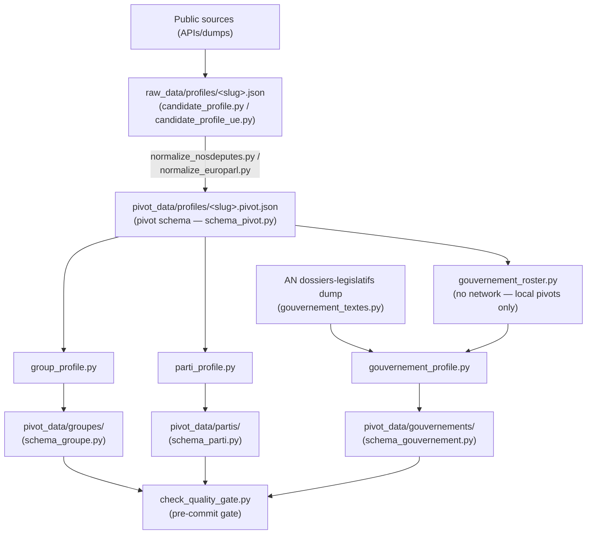

# AGENTS.md - Instructions for AI agents

Non-negotiable rules, schema conventions, validation constraints for every session.
"Why" behind each decision: `docs/technical_decisions.md` (anchors below).
Commands, structure, coverage limits: `README.md`.

---

## 1. Product

**Empreinte politique** — "Politics made clear". Factual, sourced political CVs
(mandates, votes, texts, interventions) for 2027 presidential candidates.
`CONTRECHAMP` (`web/`) is the interface design lab. `web/UI_finale` (React 19 + Vite) is
the current production interface, wired to real pivot data (`#web-v3-ui`). Earlier design
generations — `v1`-`v7`, including the `v3` editorial reference — are archived under `web/old/`.
`web/UI_finale` navigation: **Candidats** · **Groupes** (real parliamentary groups) ·
**Gouvernement** (real governments) — no Partis tab.
Positioning, naming, target audience: `docs/technical_decisions.md#positionnement`.

## 2. Non-negotiable editorial rules

Duplicated in `schema_pivot.py`, `validate_profil()`, and `web/old/v3/methodologie.html`.
Any schema/display change must preserve them:

1. No value judgments, no score, no ranking.
2. Full traceability: every fact must map to a primary source.
3. No individual attendance rate is ever published.
4. A 49.3 procedure is never treated as a vote position (separate procedural fact).
5. Missing data means missing data, never default `0`.
6. `position_dans_hemicycle` always requires a verifiable `source_url` (enforced by `validate_profil()`).
7. Group ratios published only with numerator + denominator + sufficient coverage; otherwise `N/D`.
   Individual-vs-group gaps are **internal quality control** only, never public.
8. Thematic tags are reading aids, not declared candidate positions.

## 3. Pipeline

- `raw_data/` = source-near; `pivot_data/` = only layer `web/` reads.
- **JSON write format**: individual profiles (`raw_data/profiles/`, `pivot_data/profiles/`)
  are written **compact** via `src/json_io.py` — 35 % of their volume was indentation
  alone (#433). Groupes, gouvernements, partis, rosters, audit reports stay `indent=2`.
  Never read a profile line by line; the format carries no meaning.
- Groups from `groupes_reels.json`; `group_roster.py` = 1 fetch per `(chambre, legislature)`.
- Governments from `gouvernements_reels.json`; `gouvernement_roster.py` derives `membres[]`
  from local pivots only; `gouvernement_textes.py` fetches the AN dossiers-legislatifs dump
  once per batch (`generate_gouvernement_profiles.py`).

**Additive merge (`merge_profile.py`)**: regeneration never removes collected data.
- `votes`, `mandats`, `interventions`: additive, old entry wins (`merge_lists_by_key`).
- `amendements`, `textes_portes`: new entry wins (`merge_dossier_records`) — allows stage/outcome correction.
- Scalars: new value if populated, else keep old (never regress to `null`).
Full rationale + exceptions: `docs/technical_decisions.md#fusion`.

**CI/CD (`.github/workflows/generate-data.yml`)**: `fresh_run=true` = full purge, `--no-merge`.
`fresh_run=false` = additive merge, cache restored.
In both modes, threshold = `inputs.threshold` (default 3).
Commit only if `check_quality_gate.py` exits 0. See `docs/technical_decisions.md#ci-cd`.

**Quality gate**: hard fail on IncompleteRead > threshold or invalid/missing groupe or
gouvernement file; soft warnings on low interventions, low coverage, network signals, and
amendements index freshness (§3d: distinguishes "never built" from "present but stale
beyond N days without a successful rebuild" from "frozen" — légis 15/16 are closed
dossiers, their index is committed under `raw_data/amendements_an_figes/` and never
re-fetched, see `docs/technical_decisions.md#amendements-legislatures-figees`). Gouvernement
section (§5) mirrors groupes (§4): couverture ministérielle (portefeuille attribution),
empty `textes[]`, IncompleteRead are soft; broken structure is hard — see #212.

## 4. Pivot schema v1 (`src/schema_pivot.py`)

| Key | Content |
|---|---|
| `id` | `"<source>:<identifiant_source>"` |
| `nom`, `chambre`, `parti`, `groupe` | `chambre` in `{AN, Senat, PE, mairie, null}` |
| `identite` | Nullable bio block |
| `sources[]` | `{type, url, synchro_le}` |
| `mandats[]` | Elections, committees... + sensitive fields (Section 5) |
| `votes[]` | One record per vote, `legislature` included (AN legislatures 14-17 aggregated, `#403`) |
| `textes_portes[]` | Author/reporter/co-reporter + procedural stage |
| `amendements[]` | Outcome + inadmissibility/rejection distinction |
| `interventions[]` | Speeches, questions (`type_detail`) |
| `tags_thematiques[]` | 8 stable categories (`STABLE_THEMES`), via `classify_keywords()`. |
| `meta` | `schema_version`, `genere_le`, `licence_donnees`, `warnings[]`, `provenance` (`candidat_declare`\|`roster_groupe`, see `docs/technical_decisions.md#provenance-pivot`) |

Conventions: French `snake_case`; missing = `null` (never `""` or `0`); closed values in
`frozenset KNOWN_*`, validated by `validate_profil()` — extend the frozenset, never bypass.

## 5. Sensitive institutional fields (validation constraints)

- `mandats[].position_dans_hemicycle`: requires `source_url` (rule 6).
- `mandats[].suspendu_pour_fonction_gouvernementale`: never confuse with completed mandate.
- `votes[].type_vote == "motion_censure"` requires `texte_lie_id`; 49.3 → `sort = "adopte_sans_vote_49_3"`, no position (rule 4).
- `votes[].numero_scrutin` restarts at 1 in each legislature: never a key on its own.
  Dedupe by AN `uid`, key group cohesion by `(legislature, numero)` — see
  `docs/technical_decisions.md#votes-multi-legislature`.
- `amendements[].sort == "irrecevable"` requires `base_juridique_irrecevabilite` (`"art. 40"` or `"art. 45"`).
- `amendements[].type_deposant`: never aggregate adoption rates across depositor types (rule, Section 6).
Edge-case history: `docs/technical_decisions.md#cas-limites`.

## 6. Metrics: public vs internal

| Metric | Status |
|---|---|
| `textes_portes[]` (stage ≥ `examine_commission`) | Public |
| `textes_portes[]` below threshold | Via explicit user toggle — not published by default |
| `amendements[]` raw counts + `par_type_deposant` | Public |
| Adoption rate across all submitter types | **Never** (misleading) |
| `votes[]` bill vote (`vote_texte`, latest reading) | Public |
| 49.3 / no-confidence motion | Public, labeled as procedural fact |
| Individual attendance/presence | **Never public** (rule 3) |
| Group `cohesion_votes[]` | Public, with numerator/denominator |
| Individual gaps vs group cohesion | Internal only (`--rapport-interne`) |
| `mandats[].notableCount` | Internal only (display ordering) |
| `tags_thematiques[]` (8 categories) | Public |

Full rationale: `web/old/v3/methodologie.html` — do not duplicate prose here.

## 7. Sources and licenses (reuse implications)

| Source | License | Constraint |
|---|---|---|
| NosDeputes.fr / NosSenateurs.fr | ODbL v1.0 | Share-alike if published as downloadable dataset |
| data.assemblee-nationale.fr / questions.assemblee-nationale.fr | Licence Ouverte / Open Licence (Etalab) | Attribution only |
| Parltrack (JSON dumps) | ODbL v1.0 | Share-alike if republished as downloadable dataset |
| European Parliament (data.europarl.europa.eu, www.europarl.europa.eu) | EP Legal Notice (reuse policy, attribution-based) | Attribution only |
| French Wikipedia | CC BY-SA 4.0 | Verbatim quotes only (not current use) |
| Wikidata | CC0 1.0 | No restriction |

Site HTML = ODbL "Produced Work" (attribution sufficient). Downloadable raw data → share-alike.
Full details: `docs/technical_decisions.md#licences`.

## 8. End-of-task documentation upkeep

Before finishing a task, update only what actually changed — skip a file if nothing changed for it:

| File | Update when |
|---|---|
| `AGENTS.md` | New agent-facing rule, command, or constraint. Rare edit; stay terse. |
| `README.md` | New setup step, script, or user-visible workflow/command. |
| `docs/technical_decisions.md` | New architectural choice or trade-off. Dated entry: context, decision, alternative rejected. |
| `ROADMAP.md` | Task closes a known bug, or a new idea is identified but not acted on now. Keep entries to one line; put rationale in `technical_decisions.md` instead. |
| `requirements.txt` | A new package is imported that isn't already listed. Pin the version actually installed/tested (`==`), don't add unpinned entries. |

Never create a missing file from this list without flagging it first.

## 9. Agent chat verbosity

Keep chat replies short — this file and `docs/` already hold the rationale;
don't restate it in the chat.

- 1-3 sentences per turn, no preamble, no "in summary" recap.
- Report changes as: files touched + one-line reason. Skip what you read/considered.
- Test/command output: pass/fail counts only, unless something failed.
- Always flag in the chat: schema/validation changes, anything touching
  rules in Section 2, new warnings/errors introduced, or a choice between
  multiple valid approaches — even briefly.
- Everything else (files read, intermediate reasoning, alternatives
  considered but discarded) can be omitted from the chat.
  
## References

- `src/schema_pivot.py`, `schema_groupe.py`, `schema_parti.py`, `schema_gouvernement.py`: structure contracts.
- `src/check_quality_gate.py`: quality gate (4 sections). Hard vs soft fail logic.
  Amendements coverage/freshness are deliberately never hard fails — see
  `docs/technical_decisions.md#amendements-zero-pas-de-hard-fail`.
- `docs/an_opendata.md`: AN open-data JSON schemas.
- `docs/extract-*.md`: per-source extraction jobs (sources, chain, artifacts).
- `docs/pipeline-profiles-groupes.md`: profile→groupe pipeline details.
- `docs/hatvp_opendata.md`: HATVP lobby-register — out of short-term scope.
- `src/json_io.py`: profile JSON write format (compact vs indented, #433).
- `docs/technical_decisions.md`: full rationale (`#positionnement`, `#fusion`, `#cas-limites`, `#licences`, `#ci-cd`, `#web-v3-ui`, `#hors-perimetre`, `#profils-json-compact`).
- `ROADMAP.md`: known bugs + unscheduled ideas, kept short (not read
  automatically — consult on request). Rationale for deferred items lives
  in `docs/technical_decisions.md#hors-perimetre`, not duplicated here.
