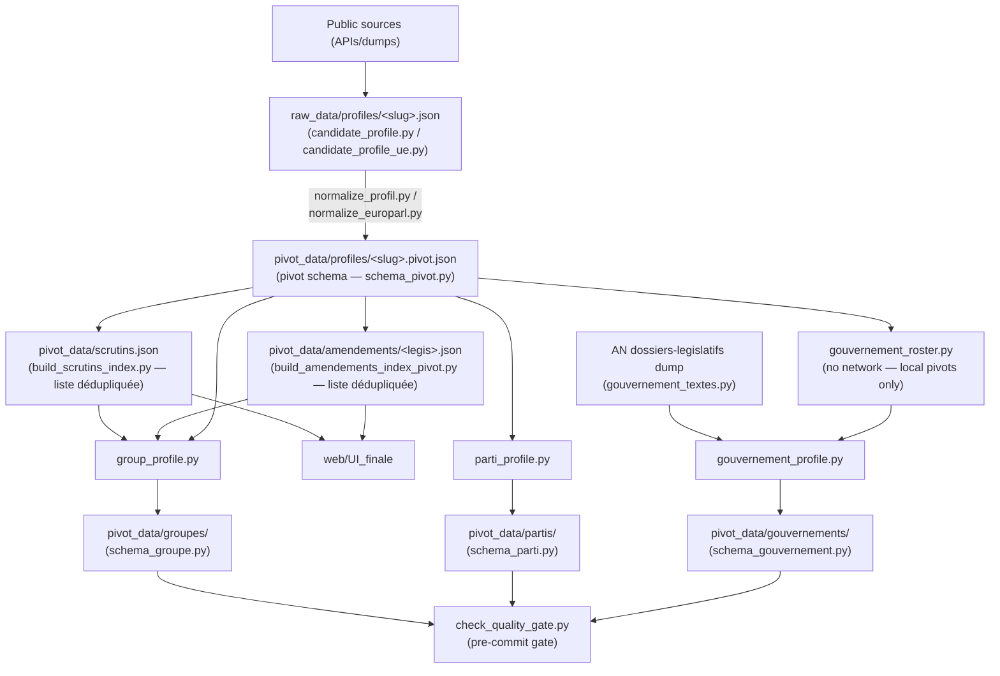

# AGENTS.md - Instructions for AI agents

Non-negotiable rules, schema conventions, validation constraints for every session.
"Why" behind each decision: `docs/technical_decisions.md` (anchors below).
Commands, structure, coverage limits: `README.md`.

---

## 1. Product

**Empreinte politique** — "Politics made clear". Factual, sourced political CVs
(mandates, votes, texts, interventions) for 2027 presidential candidates.
`CONTRECHAMP` (`web/`) is the interface design lab. `web/UI_finale` (React 19 + Vite) is
the current production interface, wired to real pivot data (`#web-v3-ui`). Earlier design
generations — `v1`-`v7`, including the `v3` editorial reference — are archived under `web/old/`.
`web/UI_finale` navigation: **Candidats** · **Groupes** (real parliamentary groups) ·
**Gouvernement** (real governments) — no Partis tab.
Positioning, naming, target audience: `docs/technical_decisions.md#positionnement`.

## 2. Non-negotiable editorial rules

Duplicated in `schema_pivot.py`, `validate_profil()`, and `web/old/v3/methodologie.html`.
Any schema/display change must preserve them:

1. No value judgments, no score, no ranking.
2. Full traceability: every fact must map to a primary source.
3. No individual attendance rate is ever published.
4. A 49.3 procedure is never treated as a vote position (separate procedural fact).
5. Missing data means missing data, never default `0`.
6. `position_dans_hemicycle` always requires a verifiable `source_url` (enforced by `validate_profil()`).
7. Group ratios published only with numerator + denominator + sufficient coverage; otherwise `N/D`.
   Individual-vs-group gaps are **internal quality control** only, never public.
8. Thematic tags are reading aids, not declared candidate positions.

## 3. Pipeline

- `raw_data/` = source-near (votes stay denormalized there); `pivot_data/` = only layer `web/` reads.
- **`pivot_data/scrutins.json`** (schema `scrutins-v1`, `#432`): the deduplicated ballot list,
  shared by profiles **and** groups — the groups' 4 104 ballots are entirely included in the
  profiles' 17 422, so one list serves both. Build it with
  `src/build_scrutins_index.py`, **before** any pivot pass — resolving a ballot's `legislature`
  is a corpus-wide join (`src/scrutins_legislature.py`), never per-profile. Merged additively:
  a partial run must never drop ballots that other profiles' mappings still point at.
- **`pivot_data/amendements/<legislature>.json`** (schema `amendements-v1`, `#431`): the
  deduplicated amendment list, plus a companion `<legislature>.cosignatures.json`. 810 552
  (member, amendment) pairs for 207 238 distinct amendments, and **77,7 M co-signature entries
  for 4,96 M distinct** (× 15,7) — that N² is 1 083,9 Mo of the 1 342,4 Mo `amendements[]`
  weighed. A profile keeps only `{amendement_id, role_signataire}`; `amendement_id` is
  `an:<uid AN>`, and the legislature is read **inside** the uid, never derived from the date.
  **Sharded per legislature** because a single global file already weighs 130,1 Mo, past
  GitHub's 100 MB blob limit; co-signatures live apart because they are 59 % of the index and
  **no consumer reads them** — never deleted, a co-signature network is analysis material
  (#324). Build it with `src/build_amendements_index_pivot.py` (not
  `build_amendements_index.py`, which is the raw AN index) — **after** the pivot pass, and
  only once: nothing here needs a corpus-wide join. Merged additively, same reason as ballots.
- Together these are the **only cross-file dependencies** inside `pivot_data/`: a profile no
  longer reads alone for its votes nor for its amendments. Both must be in the workflow's
  `git add` — an uncommitted index leaves every mapping pointing at nothing, silently.
- **JSON write format**: individual profiles (`raw_data/profiles/`, `pivot_data/profiles/`)
  are written **compact** via `src/json_io.py` — 35 % of their volume was indentation
  alone (#433). Groupes, gouvernements, partis, rosters, audit reports stay `indent=2`.
  Never read a profile line by line; the format carries no meaning.
- Groups from `groupes_reels.json`; `group_roster.py` = 1 roster per `(chambre, legislature)`,
  and **zero fetch** in CI — the run's raw roster arrives by artifact (#518, see below).
  Since #527 the `deputes` key is **derived from AMO30**; since #529 that is the only
  source left, `fetch_full_roster` emits no HTTP request of its own, and
  `AN_ROSTER_ACTIF` is a kill switch (loud refusal), no longer a switch between two
  sources.
- Governments from `gouvernements_reels.json`; `gouvernement_roster.py` derives `membres[]`
  from local pivots only; `gouvernement_textes.py` fetches the AN dossiers-legislatifs dump
  once per batch (`generate_gouvernement_profiles.py`).

**Additive merge (`merge_profile.py`)**: regeneration never removes collected data.
- `votes`, `mandats`, `interventions`: additive, old entry wins (`merge_lists_by_key`).
- `amendements`, `textes_portes`: new entry wins (`merge_dossier_records`) — allows stage/outcome correction.
  An amendment's merge key is its `amendement_id`, or — for an unresolved entry — the record kept
  under `amendement_non_resolu`; keying on the mapping alone would collapse every unresolved entry into one.
- Scalars: new value if populated, else keep old (never regress to `null`).
Full rationale + exceptions: `docs/technical_decisions.md#fusion`.

**Tests in CI (`.github/workflows/tests.yml`, #473)**: the full suite runs on every PR
and every push to `main`, and a failure fails the job. **No test may read `pivot_data/`
or `raw_data/profiles/`, write anywhere under `pivot_data/`/`raw_data/`, or hit the
network** — acceptance tests on real profiles use frozen fixtures under `tests/fixtures/`
(#457). This is enforced, not just audited: the job sparse-checks-out only what the suite
reads, so the corpus is absent from the CI disk. Watch for CLI/function **defaults**
pointing into the repo — that is how nine tests were silently reading 66 MB of corpus.
`tests/conftest.py` enforces the network half structurally (#488): an `autouse` fixture cuts
`requests.Session.send` and fails loudly, naming the URL. **Loopback stays open** — 11 tests
serve fixtures from `127.0.0.1`; the criterion is leaving the machine, not speaking HTTP.
It exists because one per-process request turned 62 existing tests into a 13,4 s file with
nothing failing.
Test-only dependencies go in `requirements-dev.txt`.
See `docs/technical_decisions.md#ci-tests-pytest`.

**CI/CD (`.github/workflows/generate-data.yml`)**: the launch form is **two
disjoint axes plus the cache** (#578). `existing_profiles` (`leave-as-is` /
**`refresh`**, the default / `overwrite`) decides what happens to profiles
already written — `overwrite` alone raises `--no-merge`. `roster_coverage`
decides whether members with no profile get one. `cold_start` purges the
download caches and re-fetches the public sources; it says nothing about how
profiles are written, so "overwrite without purging the cache" — the common
case — is one setting, not a side effect. `roster_limit` is a cap and nothing
else (default `0` = no cap); it commands no refresh policy.
In all modes, threshold = `inputs.incomplete_read_threshold` (default 3).
Commit only if `check_quality_gate.py` exits 0. See `docs/technical_decisions.md#ci-cd` and
`docs/technical_decisions.md#deux-axes-formulaire-578`.

**The data push goes out under a deploy key, not the `GITHUB_TOKEN` (#508)**: a repository
ruleset enforces its `required_status_checks` on **direct pushes**, not only on PRs — and
this job pushes to `main` without a PR, so no check can ever be attached to the commit it
builds. The rule is unsatisfiable for it, not merely slow. The GitHub Actions app cannot be
a bypass actor on a **personal** repository (it must belong to an owning organisation), so
`merge-and-pivot` checks out with `ssh-key: ${{ secrets.DATA_PUSH_SSH_KEY }}` and the key is
listed in the ruleset's `bypass_actors`. Two consequences worth knowing: a deploy-key push
**does** emit a `push` event (the `GITHUB_TOKEN` does not), so `tests.yml` now really runs on
data commits — it never did before — and `deploy-pages.yml` fires twice, serialised by its
`pages` concurrency group. Missing secret ⇒ checkout falls back to the token and the push is
rejected **loudly**, naming the rule. See
`docs/technical_decisions.md#push-donnees-cle-de-deploiement-508`.

**A job never writes a cache key for a directory it does not fill (#412 §2.3 → #424 →
#505, same defect three times)**: `actions/cache` skips the post-job save on an exact key
hit, so the first writer freezes the entry for everyone. Two corollaries, both enforced by
`tests/test_ci_cache_producteur_ecrivain.py` (verified by mutation): a job carrying a
`--skip-*` flag uses `actions/cache/restore`, and a key whose **content** depends on an
input must carry that input — `public-data-cache-an-<week>` alone let one default-mode run
starve every interventions run of the week. Two jobs sharing a key must also share the
exact same `path:`, since the entry's version is a hash of it. A collection index is only
cached once **complete**: a truncated one served to every shard is a missing value turned
into a measured `0` (§2.5). See `docs/technical_decisions.md#cache-mode-interventions-505`.

**`collect_interventions=true` is a different job (#498)**: it adds the Syceron
debate archives and the QE/QG/QOSD archives — extraction measured at **8-18 s**
without it, **59-286 s** with (32 shards, four runs). The NosDéputés search was
the third charge until #510 removed it with the fallback (90 s on
`jean-luc-melenchon`); the 240 s were sized with it, and the balance is not
re-measured. `extract-an`'s
`timeout-minutes` is therefore conditional on the input (5 / 9), and the collection
bounds *itself* with `--budget-interventions-secondes` (240 s in CI, per candidate,
shared across both chambers). Never raise one without the other — a shard killed by
`timeout-minutes` writes **no profile at all** (`Publication : 0 profil(s)`, all 12
killed shards of runs 32302557156 and 32379928098), while an exhausted budget
writes the partial profile and declares the truncation in `meta.warnings[]`
(§2.5). Guarded by
`tests/test_ci_budget_interventions.py`.
See `docs/technical_decisions.md#budget-collecte-interventions`.

**Every collection path must declare what it does with interventions (#501)**:
`extract-an` follows the input, `extract-roster-groupes` hard-codes
`--skip-interventions`. A new invocation of `generate_all_profiles.py` must be
added to the inventory in `tests/test_ci_interventions_par_job.py` with its mode,
and any job that ignores the input must be named in the input's description.
The third path, `extract-senat`, is **gone** (#528, below): it collected nothing
because nothing it collected was ever kept.
See `docs/technical_decisions.md#interventions-senat-501`.

**The Senate is out of scope, and the job that concluded green without producing
anything is retired (#528, lot 3)**: `archive.nossenateurs.fr` has served an
expired certificate since 24/08/2026 and no replacement source is **established**
— `data.senat.fr`/`www.senat.fr` were never probed. The decision is **editorial**,
not technical, and the measured data cost was near zero on the 476 committed
profiles: **2** `sources[]` entries of type `nossenateurs`, **0** published Senate
interventions, **0** `cohesion_votes` on both `groupe-Senat-*.json`. Removed:
the `extract-senat` job, `--source senat` (`SOURCE_VALUES` is `("an","ue","all")`),
`CHAMBRES = ["deputes"]`, `BASE_URLS["senateurs"]` with `fetch_votes` and
`fetch_dossiers_for_legislatures`, `senat_periode_debut`, `docs/extract-senat.md`.
**Kept**: the 2 published `groupe-Senat-*.json` (frozen — deleting a published
file is a disappearance `audit_diff_profils` blocks), the 2 `groupes_reels.json`
entries (still `extraction_suspendue`, `condition_reprise` rewritten to the
editorial reopening, no longer to a certificate), the Senate mandates already
collected on the 2 bicameral profiles (additive merge removes nothing), and the
NosSénateurs ODbL attribution in the legal notice. **Declared loss**: the 2
`sources[]` entries at the next regeneration (non-blocking, #460); an
`existing_profiles=overwrite` run additionally drops 1 `mandat` on each of the 2
profiles — a **watched stable list**, so that run needs `allow_declared_losses`. Three loud refusals guard the
non-return (`build_profile`, `_base_url_for`, argparse), frozen by
`tests/test_retrait_senat_528.py`. Reopening requires the three written
conditions of `docs/technical_decisions.md#retrait-senat-528` §7 — a renewed
certificate changes nothing.

**Syceron publishes the speaker id BARE, and never indexed anything (#510)**:
`<orateur><id>847629</id>`, matched against `re.fullmatch(r"PA\d+")` — so the
**primary** source of interventions built an empty index from day one (2 bytes
from 601 comptes rendus), and **0 of the 789 published interventions** came from
it. The prefixing is not an inference: the same `<paragraphe>` carries
`id_acteur="PA847629"`. Verified on **all three** archives since 26/08/2026
(2 768 comptes rendus, `content-length` checked): `id_acteur == "PA"+id` on
**1 232 692 of 1 235 317** paragraphs, `forme_inattendue` at **0** on each — no
archive publishes the prefixed form. When `id_acteur` **contradicts** the
prefixing (2 625 paragraphs, 2 524 of them a `<nom>` naming *two* speakers), the
source itself refuses the attribution and so do we: keeping the first would
fabricate a speech (§2 rule 2).
Two *independent* parser defects, same cause as #510 — the invented fixtures —
are fixed in the same run. (a) The traversal saw **180 755 of 1 444 564**
paragraphs (**12,5 %**, down to 3,7 % on the 15th): `nivpoint` 1-3 points are XML
**siblings**, `nivpoint` 4-5 are **nested** and never titled, and an undocumented
`<interExtraction>` container holds 86 163 of 103 213 paragraphs in a 200-CR
sample of the 15th. The perimeter is unchanged — still "under a `<point>`",
`<ouvertureSeance>`/`<finSeance>` still out. (b) `<titreStruct>` does not exist
under `<contenu>` (**0** of 162 073 points); the title is in `<point><texte>`,
and `<metadonnees><sommaire>` adds nothing (its `<intitule>` *is* the point's
`<texte>` on 12 035 of 12 038 joins). What separates a subject from a procedural
heading is **structural**, not lexical: the point's `code_grammaire`
(`TITRE_TEXTE_DISCUSSION`, `QG_1_1`, `QOSD_1_1` — the only three of 30 322 points
that carry matter). `sujet` is now filled on **88,0 %** of the 1 227 415 indexable
interventions, `None` otherwise (rule 5) — never a procedural title, since Syceron
**replaces** the NosDéputés list `tags_thematiques` is derived from (rule 8).
`point_ordre_du_jour` carries the full title chain instead.
**Measure only on verbatim reductions of the archive**: the two invented fixtures
are **deleted**, not deprecated — keeping them under test was keeping the cause
armed.
Unresolved ids are **counted, not warned** per entry (same arbitration as #492,
and expected-and-permanent discards get no warning at all, as in #474); the
tripwires are `forme_inattendue` and "not one indexed entry carries a subject",
both at **0**. And an index built from *readable* comptes rendus that resolves
**zero** actors is never cached nor returned silently — #505's guard only covered
"no readable file", and that gap is how this survived (§2.5).
**Syceron is live and the NosDéputés fallback is gone (#510, 27/08/2026)**:
operator decision, taken on those measurements. The flag is **removed**, not
raised — the old mode returned **zero** on all three archives, and keeping it
behind a switch kept the defect armed; `--activer-interventions-syceron` is
still declared and **loudly refused**, because `unrecognized arguments` would
read as "Syceron collection is off". The **fallback went with it**, and so did
the whole chain that existed only for it (`fetch_recherche`,
`fetch_all_intervention_results*`, `_extract_search_results`,
`fetch_intervention_details`, `fetch_seance_context`, `_classify_intervention`,
`--max-pages`) — the search alone cost **90 s** on `jean-luc-melenchon`, charged
to #500's 240 s. A source that *replaced* the primary one is exactly what made
#510 invisible: the path returned 789 interventions, **0** from its declared
primary source, so nothing raised a hand. An empty Syceron collection now stays
empty and says so (`interventions syceron indisponibles`, a **prefix** of the
old label so already-published warnings stay recognisable); `interventions`
leaves #514's `sections_vides`, since the search was the only part of the path
going through `_get_payload`. `normalize_nosdeputes` is untouched — additive
merge keeps the interventions already collected, and they must keep normalising.
**The index is sharded per actor** (`.cache/syceron_an/<leg>/index_par_acteur/
PA######.json`, published by one `os.replace`, patron #392/#403): it was the
"last technical lock", and it stopped being out of scope the moment activation
was decided — 1 664,8 Mio re-read **per candidate per legislature** was 12,5 s
and a 3,8 Gio RSS peak. Both flat legacy indexes are **deleted** on publication
and never re-read (a 2-byte index served to a run that resolves bare ids is
#505's defect). The per-legislature lock is **reentrant**, and the memo of
built-but-unpublished indexes is keyed on the cache **path** (the #377 trap).
**Not measured, and it says so**: per-candidate cost and RSS of the new shape
(bounded by construction, not by measurement), profile weight and group
aggregates against #429, #505's cache entry (~21 Mo → order of a Go against the
repo's 10 Go quota — the `path:` was changed identically in **both** jobs that
declare it), and the #500 balance. `tests/test_interventions_senat_non_retenues.py`
is **deleted** with the chain it measured: #528's reopening condition is harder
now, not weaker. Guarded by `tests/test_syceron_acteur_ref.py`,
`tests/test_parse_syceron.py`, `tests/test_index_interventions_cache_partiel.py`.
See `docs/technical_decisions.md#syceron-actif-510`.

**One artifact = one job's contribution (#450)**: an extraction job publishes only the
profiles it actually wrote — never `raw_data/profiles/`, which its `actions/checkout` also
filled with the committed baseline. Enforced by `generate_all_profiles.py --manifest-out`
+ `.github/actions/publish-written-profiles`; guarded by `tests/test_ci_publication_profils.py`.
Republishing the baseline made the additive merge reunite a profile's stale and corrected
versions, defeating `--no-merge` and inflating volumes every run, and made sharded jobs
collide under `merge-multiple` so only one shard's work survived. The baseline needs no
artifact: `merge-and-pivot` checks out the repo and `merge_raw_dirs` only rewrites slugs
present in the artifacts. See `docs/technical_decisions.md#publication-scopee-artifacts`.

**An empty collection never overwrites a non-empty one (#465)**: under `--no-merge`, a field
that comes back with **zero** entries never replaces one that had some — per field, not per
profile. A non-empty result overwrites normally, so a key correction still lands (#440 replaced
2 018 amendements with 944). Lifted only by `--autoriser-collecte-vide`, and the preservation is
always printed, never silent. Same principle as #427 on governments: *distinguish "zero observed"
from "incomplete collection"* — a `[]` returned by a failing API is not a measured fact (rule 5).
Profiles were the only place not applying it, which cost 18 721 amendements and 1 016 votes on
`jean-luc-melenchon`, and 23 textes portés on `marine-le-pen` **with no warning in the profile**.
See `docs/technical_decisions.md#collecte-vide-necrase-jamais`.

**Bicameral collection is for candidates only (#488)**: `build_profile_any_chambre` queries
**both** chambers — instead of stopping at the first that returns an identity — only when
`meta.provenance == "candidat_declare"` (8 of 209 profiles). A `roster_groupe` member keeps the
historical first-answer-wins behaviour: no Senate group is ever aggregated (both published
`groupe-Senat-*.json` carry `cohesion_votes: 0`, no usable Senate dataset exists), so a roster
member's Senate past feeds nothing, and collecting it costs 2 requests at ~9,5 s median each —
**+30,6 min per roster shard**, +4 h at full scale. A candidate's Senate past is *biographical*,
which is why it is worth those 16 requests. Two warning types reach the published
`meta.warnings`: `carrière sur deux chambres` (candidates only) and `collecte de chambre en
échec` (**all profiles** — it only fires on a real exception, and a chamber silently picked by
an outage is exactly §2.5). When both answer, the **first of `CHAMBRES` wins by documented
convention** — deriving `chambre` from the mandates is #486's sub-issue D and would erase the
other career. No mandate is ever merged across chambers here, and #492 merged none either.
`--source an`/`--source senat` stay scoped whatever the provenance, tested.
See `docs/technical_decisions.md#deux-chambres-interrogees`.

**A profile's chambers are derived, and the fallback is declared (#493)**:
`chambres` is recomputed from `mandats[].chambre` by `schema_pivot.deriver_chambres()`;
`chambre` is its head. **Call `appliquer_chambres()` after any mutation of `mandats[]`** —
a derived field is recomputed, never merged: `merge_lists_by_key` makes `merged["mandats"]`
a *superset* of both sides, so a merged `chambres` would describe a mandate set that exists
in neither (the mirror image of the `backfill_mandat_chambre` trap in #492). The collection
chamber — *which dataset answered* — is **always unioned in**, never substituted and never
dropped: two stricter rules were measured and reverted on the 209 published profiles of
`b2c34f4`, flipping 7 then 1 profile from `AN`/`Senat` to `PE`, because removing an observed
chamber is a deletion. That fallback is usable, not verified — it is wrong on at least 20
measured profiles, including **18 senators published `chambre: "AN"`**, the same 18 that have
no `mandat_electif` at all. What keeps it from being misleading is that it is **declared**:
one `chambres du profil non corroborée` warning per profile names the unbacked chambers
(§2.5), and its corpus count is the migration meter — 208 of 209 today. Measured read-only on
both pipeline paths: **0** scalar divergence, `population_an` 207 → 207,
`MAPPING_CHAMBRE_SOURCES` 209 → 209, loss check non-blocking. Consumers are **not** migrated
here (#494). `chambre`'s retirement condition — both consumers migrated *and* the warning
gone from the whole corpus — is written in
`docs/technical_decisions.md#chambres-profil-derivees`; without a written criterion this
transitional would become permanent, as #431's and #432's read fallbacks did.
Guarded by `tests/test_chambres_profil.py`.

**A group's eligibility window is chamber-scoped (#492)**:
`group_profile._member_eligibility_intervals` took the **union** of all `mandat_electif`, so
a chamber change mid-legislature extended the window past the member's departure from the
Assembly and counted him absent on ballots he could no longer vote — a false cohesion
denominator (§2.7). It now filters on the group's chamber (threaded through
`_derive_membre_entry`, `_compute_cohesion_votes`, `_aggregate_mandats`,
`compute_ecarts_cohesion_internes`). Two rules make it a fix and not a new defect: a mandate
with `chambre: null` is **kept** — excluding it would shrink a published denominator on
missing data, so on today's unstamped corpus the filter changes **no** published
denominator — and "no elective mandate at all" (`None` → eligible by default) stays distinct
from "elective mandates, none in this chamber" (`[]` → never eligible). Falling back on
`groupe_politique` mandates does **not** work: 398 of them on 188 profiles, **0 open**.
See `docs/technical_decisions.md#chambre-par-mandat-electif`.

**Loss check before commit (#460, scope extended by #470)**: `merge-and-pivot` runs
`src/audit_diff_profils.py --ref HEAD` **before** the commit step, over **all of
`pivot_data/`** — the five published layers plus the two shared indexes. Three findings
abort the commit: a file that **disappeared**; a **drop on a stable list** (profiles:
`votes`, `mandats`, `textes_portes`, `interventions`, `tags_thematiques`,
`dossiers_legislatifs` — groupes: `membres`, `cohesion_votes`, `mandats_agreges`,
`tags_thematiques_agreges`, `historique_noms` — partis: `candidats`,
`tags_thematiques_agreges` — gouvernements: `membres`, `textes`); a **watched scalar going
from populated to `null`** (`parti`, `groupe`, `chambre`, `identite`, `meta.provenance`,
`premier_ministre`, `meta.couverture_roster.roster_total`…). Reported but **non-blocking**:
drops on `amendements` and `sources`, drops in the shared indexes' distinct-entry counts,
and any scalar **value change** (A → B) — measured over 13 committed transitions, every
`populated → null` was a real defect and nearly every value change was a legitimate
normalisation. A run may legitimately lose entries — declare it with the
`allow_declared_losses` input, never by removing the check. Guarded by
`tests/test_ci_controle_perte_profils.py` and `tests/test_audit_diff_agregats.py`.
Why it exists: `collect_interventions=false` (skip collection, intended) combined with
`existing_profiles=overwrite` (rewrite without what wasn't collected, also intended) erased the
corpus's 789 interventions — and with them 647 `tags_thematiques` and 497 aggregated tags,
all **published** fields. The quality gate could not catch it: it measures a *level*, not a
*variation*. Why the scope grew: with only profile list-lengths watched, SOC-16's
`cohesion_votes` fell 814 → 0 (a **published denominator**, §2.7) and `parti` regressed to
`null` on three profiles, both while the check was running.
See `docs/technical_decisions.md#controle-de-perte-avant-commit` and
`#perimetre-controle-perte`.

**Referential integrity before commit (#485)**: `merge-and-pivot` also runs
`src/audit_integrite_referentielle.py --pivot-dir pivot_data`, right after the
loss check and before the commit. Every published key must resolve in the shared
index it points at — `votes[].scrutin_id` and a groupe's
`cohesion_votes[].scrutin_id` in `scrutins.json`, `amendements[].amendement_id`
in `amendements/<legislature>.json`. An **orphan reference** aborts the commit,
naming the file and the key (§2.5): a key that doesn't resolve is a vote
published with no object, and on a groupe a **false denominator** (§2.7). So do
a missing index/shard, and a `null` key **without** its `scrutin_non_resolu` /
`amendement_non_resolu` record — **with** that record it is the normal shape of
an EP amendment and never blocks. Reported but non-blocking: **index entries
nobody references**, at 0 today but a legitimate state — additive merge means an
entry outlives its referent by design. Measured at `01ffa7f`: 0 orphans out of
1 347 451 references, 3,02 s / 162,0 Mio, a separate process from the loss check
so the job's peak stays 186,6 Mio. **`allow_declared_losses` does not disarm
it** and must never be merged with `allow_broken_references`: a loss can be
legitimate, an orphan reference cannot. This is an **invariance in one state**,
not a variation over time — which is why `audit_diff_profils` cannot cover it.
Guarded by `tests/test_audit_integrite_referentielle.py` and
`tests/test_ci_integrite_referentielle.py`.
See `docs/technical_decisions.md#integrite-referentielle-pivot`.

**Collected must equal published (#511)**: `merge-and-pivot` also runs
`src/audit_collecte_non_publiee.py`, **after both `--pivot-only` passes** (declared
candidates, then roster) and before the commit. Every `raw_data/profiles/<slug>.json`
must have its `pivot_data/profiles/<slug>.pivot.json`; **any** miss aborts the commit,
naming the slugs. Threshold **0**, measured: 0 gap across the 12 run-produced commits
of 16-20/08/2026 while the corpus went 48 → 209. A raw profile is always normalisable —
`process_candidat` writes nothing when collection returns neither an FR identity nor an
EU mandate — so a raw without a pivot means **never offered to a pivot pass**. Reported
but non-blocking: a pivot with no raw. **Placement is half the control**: between the
two passes every roster member is legitimately pivot-less, so checking earlier would
flag 543 phantom gaps. It **parses no profile** (two filename listings — the raw corpus
is 1 642 Mo, largest profile 26,5 Mo): 0,08 s / 13,9 Mio measured at 752, a separate
process so the job peak stays the loss check's. Third tolerance, still partitioned:
`allow_unpublished_profiles` — neither `allow_declared_losses` nor
`allow_broken_references` disarms it. **Same run also fixed the cause**:
`generate_roster_candidats.py` now refuses to write on a failed fetch, on a configured
group returning 0 members, or on an empty roster — a `Read timed out` wrote a 0-candidate
roster and the roster pivot pass iterated on nothing, in a run that concluded `success`.
Guarded by `tests/test_audit_collecte_non_publiee.py`,
`tests/test_ci_collecte_non_publiee.py` and `tests/test_generate_roster_candidats.py`.
See `docs/technical_decisions.md#collecte-non-publiee`.

**Each published list must carry what collection returned (#545)**: `merge-and-pivot`
also runs `src/audit_collecte_vs_publie.py`, after both `--pivot-only` passes and before
the commit. #511 reasons about **profiles**; this one reasons about the **contents of
their lists** — a pivot that exists but lost its interventions is irreproachable to all
three other guards, which is how #540 shipped (7 767 collected, 891 published, green run).
It applies a committed **relations table** (`RELATIONS`), one entry per business list,
because a naive "pivot must carry as much as raw" would raise two false positives out of
five fields: `dossiers_legislatifs` is **renamed** to `textes_portes`
(`normalize_profil.py:447`), and the pivot's `mandats` also receives the European mandates
that raw files under `mandat_europeen.mandats_europeens`
(`generate_all_profiles.py:779`, `:989`). Each published list therefore declares the raw
**paths whose lengths it sums** — a named source, never a tolerated margin — which keeps
the threshold at **0** everywhere. **Blocking**: a deficit (published < collected), and an
unreadable profile. **Reported, not blocking**: a surplus (additive pivot merge keeps
entries the day's collection did not return — AGENTS.md §3) and a raw list with **no
declared relation**, which is the next source plugged in. Measured on the 476 profiles of
`3104e37`: 0 deficit and 0 surplus across 2 380 (profile, relation) pairs; replayed on
`deb28a7` it exits 1 and names the five profiles in deficit. Reading 4,3 Go of raw
profiles without materialising one: an `object_pairs_hook` keeps only the table's keys,
which takes the largest profile from 186,3 to 96,0 Mio — 58,7 s / 158,2 Mio for the whole
corpus, a separate process. Fourth tolerance, still partitioned: `allow_publication_gaps`.
Guarded by `tests/test_audit_collecte_vs_publie.py` and
`tests/test_ci_collecte_vs_publie.py`.
See `docs/technical_decisions.md#collecte-vs-publie-545`.

**A progress file is not a profile — and `Path.glob` disagrees (#518, third incident)**:
`pathlib.Path.glob("*.json")` **returns dotfiles**, unlike the `glob` module. Every
inventory of `raw_data/profiles/` must therefore skip `name.startswith(".")` — the
convention four of them already carried (`merge_profile.merge_raw_dirs`,
`scrutins_index`, `amendements_index`, `audit_legislature_votes`), and the one #511's
control had not. It read `raw_data/profiles/.generation_checkpoint.json` —
`generate_all_profiles.py`'s save point, written **into the data directory** — as a raw
profile with no pivot and aborted the commit of 476 correctly published profiles: run
`32773067295`, 22 green jobs, `Slug(s) : .generation_checkpoint`. **No run had ever
cleared this step.** The filter is safe by construction, not by exception list:
`slugify()` emits `[a-z0-9-]` then `.strip("-")`, so no slug can start with a dot. The
cause is fixed too — **`--no-checkpoint` on every `--pivot-only` pass** (nothing to
resume there; the roster shards keep `--resume`, and their checkpoint never leaves the
runner since #450 stages from the manifest). Threshold stays 0, no tolerance added.
See `docs/technical_decisions.md#point-de-sauvegarde-dans-les-profils-518`.

**A test reading a file outside `tests.yml`'s sparse-checkout passes locally and fails
in CI (#518, third incident)**: second occurrence after #434 — #520 shipped a test
reading `.gitignore`, green locally, `FileNotFoundError` on the push to `main` (run
`32773016491`). Whitelisting the file is half of it; the other half is
`tests/test_ci_perimetre_sparse_checkout.py`, which collects the repo-root-anchored path
literals across the suite and fails **locally** when one is not covered — and checks the
other direction too, that `pivot_data/` and `raw_data/profiles/` never enter the list
(#473). **A top-level file counts as much as a directory.**

**A configured group's extraction can be suspended, never silently (#516)**: an
entry of `groupes_reels.json` carrying `extraction_suspendue` is not fetched
(`generate_roster_candidats.py`), not regenerated (`generate_group_profiles.py`,
and **not counted as a failure**), and keeps its **hard** gate checks but not
its soft ones — the published file stays on disk, frozen, still served by the
Groupes tab. Suspending is not removing: removing an entry deletes a published
file, which `audit_diff_profils` blocks (#460/#470). The block requires
`depuis`, `motif`, `references`, `condition_reprise` — **the gate hard-fails
without them**, `"extraction_suspendue": true` included: a suspension with
nothing left to re-read becomes permanent by omission. Both Senate groups are
suspended since 24/08/2026 (expired TLS certificate on
`archive.nossenateurs.fr`, the only domain left serving the Senate roster;
runs `32463926808` and `32548486495` died on it, AN collection included).
Guarded by `tests/test_groupes_suspendus.py`.
See `docs/technical_decisions.md#extraction-groupe-suspendue-516`.

**One roster per run, and failures you can read (#518)**: `raw_data/roster_candidats.json`
is built **once**, by `prepare-roster-matrix`, and shipped to the 8 roster shards and to
`merge-and-pivot` as the `roster-candidats` artifact. Nine independent fetches were both
fragile (4 shards lost on run `32738726729`) and *incorrect*: shards split the roster by
position while `merge-and-pivot` pivots its own list, so two diverging lists produce a
"collected but never published" (#511) with no step failing. Each consumer still
regenerates it, but **only if the artifact is missing** — never unconditionally.
`fetch_full_roster` retries timeout/`ConnectionError`/5xx (3 attempts, growing backoff)
and **never** `SSLError` (subclass of `ConnectionError` — order matters) or 4xx: a
deterministic verdict must surface fast, that is what #516 relied on. Blocking anomalies
of `generate_roster_candidats.py` and `audit_collecte_non_publiee.py` are now `::error::`
annotations via `src/gha.py` — **stdout only** (GitHub reads workflow commands nowhere
else) and single-line. Guarded by `tests/test_ci_roster_unique_par_run.py`,
`tests/test_roster_reprise_reseau.py`, `tests/test_annotations_gha.py`.
See `docs/technical_decisions.md#roster-unique-par-run-518`.

**Retrying under a ceiling set too low does not buy back the ceiling (#518, second
incident)**: run `32750929942` lost its commit on the **last** roster fetch of the run —
`generate_group_profiles.py` fetched its own. `fetch_full_roster` inherited
`candidate_profile.TIMEOUT` (15 s), sized for per-candidate pages, while
`/deputes/json` is **814 Ko generated on the fly**: measured over 24 calls, **no reply
under 10 s**, fastest 10,7 s, median of successes ~16,7 s. The production ceiling sat
**inside** the endpoint's response distribution. Now `group_roster._ROSTER_TIMEOUT =
(TIMEOUT, 90)`, split `(connect, read)` like `gouvernement_textes` and `syceron_debates`
— **connect unchanged**, it is what #516's deterministic `SSLError` verdict rides on.
Three more rules, and the last two are the ones that keep a slow source from costing a
commit: the run's **raw** roster ships in the same `roster-candidats` artifact
(`--rosters-bruts-out` → `--rosters-bruts`), because a group sheet built on a roster read
~7 min after the collection one diverges from the collected corpus with **no step
failing**; `generate_group_profiles.py` returns **`EXIT_ROSTER_INDISPONIBLE = 2`** (same
value as `generate_gouvernement_profiles.EXIT_COLLECTE_INCOMPLETE`) when *every* failure
is "roster unavailable" — nothing written, committed sheets intact — and `1` as soon as a
generation actually crashed; and the workflow step tolerates **only** code 2, in the
shell. **Never put `continue-on-error: true` on that step**: it would swallow code 1 too
and commit a stale sheet with nothing blocking. Failures are `::error::` annotations
naming the fetch key and every skipped `groupe_id`. Guarded by
`tests/test_roster_timeout_lecture.py`, `tests/test_rosters_bruts_transit.py`,
`tests/test_groupes_roster_indisponible.py`.
See `docs/technical_decisions.md#plafond-roster-et-commit-518`.

**A source outage costs the roster branch, never the commit (#524)**: three
amplifiers turned one 500 into a fully lost run (`32876863499`, 3 red jobs, the
same mute annotation in all three). (a) `fetch_rosters_bruts` returns
`(rosters_bruts, echecs)` — the **exception** reaches the `::error::`
annotation (`HTTPError: 500 …`), flattened and capped by `resume_exception()`;
reconstructing the message from the key alone is why the endpoint had to be
probed by hand. (b) `merge-and-pivot`'s roster fallback tolerates codes **1 and
2 in the shell** — nothing is written on either path — and `Normalisation pivot
roster-driven` is gated on `hashFiles('raw_data/roster_candidats.json')`, on the
**file**, not on a step's success. Never `continue-on-error: true`: it would
swallow undocumented codes too (same rule as the groupes step). The skip is
legitimate *because* `audit_collecte_non_publiee.py` stays armed — it is not
bypassed. (c) "every group suspended" returns
**`EXIT_ROSTER_INDISPONIBLE = 2`**, tolerated by all **three** callers, which
then skip the roster branch: while it exited 1, suspending the AN entries — the
documented remedy for an outage — reproduced the very failure it was meant to
end. **A 0-candidate roster is still never written** (#511); an unreadable
config keeps code 1. And a **500 is deterministic** on this platform
(`_STATUTS_5XX_RETENTABLES = {502, 503, 504}`): retrying it only delayed the
verdict the suspension decision rides on. Guarded by
`tests/test_roster_cause_echec.py` and
`tests/test_ci_cloisonnement_branche_roster.py`.
See `docs/technical_decisions.md#cloisonnement-branche-roster-524`.

**The slug ↔ AN actor correspondence is a committed artifact, not a heuristic (#525)**:
`raw_data/correspondance_acteurs_an.json` maps each of the **476 published slugs** to
its `PA######`, the AMO30 état civil, the **proof** (the actor's AN fiche URL) and a
verification date. Slugs are the profile `id` (#487) and AMO30 publishes no external
id, so a roster derived from it cannot know which profile it feeds without this table.
Name matching resolves **466 of 476**; the 10 remaining are facts nothing in the data
can guess — two real homonyms the AN disambiguates *inside the état civil*
(`Martin (Alpes-Maritimes)` / `Martin (Gironde)`), two apostrophes, four noms d'usage,
one mid-career name change, and one **declared** `hors_an` (`jordan-bardella`, MEP:
`acteur_ref: null` + `ecart` + `motif`, never absent — a mute hole is what produced
#510 and #501). Cross-checked: 474 agreements, **0 disagreements** with the published
profiles' `identite.source_url`. `_resolve_acteur_ref_par_slug` reads the table
**first**; a declared `hors_an` returns `None` with **no** name fallback, an *absent*
slug does fall back (the roster grows every run — a newly elected member has no
reviewed entry by construction), and a missing table is a **declared** fallback, one
printed line. The loud failure lives in the gate: **§5b hard-fails the commit naming
any published slug with no entry**, threshold 0; an entry with no published profile is
non-blocking. `build_correspondance_acteurs_an.py` reconducts reviewed entries verbatim
and **refuses to invent** — unresolved slugs are named on stderr, exit 1, never filled
from `identite.source_url`. Guarded by `tests/test_correspondance_acteurs_an.py`
(fixture only — the table is not in `tests.yml`'s sparse-checkout).
See `docs/technical_decisions.md#correspondance-acteurs-an-525`.

**NosDéputés is out of the pipeline (#529, lot 5 — the epic's last)**: the raw
profile now comes **entirely** from AN open data. Each path had already migrated,
lot after lot — #369 identity, #392/#403 votes and amendments, #400 carried texts,
#526/#527 the group roster, #528 the Senate — and what was left here was the last
branch still called: the **interventions search**. Removed: `BASE_URLS`, the whole
transport (`_get_with_watchdog`, `_get_payload`, `_try_urls`), `fetch_identity`,
`fetch_recherche`/`fetch_all_intervention_results*`, `fetch_intervention_details`,
`fetch_seance_context`, `_extract_search_results`, `_extract_mandats`,
`group_roster`'s NosDéputés read **with its whole retry machinery** (#518/#524 —
sized for an 814 Ko endpoint that no longer answers), and **both counters**
(`compteur_appels_nosdeputes` #467, `compteur_requetes_sans_reponse` #514) with the
`source injoignable` warning they fed: on a source nobody queries, they can only
ever read 0, and a counter structurally at zero kept under watch is exactly #510's
mute hole. `normalize_nosdeputes.py` is renamed **`normalize_profil.py`**
(`normalize_profil()`), and `_SOURCE_TYPE_MAP` is gone — `sources[].type` is
`assemblee_nationale`. **Declared consequence, and it is the one to read**: #510's
Syceron flag is still `False`, so a fresh collection now yields
`interventions[] = official questions only`. The 496 published NosDéputés speeches
**stay** (additive merge removes nothing) and a `--no-merge` run cannot lose them
silently — `interventions` is a blocking watched list (#460). **Kept on purpose**,
because they *read* the published corpus rather than collect: `nosdeputes`/
`nossenateurs` in `KNOWN_SOURCE_TYPES` and in `MAPPING_CHAMBRE_SOURCES` (removing
them would make `validate_profil()` reject the 476 profiles just published — that
is lot 6, with the ODbL attribution), `normalize_profil`'s fallback read of
`meta.synchro_sources.nosdeputes`, and the `interventions[].mots_cles` →
`tags_thematiques` fallback, which derives **647 published tags**. `--max-pages` is
still accepted (the workflow passes it) but **loudly declared without effect**.
Guarded by `tests/test_retrait_nosdeputes_529.py`, which reads the *executed* code —
strings and identifiers, never comments: history stays readable.
See `docs/technical_decisions.md#retrait-nosdeputes-529`.

**The AN group roster now comes from AMO30 (#527, lot 1b)**: the flag below is
`True`, and `group_roster.fetch_full_roster` delegates every `deputes` key to
`an_roster.fetch_full_roster_an`. The NosDéputés read survived under its own
name, `fetch_full_roster_nosdeputes`, as the flag's fallback — **until #529
removed it**. The switch was that one line, and its `git revert` was the
insurance of the epic while a second source existed; the flag is now a kill
switch (lowered → `RosterAnInactif`, never an empty roster). Measured on the 476 committed pivots: the **5
published 16th-legislature sheets are reproduced identically** — 0 member lost
or gained, `cohesion_votes`/`mandats_agreges`/`tags_thematiques_agreges`
unchanged, roster of candidates still 452. The only move is
`meta.couverture_roster.roster_total` on two sheets (193 → **196**, 62 → **63**),
a *gain*: the 4 members the mirror dropped are now in the **denominator**, so
coverage reads 98,5 % instead of a false 100 % (rule 7). Three consequences the
one line does not carry alone: `ERREURS_ROSTER` unites both sources' failures,
so an absent AMO30 archive stays a named « roster indisponible » (`exit 2`,
committed sheets intact) instead of a stack trace costing the run's commit
(#518/#524); a **slugless** member — impossible with NosDéputés, normal with
AMO30 — is counted and named (`ROSTER_SANS_SLUG`, non-blocking) instead of
being dropped without a word, the exact shape of #510's mute hole; and the
**published** `fraicheur_donnees` warning follows the flag, because saying
`www.nosdeputes.fr` while the composition comes from AMO30 breaks rule 2. **The
double computation is NOT retired**: of #526 §9's three written clauses, only
the first holds (`membres_sans_slug` = **4**, no 17th-legislature sheet
published), and clause 3 is now known to require deciding *how a slug is born
when the source publishes none* — a schema decision, not a collection pass.
`generate-data.yml` is untouched: `prepare-roster-matrix` has no
`.cache/acteurs_historique_an` entry and will download 13,6 Mo once per run,
and `--divergence` is still not wired in CI. Guarded by
`tests/test_bascule_roster_an_527.py` and the two **reversed** freeze tests of
`tests/test_an_roster.py` (flag `True`; the set of `src/` importers is
`{group_roster.py, group_profile.py}`, named, not empty).
See `docs/technical_decisions.md#bascule-roster-an-amo30-527`.

**The AN group roster is derivable from AMO30, and shipped inactive (#526)**:
`src/an_roster.py` rebuilds a legislature's group composition from the archive
`candidate_profile.py` already downloads and caches — same source as the ballots
and the amendments, **Licence Ouverte** instead of ODbL, and it serves the **17th
legislature**, which NosDéputés never did (hence the removal of
`LEGISLATURE_BY_BASE_URL`). Output contract is `fetch_full_roster`'s, so
`filter_roster_by_sigle` applies unchanged — that is what makes lot 1b a switch
and not a rewrite. Three measured traps, all three handled in the module, none
cosmetic: (a) **`NI` counts 592 on the 16th** because « Non inscrit » opens
before the groups (2022-06-22 vs 2022-06-28; 2024-07-01 vs 2024-07-18) — a
mandate ending **on or before** the day the legislature's groups are constituted
is a transit, and that date is *read* from the referential, never hard-coded
(`NI` 592 → 39 and 640 → 94; **no other group loses a member**); (b) the AN sigle
is `organe.libelleAbrev`, **not** `libelleAbrege`, which writes `LFI - NUPES` and
returns `SOC` for **both** 16th-legislature socialist organs — the published
sigle → AN sigle(s) table is committed in `raw_data/groupes_reels.json`
(`correspondance_sigles_an`), with organs and effectifs *measured* and the gap
named **entry by entry**; (c) one group can have **successive organs** in one
legislature (`SOC` `PO800496` → `SOC-A` `PO830170`; `AD` → `UDR` → `UDDPLR`), so
the roster is the **union**, deduplicated per actor, with periods re-glued —
without it the 31 SOC members would carry `mandat_fin: 2023-10-18`, half a year
lost with no count moving. The slug comes from #525's table read backwards; an
actor with no entry gets `slug: None` **and** a named, dated line in
`membres_sans_slug` — the downstream chain drops a slugless member without a
word. Inactive means **loud refusal**, never an empty roster, and two tests
freeze it: the flag is `False`, and **no module in `src/` imports `an_roster`**.
Migration meter = `--divergence`'s `ecart_total`, **4** at 26/08/2026 (four
deputies who left before 2024-06-09). Retirement condition of the double
computation, and the measured cost of the 17th-legislature perimeter (461
members, 305 already carrying a slug, 156 profiles to collect), are written in
`docs/technical_decisions.md#roster-an-derive-amo30-526`. Guarded by
`tests/test_an_roster.py`, on a **reduction** of the real archive — never a
hand-written fixture (#510).

**Quality gate**: hard fail on IncompleteRead > threshold or invalid/missing groupe or
gouvernement file; soft warnings on low interventions, low coverage, network signals,
partial identifier coverage inside a profile's `amendements[]` (§3c — measured on
`amendement_id` since #431, on `uid` for profiles predating it: the measure follows the field — two versions of the same
amendment cohabiting, so the entry is counted twice and the published denominators are
wrong; #447, cause #450 — soft on purpose: mixed profiles were expected during the
remediation window, and failing the gate would have blocked the very runs meant to fix
them. The window is closed: 179 AN profiles at 100 % `uid`, 0 mixed, at `a125e9e`.
**The `uid` measurement follows the amendments, not the record**: it covers every profile
that *publishes* `amendements[]`, whatever its `chambre` — a profile can stop being
counted without stopping being published, and 18 721 published amendments were invisible
to it until then. The "AN candidates" counters and the "empty everywhere" regression
signal keep the narrower population, the one amendments are *expected* from. See
`docs/technical_decisions.md#cache-amendements-existence-nest-pas-conformite`),
and amendements index freshness (§3d: distinguishes "never built" from "present but stale
beyond N days without a successful rebuild" from "frozen" — légis 14/15/16 are closed
dossiers, their index is committed under `raw_data/amendements_an_figes/` and never
re-fetched, see `docs/technical_decisions.md#amendements-legislatures-figees`). Gouvernement
section (§5) mirrors groupes (§4): couverture ministérielle (portefeuille attribution),
empty `textes[]`, IncompleteRead are soft; broken structure is hard — see #212.

## 4. Pivot schema v1 (`src/schema_pivot.py`)

| Key | Content |
|---|---|
| `id` | The profile's **slug** — its filename, **no provenance prefix** (#487). `nosdeputes:`/`nossenateurs:` derived from whichever chamber answered the collection, so it *changed value* on an unchanged career (two profiles flipped, in opposite directions, between `25f7bc7` and `01ffa7f`). Provenance stays where it is true: `sources[].type`, `identite.source_url`, `meta.provenance`. Standalone tools with no slug (`mep_profile.py --ep-id`) keep an explicit source id — better that than a slug invented from a collected name. See `docs/technical_decisions.md#id-pivot-sans-prefixe`. |
| `nom`, `chambres`, `chambre`, `parti`, `groupe` | `chambres` (#493) is the **derived list** of chambers the person sat in, values from `KNOWN_CHAMBRES`, ordered by `ORDRE_CHAMBRES` (`AN`, `Senat`, `PE`, `mairie`). `chambre` is `chambres[0]` — never collected, never able to contradict it (`validate_profil` enforces it). Both come from `schema_pivot.deriver_chambres()`, the single factory. See `docs/technical_decisions.md#chambres-profil-derivees` |
| `identite` | Nullable bio block |
| `sources[]` | `{type, url, synchro_le}` |
| `mandats[]` | Elections, committees... + sensitive fields (Section 5). `mandats[].chambre` (#492) is written **only on `mandat_electif`**: `AN`/`Senat`/`PE`/`null`, meaning *the chamber whose dataset returned this mandate*, stamped at collection. Never derived from `source_url` (0 of 214 AN/Senate elective mandates carry one) nor from the profile's `chambre` (additive merge accumulates mandates from both chambers in one profile). `null` + one aggregated warning per profile, never a default. See `docs/technical_decisions.md#chambre-par-mandat-electif` |
| `votes[]` | **Mapping only** (`#432`): `{scrutin_id, position}`. The ballot's metadata (date, text, sort, type_vote…) lives once in `pivot_data/scrutins.json`, not once per voter — 179,8 → 17,9 Mo + 8,1 Mo of shared index, −85,5 %. AN legislatures 14-17 aggregated (`#403`) |
| `textes_portes[]` | Author/reporter/co-reporter + procedural stage |
| `amendements[]` | **Mapping only** (`#431`): `{amendement_id, role_signataire}`. Outcome, inadmissibility, date, `co_signataires`… live once in `pivot_data/amendements/<legislature>.json`, not once per signatory — 1 342,4 → 73,8 Mo of mapping + 130,1 Mo of shared index, −84,8 %. `role_signataire` is the only member-specific field |
| `interventions[]` | Speeches, questions (`type_detail`) |
| `tags_thematiques[]` | 8 stable categories (`STABLE_THEMES`), via `classify_keywords()`. |
| `meta` | `schema_version`, `genere_le`, `licence_donnees`, `warnings[]`, `provenance` (`candidat_declare`\|`roster_groupe`, see `docs/technical_decisions.md#provenance-pivot`) |

Conventions: French `snake_case`; missing = `null` (never `""` or `0`); closed values in
`frozenset KNOWN_*`, validated by `validate_profil()` — extend the frozenset, never bypass.

## 5. Sensitive institutional fields (validation constraints)

- `mandats[].position_dans_hemicycle`: requires `source_url` (rule 6).
- `mandats[].suspendu_pour_fonction_gouvernementale`: never confuse with completed mandate.
- `votes[].type_vote == "motion_censure"` requires `texte_lie_id`; 49.3 → `sort = "adopte_sans_vote_49_3"`, no position (rule 4).
- `votes[].numero_scrutin` restarts at 1 in each legislature: never a key on its own.
  Dedupe by AN `uid` **at index level** (`raw_data/scrutins_an_figes/`, where the AN
  `uid` exists); key group cohesion by `(legislature, numero)` — see
  `docs/technical_decisions.md#votes-multi-legislature`. A profile's `votes[]` carries no
  `uid`: its key is `(legislature, numero_scrutin)`, and 22,5 % of collected votes have no
  `legislature` at all. Resolve it with `src/scrutins_legislature.py` — labelled-twin join
  first, legislature calendar second, loud failure third; never a default (rule 5). Audit
  the corpus with `src/audit_legislature_votes.py` before relying on the key
  (`docs/technical_decisions.md#resolution-legislature-votes`).
- `amendements[].sort == "irrecevable"` requires `base_juridique_irrecevabilite` (`"art. 40"` or `"art. 45"`).
  Since `#431` both fields live in the shared index: the invariant followed them, into
  `validate_amendements_index()` — checked once per amendment, not once per signatory.
  What `validate_profil()` can no longer check alone is that a referenced `amendement_id`
  exists: it does so **only if** `amendements_index=` is passed, and skips it otherwise —
  never declares it valid by default.
- `amendements[].type_deposant`: never aggregate adoption rates across depositor types (rule, Section 6).
- Amendements cache (`.cache/amendements_an/<leg>/`): **a directory that exists is not
  evidence of what it holds.** Presence checks must also check the key format — a frozen
  cache written before the `uid` correction is skipped by `build_amendements_index.py` and
  refused by `_read_cached_amendements_acteur` at once, losing the whole legislature in
  silence. And the shard directory is published by a single `os.replace` from a temp dir,
  never filled in place: a half-written directory reads as "this member has no amendments"
  instead of "index unavailable". That atomicity is what makes the single-shard format
  check legitimate — do not fill in place.
  See `docs/technical_decisions.md#cache-amendements-existence-nest-pas-conformite`.
- **A disk cache prevents a re-download, never a re-parse.** Any shared index read
  once per candidate must be memoised in-process — third occurrence of the same
  cost at the same spot (#392 amendements, #403 scrutins, #467 AN acteurs/organes:
  2 255 re-reads of one index for 24 members, 59 % of wall time). Key the memo on the
  index **path**, never on a logical name: tests patch the cache dir per case, and a
  global memo leaks one test's index into the next (the trap that reverted #377).
  See `docs/technical_decisions.md#budget-execution-pleine-echelle-467`.
- An amendment with no AN `uid` gets **no invented key**: `amendement_id: null` plus its full
  record under `amendement_non_resolu`. That is the normal shape for European Parliament
  amendments, which ParlTrack ships without an AN uid.
- **Never re-materialise the flat form.** `joindre()` is a generator and `get()` returns the
  shared object itself, never a copy — expanding index × mapping cost a ~21 × factor and an
  OOM in `#377`. Locked by `tests/test_amendements_index.py`.
Edge-case history: `docs/technical_decisions.md#cas-limites`.

## 6. Metrics: public vs internal

| Metric | Status |
|---|---|
| `textes_portes[]` (stage ≥ `examine_commission`) | Public |
| `textes_portes[]` below threshold | Via explicit user toggle — not published by default |
| `amendements[]` raw counts + `par_type_deposant` | Public |
| Adoption rate across all submitter types | **Never** (misleading) |
| `votes[]` bill vote (`vote_texte`, latest reading) | Public |
| 49.3 / no-confidence motion | Public, labeled as procedural fact |
| Individual attendance/presence | **Never public** (rule 3) |
| Group `cohesion_votes[]` | Public, with numerator/denominator |
| Individual gaps vs group cohesion | Internal only (`--rapport-interne`) |
| `mandats[].notableCount` | Internal only (display ordering) |
| `tags_thematiques[]` (8 categories) | Public |

Full rationale: `web/old/v3/methodologie.html` — do not duplicate prose here.

## 7. Sources and licenses (reuse implications)

| Source | Collected? | License | Constraint |
|---|---|---|---|
| data.assemblee-nationale.fr / questions.assemblee-nationale.fr | **Yes — the only French source** (#529) | Licence Ouverte / Open Licence (Etalab) | Attribution only |
| Parltrack (JSON dumps) | Yes | ODbL v1.0 | **Share-alike** if republished as downloadable dataset |
| European Parliament (data.europarl.europa.eu, www.europarl.europa.eu) | Yes | EP Legal Notice (reuse policy, attribution-based) | Attribution only |
| NosDeputes.fr / NosSenateurs.fr | **No** since #528/#529 — but published fields still derive from it | ODbL v1.0 | **Share-alike** if published as downloadable dataset |
| French Wikipedia | Yes | CC BY-SA 4.0 | Verbatim quotes only (not current use) |
| Wikidata | Yes | CC0 1.0 | No restriction |

**"No French source is collected from Regards Citoyens any more" does not mean "the corpus
is under Licence Ouverte" (#530).** Share-alike survives on two counts: Parltrack is a
*live* source under ODbL, and 475 of 476 published profiles still carry a
`sources[].type` of `nosdeputes`/`nossenateurs` (511 published interventions still link to
`www.nosdeputes.fr`) — `merge_pivot_profile` unions `sources[]` by type, so additive
regeneration never drops them. Attribution stays due while the fields stay published
(§2 rule 2), exactly as `#retrait-senat-528` §4 already ruled.

`meta.licence_donnees` is therefore a **derived** field, never a constant: `src/licences.py`
holds the four canonical labels and `appliquer_licence_donnees(profil)` recomposes the
string from `sources[]` after every step that changes it (`normalize_profil`,
`normalize_europarl`, `enrich_pivot_with_parltrack`, `merge_pivot_profile`). Same pattern as
`chambres` in #493 — and its retirement condition runs itself: the ODbL clause leaves a
profile the day that profile stops carrying anything from Regards Citoyens.
Never hardcode a licence label elsewhere; import it from `src/licences.py`, and keep
`AGENTS.md` §7, `sources.config.js` and `LegalNoticePage.jsx` saying the same thing.

Site HTML = ODbL "Produced Work" (attribution sufficient). Downloadable raw data → share-alike.
Full details: `docs/technical_decisions.md#licences`, `docs/technical_decisions.md#licence-lot-6-530`.

## 8. End-of-task documentation upkeep

Before finishing a task, update only what actually changed — skip a file if nothing changed for it:

| File | Update when |
|---|---|
| `AGENTS.md` | New agent-facing rule, command, or constraint. Rare edit; stay terse. |
| `README.md` | New setup step, script, or user-visible workflow/command. |
| `docs/technical_decisions.md` | New architectural choice or trade-off. Dated entry: context, decision, alternative rejected. |
| `ROADMAP.md` | Task closes a known bug, or a new idea is identified but not acted on now. Keep entries to one line; put rationale in `technical_decisions.md` instead. |
| `requirements.txt` | A new package is imported that isn't already listed. Pin the version actually installed/tested (`==`), don't add unpinned entries. |
| `requirements-dev.txt` | A new **test-only** package is imported. Same pinning rule; it already pulls `requirements.txt` via `-r`. |

Never create a missing file from this list without flagging it first.

## 9. Agent chat verbosity

Keep chat replies short — this file and `docs/` already hold the rationale;
don't restate it in the chat.

- 1-3 sentences per turn, no preamble, no "in summary" recap.
- Report changes as: files touched + one-line reason. Skip what you read/considered.
- Test/command output: pass/fail counts only, unless something failed.
- Always flag in the chat: schema/validation changes, anything touching
  rules in Section 2, new warnings/errors introduced, or a choice between
  multiple valid approaches — even briefly.
- Everything else (files read, intermediate reasoning, alternatives
  considered but discarded) can be omitted from the chat.
  
## References

- `src/schema_pivot.py`, `schema_groupe.py`, `schema_parti.py`, `schema_gouvernement.py`: structure contracts.
- `src/check_quality_gate.py`: quality gate (4 sections). Hard vs soft fail logic.
  Amendements coverage/freshness are deliberately never hard fails — see
  `docs/technical_decisions.md#amendements-zero-pas-de-hard-fail`.
- `docs/an_opendata.md`: AN open-data JSON schemas.
- `docs/extract-*.md`: per-source extraction jobs (sources, chain, artifacts).
- `docs/pipeline-profiles-groupes.md`: profile→groupe pipeline details.
- `docs/hatvp_opendata.md`: HATVP lobby-register — out of short-term scope.
- `src/json_io.py`: profile JSON write format (compact vs indented, #433).
- `src/normalize_profil.py`: raw FR profile → pivot adapter (named
  `normalize_nosdeputes.py` until #529).
- `src/licences.py`: canonical licence labels + the derivation of `meta.licence_donnees` (#530).
- `docs/technical_decisions.md`: full rationale (`#positionnement`, `#fusion`, `#cas-limites`, `#licences`, `#licence-lot-6-530`, `#ci-cd`, `#ci-tests-pytest`, `#web-v3-ui`, `#hors-perimetre`, `#profils-json-compact`).
- `ROADMAP.md`: known bugs + unscheduled ideas, kept short (not read
  automatically — consult on request). Rationale for deferred items lives
  in `docs/technical_decisions.md#hors-perimetre`, not duplicated here.
