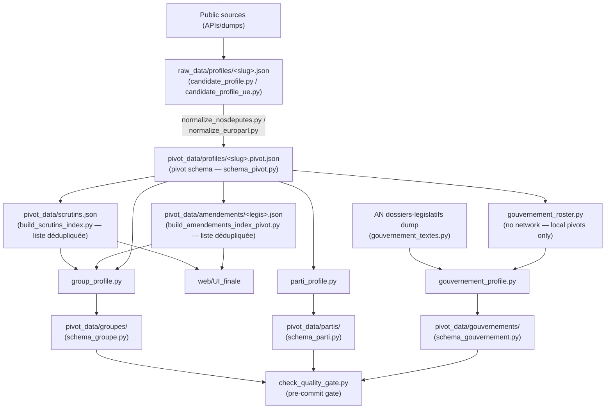

# AGENTS.md - Instructions for AI agents

Non-negotiable rules, schema conventions, validation constraints for every session.
"Why" behind each decision: `docs/technical_decisions.md` (anchors below).
Commands, structure, coverage limits: `README.md`.

---

## 1. Product

**Empreinte politique** — "Politics made clear". Factual, sourced political CVs
(mandates, votes, texts, interventions) for 2027 presidential candidates.
`CONTRECHAMP` (`web/`) is the interface design lab. `web/UI_finale` (React 19 + Vite) is
the current production interface, wired to real pivot data (`#web-v3-ui`). Earlier design
generations — `v1`-`v7`, including the `v3` editorial reference — are archived under `web/old/`.
`web/UI_finale` navigation: **Candidats** · **Groupes** (real parliamentary groups) ·
**Gouvernement** (real governments) — no Partis tab.
Positioning, naming, target audience: `docs/technical_decisions.md#positionnement`.

## 2. Non-negotiable editorial rules

Duplicated in `schema_pivot.py`, `validate_profil()`, and `web/old/v3/methodologie.html`.
Any schema/display change must preserve them:

1. No value judgments, no score, no ranking.
2. Full traceability: every fact must map to a primary source.
3. No individual attendance rate is ever published.
4. A 49.3 procedure is never treated as a vote position (separate procedural fact).
5. Missing data means missing data, never default `0`.
6. `position_dans_hemicycle` always requires a verifiable `source_url` (enforced by `validate_profil()`).
7. Group ratios published only with numerator + denominator + sufficient coverage; otherwise `N/D`.
   Individual-vs-group gaps are **internal quality control** only, never public.
8. Thematic tags are reading aids, not declared candidate positions.

## 3. Pipeline

- `raw_data/` = source-near (votes stay denormalized there); `pivot_data/` = only layer `web/` reads.
- **`pivot_data/scrutins.json`** (schema `scrutins-v1`, `#432`): the deduplicated ballot list,
  shared by profiles **and** groups — the groups' 4 104 ballots are entirely included in the
  profiles' 17 422, so one list serves both. Build it with
  `src/build_scrutins_index.py`, **before** any pivot pass — resolving a ballot's `legislature`
  is a corpus-wide join (`src/scrutins_legislature.py`), never per-profile. Merged additively:
  a partial run must never drop ballots that other profiles' mappings still point at.
- **`pivot_data/amendements/<legislature>.json`** (schema `amendements-v1`, `#431`): the
  deduplicated amendment list, plus a companion `<legislature>.cosignatures.json`. 810 552
  (member, amendment) pairs for 207 238 distinct amendments, and **77,7 M co-signature entries
  for 4,96 M distinct** (× 15,7) — that N² is 1 083,9 Mo of the 1 342,4 Mo `amendements[]`
  weighed. A profile keeps only `{amendement_id, role_signataire}`; `amendement_id` is
  `an:<uid AN>`, and the legislature is read **inside** the uid, never derived from the date.
  **Sharded per legislature** because a single global file already weighs 130,1 Mo, past
  GitHub's 100 MB blob limit; co-signatures live apart because they are 59 % of the index and
  **no consumer reads them** — never deleted, a co-signature network is analysis material
  (#324). Build it with `src/build_amendements_index_pivot.py` (not
  `build_amendements_index.py`, which is the raw AN index) — **after** the pivot pass, and
  only once: nothing here needs a corpus-wide join. Merged additively, same reason as ballots.
- Together these are the **only cross-file dependencies** inside `pivot_data/`: a profile no
  longer reads alone for its votes nor for its amendments. Both must be in the workflow's
  `git add` — an uncommitted index leaves every mapping pointing at nothing, silently.
- **JSON write format**: individual profiles (`raw_data/profiles/`, `pivot_data/profiles/`)
  are written **compact** via `src/json_io.py` — 35 % of their volume was indentation
  alone (#433). Groupes, gouvernements, partis, rosters, audit reports stay `indent=2`.
  Never read a profile line by line; the format carries no meaning.
- Groups from `groupes_reels.json`; `group_roster.py` = 1 fetch per `(chambre, legislature)`.
- Governments from `gouvernements_reels.json`; `gouvernement_roster.py` derives `membres[]`
  from local pivots only; `gouvernement_textes.py` fetches the AN dossiers-legislatifs dump
  once per batch (`generate_gouvernement_profiles.py`).

**Additive merge (`merge_profile.py`)**: regeneration never removes collected data.
- `votes`, `mandats`, `interventions`: additive, old entry wins (`merge_lists_by_key`).
- `amendements`, `textes_portes`: new entry wins (`merge_dossier_records`) — allows stage/outcome correction.
  An amendment's merge key is its `amendement_id`, or — for an unresolved entry — the record kept
  under `amendement_non_resolu`; keying on the mapping alone would collapse every unresolved entry into one.
- Scalars: new value if populated, else keep old (never regress to `null`).
Full rationale + exceptions: `docs/technical_decisions.md#fusion`.

**Tests in CI (`.github/workflows/tests.yml`, #473)**: the full suite runs on every PR
and every push to `main`, and a failure fails the job. **No test may read `pivot_data/`
or `raw_data/profiles/`, write anywhere under `pivot_data/`/`raw_data/`, or hit the
network** — acceptance tests on real profiles use frozen fixtures under `tests/fixtures/`
(#457). This is enforced, not just audited: the job sparse-checks-out only what the suite
reads, so the corpus is absent from the CI disk. Watch for CLI/function **defaults**
pointing into the repo — that is how nine tests were silently reading 66 MB of corpus.
`tests/conftest.py` enforces the network half structurally (#488): an `autouse` fixture cuts
`requests.Session.send` and fails loudly, naming the URL. **Loopback stays open** — 11 tests
serve fixtures from `127.0.0.1`; the criterion is leaving the machine, not speaking HTTP.
It exists because one per-process request turned 62 existing tests into a 13,4 s file with
nothing failing.
Test-only dependencies go in `requirements-dev.txt`.
See `docs/technical_decisions.md#ci-tests-pytest`.

**CI/CD (`.github/workflows/generate-data.yml`)**: `cold_start=true` = full purge, `--no-merge`.
`cold_start=false` = additive merge, cache restored.
In both modes, threshold = `inputs.threshold` (default 3).
Commit only if `check_quality_gate.py` exits 0. See `docs/technical_decisions.md#ci-cd`.

**`collect_interventions=true` is a different job (#498)**: it adds the NosDéputés
search, the Syceron debate archives and the QE/QG/QOSD archives — extraction measured
at **8-18 s** without it, **59-286 s** with (32 shards, four runs). `extract-an`'s
`timeout-minutes` is therefore conditional on the input (5 / 9), and the collection
bounds *itself* with `--budget-interventions-secondes` (240 s in CI, per candidate,
shared across both chambers). Never raise one without the other — a shard killed by
`timeout-minutes` writes **no profile at all** (`Publication : 0 profil(s)`, all 12
killed shards of runs 32302557156 and 32379928098), while an exhausted budget
writes the partial profile and declares the truncation in `meta.warnings[]`
(§2.5). Guarded by
`tests/test_ci_budget_interventions.py`.
See `docs/technical_decisions.md#budget-collecte-interventions`.

**Every collection path must declare what it does with interventions (#501)**:
`extract-an` follows the input, `extract-roster-groupes` and `extract-senat`
hard-code `--skip-interventions`. The Senate one collects nothing because
nothing it collects is ever kept — `archive.nossenateurs.fr` publishes
`url_nossenateurs`, `fetch_intervention_details` reads `url_nosdeputes`, so every
Senate intervention is classified `mention` and dropped (0 of 789 published
interventions come from the Senate). A new invocation of `generate_all_profiles.py`
must be added to the inventory in `tests/test_ci_interventions_par_job.py` with its
mode, and any job that ignores the input must be named in the input's description.
See `docs/technical_decisions.md#interventions-senat-501`.

**One artifact = one job's contribution (#450)**: an extraction job publishes only the
profiles it actually wrote — never `raw_data/profiles/`, which its `actions/checkout` also
filled with the committed baseline. Enforced by `generate_all_profiles.py --manifest-out`
+ `.github/actions/publish-written-profiles`; guarded by `tests/test_ci_publication_profils.py`.
Republishing the baseline made the additive merge reunite a profile's stale and corrected
versions, defeating `--no-merge` and inflating volumes every run, and made sharded jobs
collide under `merge-multiple` so only one shard's work survived. The baseline needs no
artifact: `merge-and-pivot` checks out the repo and `merge_raw_dirs` only rewrites slugs
present in the artifacts. See `docs/technical_decisions.md#publication-scopee-artifacts`.

**An empty collection never overwrites a non-empty one (#465)**: under `--no-merge`, a field
that comes back with **zero** entries never replaces one that had some — per field, not per
profile. A non-empty result overwrites normally, so a key correction still lands (#440 replaced
2 018 amendements with 944). Lifted only by `--autoriser-collecte-vide`, and the preservation is
always printed, never silent. Same principle as #427 on governments: *distinguish "zero observed"
from "incomplete collection"* — a `[]` returned by a failing API is not a measured fact (rule 5).
Profiles were the only place not applying it, which cost 18 721 amendements and 1 016 votes on
`jean-luc-melenchon`, and 23 textes portés on `marine-le-pen` **with no warning in the profile**.
See `docs/technical_decisions.md#collecte-vide-necrase-jamais`.

**Bicameral collection is for candidates only (#488)**: `build_profile_any_chambre` queries
**both** chambers — instead of stopping at the first that returns an identity — only when
`meta.provenance == "candidat_declare"` (8 of 209 profiles). A `roster_groupe` member keeps the
historical first-answer-wins behaviour: no Senate group is ever aggregated (both published
`groupe-Senat-*.json` carry `cohesion_votes: 0`, no usable Senate dataset exists), so a roster
member's Senate past feeds nothing, and collecting it costs 2 requests at ~9,5 s median each —
**+30,6 min per roster shard**, +4 h at full scale. A candidate's Senate past is *biographical*,
which is why it is worth those 16 requests. Two warning types reach the published
`meta.warnings`: `carrière sur deux chambres` (candidates only) and `collecte de chambre en
échec` (**all profiles** — it only fires on a real exception, and a chamber silently picked by
an outage is exactly §2.5). When both answer, the **first of `CHAMBRES` wins by documented
convention** — deriving `chambre` from the mandates is #486's sub-issue D and would erase the
other career. No mandate is ever merged across chambers here, and #492 merged none either.
`--source an`/`--source senat` stay scoped whatever the provenance, tested.
See `docs/technical_decisions.md#deux-chambres-interrogees`.

**A profile's chambers are derived, and the fallback is declared (#493)**:
`chambres` is recomputed from `mandats[].chambre` by `schema_pivot.deriver_chambres()`;
`chambre` is its head. **Call `appliquer_chambres()` after any mutation of `mandats[]`** —
a derived field is recomputed, never merged: `merge_lists_by_key` makes `merged["mandats"]`
a *superset* of both sides, so a merged `chambres` would describe a mandate set that exists
in neither (the mirror image of the `backfill_mandat_chambre` trap in #492). The collection
chamber — *which dataset answered* — is **always unioned in**, never substituted and never
dropped: two stricter rules were measured and reverted on the 209 published profiles of
`b2c34f4`, flipping 7 then 1 profile from `AN`/`Senat` to `PE`, because removing an observed
chamber is a deletion. That fallback is usable, not verified — it is wrong on at least 20
measured profiles, including **18 senators published `chambre: "AN"`**, the same 18 that have
no `mandat_electif` at all. What keeps it from being misleading is that it is **declared**:
one `chambres du profil non corroborée` warning per profile names the unbacked chambers
(§2.5), and its corpus count is the migration meter — 208 of 209 today. Measured read-only on
both pipeline paths: **0** scalar divergence, `population_an` 207 → 207,
`MAPPING_CHAMBRE_SOURCES` 209 → 209, loss check non-blocking. Consumers are **not** migrated
here (#494). `chambre`'s retirement condition — both consumers migrated *and* the warning
gone from the whole corpus — is written in
`docs/technical_decisions.md#chambres-profil-derivees`; without a written criterion this
transitional would become permanent, as #431's and #432's read fallbacks did.
Guarded by `tests/test_chambres_profil.py`.

**A group's eligibility window is chamber-scoped (#492)**:
`group_profile._member_eligibility_intervals` took the **union** of all `mandat_electif`, so
a chamber change mid-legislature extended the window past the member's departure from the
Assembly and counted him absent on ballots he could no longer vote — a false cohesion
denominator (§2.7). It now filters on the group's chamber (threaded through
`_derive_membre_entry`, `_compute_cohesion_votes`, `_aggregate_mandats`,
`compute_ecarts_cohesion_internes`). Two rules make it a fix and not a new defect: a mandate
with `chambre: null` is **kept** — excluding it would shrink a published denominator on
missing data, so on today's unstamped corpus the filter changes **no** published
denominator — and "no elective mandate at all" (`None` → eligible by default) stays distinct
from "elective mandates, none in this chamber" (`[]` → never eligible). Falling back on
`groupe_politique` mandates does **not** work: 398 of them on 188 profiles, **0 open**.
See `docs/technical_decisions.md#chambre-par-mandat-electif`.

**Loss check before commit (#460, scope extended by #470)**: `merge-and-pivot` runs
`src/audit_diff_profils.py --ref HEAD` **before** the commit step, over **all of
`pivot_data/`** — the five published layers plus the two shared indexes. Three findings
abort the commit: a file that **disappeared**; a **drop on a stable list** (profiles:
`votes`, `mandats`, `textes_portes`, `interventions`, `tags_thematiques`,
`dossiers_legislatifs` — groupes: `membres`, `cohesion_votes`, `mandats_agreges`,
`tags_thematiques_agreges`, `historique_noms` — partis: `candidats`,
`tags_thematiques_agreges` — gouvernements: `membres`, `textes`); a **watched scalar going
from populated to `null`** (`parti`, `groupe`, `chambre`, `identite`, `meta.provenance`,
`premier_ministre`, `meta.couverture_roster.roster_total`…). Reported but **non-blocking**:
drops on `amendements` and `sources`, drops in the shared indexes' distinct-entry counts,
and any scalar **value change** (A → B) — measured over 13 committed transitions, every
`populated → null` was a real defect and nearly every value change was a legitimate
normalisation. A run may legitimately lose entries — declare it with the
`allow_declared_losses` input, never by removing the check. Guarded by
`tests/test_ci_controle_perte_profils.py` and `tests/test_audit_diff_agregats.py`.
Why it exists: `collect_interventions=false` (skip collection, intended) combined with
`overwrite_profiles=true` (rewrite without what wasn't collected, also intended) erased the
corpus's 789 interventions — and with them 647 `tags_thematiques` and 497 aggregated tags,
all **published** fields. The quality gate could not catch it: it measures a *level*, not a
*variation*. Why the scope grew: with only profile list-lengths watched, SOC-16's
`cohesion_votes` fell 814 → 0 (a **published denominator**, §2.7) and `parti` regressed to
`null` on three profiles, both while the check was running.
See `docs/technical_decisions.md#controle-de-perte-avant-commit` and
`#perimetre-controle-perte`.

**Referential integrity before commit (#485)**: `merge-and-pivot` also runs
`src/audit_integrite_referentielle.py --pivot-dir pivot_data`, right after the
loss check and before the commit. Every published key must resolve in the shared
index it points at — `votes[].scrutin_id` and a groupe's
`cohesion_votes[].scrutin_id` in `scrutins.json`, `amendements[].amendement_id`
in `amendements/<legislature>.json`. An **orphan reference** aborts the commit,
naming the file and the key (§2.5): a key that doesn't resolve is a vote
published with no object, and on a groupe a **false denominator** (§2.7). So do
a missing index/shard, and a `null` key **without** its `scrutin_non_resolu` /
`amendement_non_resolu` record — **with** that record it is the normal shape of
an EP amendment and never blocks. Reported but non-blocking: **index entries
nobody references**, at 0 today but a legitimate state — additive merge means an
entry outlives its referent by design. Measured at `01ffa7f`: 0 orphans out of
1 347 451 references, 3,02 s / 162,0 Mio, a separate process from the loss check
so the job's peak stays 186,6 Mio. **`allow_declared_losses` does not disarm
it** and must never be merged with `allow_broken_references`: a loss can be
legitimate, an orphan reference cannot. This is an **invariance in one state**,
not a variation over time — which is why `audit_diff_profils` cannot cover it.
Guarded by `tests/test_audit_integrite_referentielle.py` and
`tests/test_ci_integrite_referentielle.py`.
See `docs/technical_decisions.md#integrite-referentielle-pivot`.

**Quality gate**: hard fail on IncompleteRead > threshold or invalid/missing groupe or
gouvernement file; soft warnings on low interventions, low coverage, network signals,
partial identifier coverage inside a profile's `amendements[]` (§3c — measured on
`amendement_id` since #431, on `uid` for profiles predating it: the measure follows the field — two versions of the same
amendment cohabiting, so the entry is counted twice and the published denominators are
wrong; #447, cause #450 — soft on purpose: mixed profiles were expected during the
remediation window, and failing the gate would have blocked the very runs meant to fix
them. The window is closed: 179 AN profiles at 100 % `uid`, 0 mixed, at `a125e9e`.
**The `uid` measurement follows the amendments, not the record**: it covers every profile
that *publishes* `amendements[]`, whatever its `chambre` — a profile can stop being
counted without stopping being published, and 18 721 published amendments were invisible
to it until then. The "AN candidates" counters and the "empty everywhere" regression
signal keep the narrower population, the one amendments are *expected* from. See
`docs/technical_decisions.md#cache-amendements-existence-nest-pas-conformite`),
and amendements index freshness (§3d: distinguishes "never built" from "present but stale
beyond N days without a successful rebuild" from "frozen" — légis 14/15/16 are closed
dossiers, their index is committed under `raw_data/amendements_an_figes/` and never
re-fetched, see `docs/technical_decisions.md#amendements-legislatures-figees`). Gouvernement
section (§5) mirrors groupes (§4): couverture ministérielle (portefeuille attribution),
empty `textes[]`, IncompleteRead are soft; broken structure is hard — see #212.

## 4. Pivot schema v1 (`src/schema_pivot.py`)

| Key | Content |
|---|---|
| `id` | The profile's **slug** — its filename, **no provenance prefix** (#487). `nosdeputes:`/`nossenateurs:` derived from whichever chamber answered the collection, so it *changed value* on an unchanged career (two profiles flipped, in opposite directions, between `25f7bc7` and `01ffa7f`). Provenance stays where it is true: `sources[].type`, `identite.source_url`, `meta.provenance`. Standalone tools with no slug (`mep_profile.py --ep-id`) keep an explicit source id — better that than a slug invented from a collected name. See `docs/technical_decisions.md#id-pivot-sans-prefixe`. |
| `nom`, `chambres`, `chambre`, `parti`, `groupe` | `chambres` (#493) is the **derived list** of chambers the person sat in, values from `KNOWN_CHAMBRES`, ordered by `ORDRE_CHAMBRES` (`AN`, `Senat`, `PE`, `mairie`). `chambre` is `chambres[0]` — never collected, never able to contradict it (`validate_profil` enforces it). Both come from `schema_pivot.deriver_chambres()`, the single factory. See `docs/technical_decisions.md#chambres-profil-derivees` |
| `identite` | Nullable bio block |
| `sources[]` | `{type, url, synchro_le}` |
| `mandats[]` | Elections, committees... + sensitive fields (Section 5). `mandats[].chambre` (#492) is written **only on `mandat_electif`**: `AN`/`Senat`/`PE`/`null`, meaning *the chamber whose dataset returned this mandate*, stamped at collection. Never derived from `source_url` (0 of 214 AN/Senate elective mandates carry one) nor from the profile's `chambre` (additive merge accumulates mandates from both chambers in one profile). `null` + one aggregated warning per profile, never a default. See `docs/technical_decisions.md#chambre-par-mandat-electif` |
| `votes[]` | **Mapping only** (`#432`): `{scrutin_id, position}`. The ballot's metadata (date, text, sort, type_vote…) lives once in `pivot_data/scrutins.json`, not once per voter — 179,8 → 17,9 Mo + 8,1 Mo of shared index, −85,5 %. AN legislatures 14-17 aggregated (`#403`) |
| `textes_portes[]` | Author/reporter/co-reporter + procedural stage |
| `amendements[]` | **Mapping only** (`#431`): `{amendement_id, role_signataire}`. Outcome, inadmissibility, date, `co_signataires`… live once in `pivot_data/amendements/<legislature>.json`, not once per signatory — 1 342,4 → 73,8 Mo of mapping + 130,1 Mo of shared index, −84,8 %. `role_signataire` is the only member-specific field |
| `interventions[]` | Speeches, questions (`type_detail`) |
| `tags_thematiques[]` | 8 stable categories (`STABLE_THEMES`), via `classify_keywords()`. |
| `meta` | `schema_version`, `genere_le`, `licence_donnees`, `warnings[]`, `provenance` (`candidat_declare`\|`roster_groupe`, see `docs/technical_decisions.md#provenance-pivot`) |

Conventions: French `snake_case`; missing = `null` (never `""` or `0`); closed values in
`frozenset KNOWN_*`, validated by `validate_profil()` — extend the frozenset, never bypass.

## 5. Sensitive institutional fields (validation constraints)

- `mandats[].position_dans_hemicycle`: requires `source_url` (rule 6).
- `mandats[].suspendu_pour_fonction_gouvernementale`: never confuse with completed mandate.
- `votes[].type_vote == "motion_censure"` requires `texte_lie_id`; 49.3 → `sort = "adopte_sans_vote_49_3"`, no position (rule 4).
- `votes[].numero_scrutin` restarts at 1 in each legislature: never a key on its own.
  Dedupe by AN `uid` **at index level** (`raw_data/scrutins_an_figes/`, where the AN
  `uid` exists); key group cohesion by `(legislature, numero)` — see
  `docs/technical_decisions.md#votes-multi-legislature`. A profile's `votes[]` carries no
  `uid`: its key is `(legislature, numero_scrutin)`, and 22,5 % of collected votes have no
  `legislature` at all. Resolve it with `src/scrutins_legislature.py` — labelled-twin join
  first, legislature calendar second, loud failure third; never a default (rule 5). Audit
  the corpus with `src/audit_legislature_votes.py` before relying on the key
  (`docs/technical_decisions.md#resolution-legislature-votes`).
- `amendements[].sort == "irrecevable"` requires `base_juridique_irrecevabilite` (`"art. 40"` or `"art. 45"`).
  Since `#431` both fields live in the shared index: the invariant followed them, into
  `validate_amendements_index()` — checked once per amendment, not once per signatory.
  What `validate_profil()` can no longer check alone is that a referenced `amendement_id`
  exists: it does so **only if** `amendements_index=` is passed, and skips it otherwise —
  never declares it valid by default.
- `amendements[].type_deposant`: never aggregate adoption rates across depositor types (rule, Section 6).
- Amendements cache (`.cache/amendements_an/<leg>/`): **a directory that exists is not
  evidence of what it holds.** Presence checks must also check the key format — a frozen
  cache written before the `uid` correction is skipped by `build_amendements_index.py` and
  refused by `_read_cached_amendements_acteur` at once, losing the whole legislature in
  silence. And the shard directory is published by a single `os.replace` from a temp dir,
  never filled in place: a half-written directory reads as "this member has no amendments"
  instead of "index unavailable". That atomicity is what makes the single-shard format
  check legitimate — do not fill in place.
  See `docs/technical_decisions.md#cache-amendements-existence-nest-pas-conformite`.
- **A disk cache prevents a re-download, never a re-parse.** Any shared index read
  once per candidate must be memoised in-process — third occurrence of the same
  cost at the same spot (#392 amendements, #403 scrutins, #467 AN acteurs/organes:
  2 255 re-reads of one index for 24 members, 59 % of wall time). Key the memo on the
  index **path**, never on a logical name: tests patch the cache dir per case, and a
  global memo leaks one test's index into the next (the trap that reverted #377).
  See `docs/technical_decisions.md#budget-execution-pleine-echelle-467`.
- An amendment with no AN `uid` gets **no invented key**: `amendement_id: null` plus its full
  record under `amendement_non_resolu`. That is the normal shape for European Parliament
  amendments, which ParlTrack ships without an AN uid.
- **Never re-materialise the flat form.** `joindre()` is a generator and `get()` returns the
  shared object itself, never a copy — expanding index × mapping cost a ~21 × factor and an
  OOM in `#377`. Locked by `tests/test_amendements_index.py`.
Edge-case history: `docs/technical_decisions.md#cas-limites`.

## 6. Metrics: public vs internal

| Metric | Status |
|---|---|
| `textes_portes[]` (stage ≥ `examine_commission`) | Public |
| `textes_portes[]` below threshold | Via explicit user toggle — not published by default |
| `amendements[]` raw counts + `par_type_deposant` | Public |
| Adoption rate across all submitter types | **Never** (misleading) |
| `votes[]` bill vote (`vote_texte`, latest reading) | Public |
| 49.3 / no-confidence motion | Public, labeled as procedural fact |
| Individual attendance/presence | **Never public** (rule 3) |
| Group `cohesion_votes[]` | Public, with numerator/denominator |
| Individual gaps vs group cohesion | Internal only (`--rapport-interne`) |
| `mandats[].notableCount` | Internal only (display ordering) |
| `tags_thematiques[]` (8 categories) | Public |

Full rationale: `web/old/v3/methodologie.html` — do not duplicate prose here.

## 7. Sources and licenses (reuse implications)

| Source | License | Constraint |
|---|---|---|
| NosDeputes.fr / NosSenateurs.fr | ODbL v1.0 | Share-alike if published as downloadable dataset |
| data.assemblee-nationale.fr / questions.assemblee-nationale.fr | Licence Ouverte / Open Licence (Etalab) | Attribution only |
| Parltrack (JSON dumps) | ODbL v1.0 | Share-alike if republished as downloadable dataset |
| European Parliament (data.europarl.europa.eu, www.europarl.europa.eu) | EP Legal Notice (reuse policy, attribution-based) | Attribution only |
| French Wikipedia | CC BY-SA 4.0 | Verbatim quotes only (not current use) |
| Wikidata | CC0 1.0 | No restriction |

Site HTML = ODbL "Produced Work" (attribution sufficient). Downloadable raw data → share-alike.
Full details: `docs/technical_decisions.md#licences`.

## 8. End-of-task documentation upkeep

Before finishing a task, update only what actually changed — skip a file if nothing changed for it:

| File | Update when |
|---|---|
| `AGENTS.md` | New agent-facing rule, command, or constraint. Rare edit; stay terse. |
| `README.md` | New setup step, script, or user-visible workflow/command. |
| `docs/technical_decisions.md` | New architectural choice or trade-off. Dated entry: context, decision, alternative rejected. |
| `ROADMAP.md` | Task closes a known bug, or a new idea is identified but not acted on now. Keep entries to one line; put rationale in `technical_decisions.md` instead. |
| `requirements.txt` | A new package is imported that isn't already listed. Pin the version actually installed/tested (`==`), don't add unpinned entries. |
| `requirements-dev.txt` | A new **test-only** package is imported. Same pinning rule; it already pulls `requirements.txt` via `-r`. |

Never create a missing file from this list without flagging it first.

## 9. Agent chat verbosity

Keep chat replies short — this file and `docs/` already hold the rationale;
don't restate it in the chat.

- 1-3 sentences per turn, no preamble, no "in summary" recap.
- Report changes as: files touched + one-line reason. Skip what you read/considered.
- Test/command output: pass/fail counts only, unless something failed.
- Always flag in the chat: schema/validation changes, anything touching
  rules in Section 2, new warnings/errors introduced, or a choice between
  multiple valid approaches — even briefly.
- Everything else (files read, intermediate reasoning, alternatives
  considered but discarded) can be omitted from the chat.
  
## References

- `src/schema_pivot.py`, `schema_groupe.py`, `schema_parti.py`, `schema_gouvernement.py`: structure contracts.
- `src/check_quality_gate.py`: quality gate (4 sections). Hard vs soft fail logic.
  Amendements coverage/freshness are deliberately never hard fails — see
  `docs/technical_decisions.md#amendements-zero-pas-de-hard-fail`.
- `docs/an_opendata.md`: AN open-data JSON schemas.
- `docs/extract-*.md`: per-source extraction jobs (sources, chain, artifacts).
- `docs/pipeline-profiles-groupes.md`: profile→groupe pipeline details.
- `docs/hatvp_opendata.md`: HATVP lobby-register — out of short-term scope.
- `src/json_io.py`: profile JSON write format (compact vs indented, #433).
- `docs/technical_decisions.md`: full rationale (`#positionnement`, `#fusion`, `#cas-limites`, `#licences`, `#ci-cd`, `#ci-tests-pytest`, `#web-v3-ui`, `#hors-perimetre`, `#profils-json-compact`).
- `ROADMAP.md`: known bugs + unscheduled ideas, kept short (not read
  automatically — consult on request). Rationale for deferred items lives
  in `docs/technical_decisions.md#hors-perimetre`, not duplicated here.
