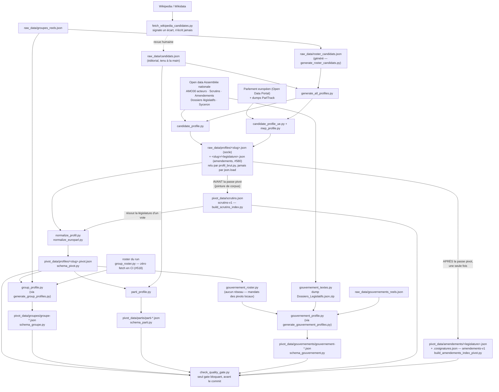
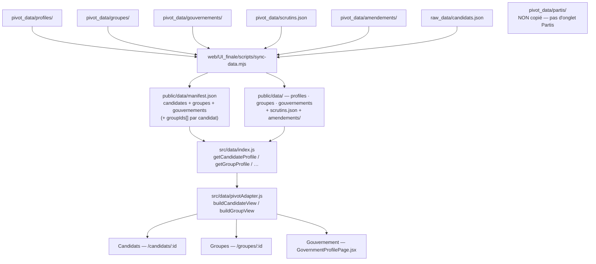

# Ce que devient la donnée — les six sorties de `pivot_data/`

Ce fichier décrit le **flux** : les sources, les fichiers, les schémas, la
volumétrie, et ce que le web lit. Il couvre les six sorties de `pivot_data/` —
`profiles`, `groupes`, `partis`, `gouvernements`, `scrutins.json`,
`amendements/`.

Trois voisins, et ce qui les sépare :

- **les règles** vivent dans `AGENTS.md` §2 et §3 — une règle derrière un lien
  est une règle qu'on manque ;
- **le pourquoi** vit dans `docs/decisions/`, un fichier par décision, indexé
  par `docs/technical_decisions.md` ;
- **ce que fait un run** — les huit jobs, le formulaire, les caches, les
  artifacts, les budgets, le push, la relance automatique — vit dans
  [`workflow-generate-data.md`](./workflow-generate-data.md). Ce fichier-ci n'en
  redit rien : il décrit ce qui est écrit, pas comment le run l'écrit.

Volumétrie mesurée le **30/08/2026** sur `origin/main` (`ad2cd016`), sur le
corpus **committé** — pas sur un run local.

---

## Les deux couches

| Couche | Ce que c'est | Qui la lit |
|---|---|---|
| `raw_data/` | **au plus près de la source** — les votes y restent dénormalisés, chaque amendement y porte sa liste de cosignataires | la normalisation pivot, les deux constructeurs d'index, les audits |
| `pivot_data/` | le format commun à toutes les sources | **la seule couche que `web/` lit**, le quality gate, les agrégats |

Un profil brut n'est jamais publié tel quel. Un profil pivot ne se relit jamais
ligne à ligne : son format ne porte aucun sens (voir *Format d'écriture JSON*).

## Les sources

| Source | Ce qu'elle alimente | Périmètre |
|---|---|---|
| Open data de l'**Assemblée nationale** — référentiel acteurs AMO30, scrutins, amendements, dossiers législatifs, comptes rendus Syceron | tout le volet français : identité, mandats, votes, amendements, textes portés, interventions, roster de groupe, textes gouvernementaux | **source française unique depuis #529** |
| **Open Data Portal du Parlement européen** (+ dumps **ParlTrack** en enrichissement) | `mandat_europeen` du profil brut, normalisé par `normalize_europarl.py` | volet UE |
| **Wikipedia / Wikidata** (`fetch_wikipedia_candidates.py`) | un signalement d'écart sur la liste des candidats | **ne modifie jamais** `raw_data/candidats.json`, qui reste éditorial |

Deux sources ont été **retirées**, et ce fichier les nomme pour que personne ne
les recherche :

- **NosDéputés.fr / NosSénateurs.fr ne sont plus interrogés (#529, 27/08/2026)**.
  Le transport, la recherche d'interventions, le scraping HTML et le repli de
  roster sont partis d'un bloc. Ce qui **reste** est de la lecture du corpus déjà
  publié, jamais de la collecte : les valeurs `nosdeputes`/`nossenateurs` de
  `sources[].type`, l'attribution ODbL due aux champs déjà publiés (#530), et les
  interventions déjà collectées, qu'aucune régénération ne retire.
  → `docs/decisions/retrait-nosdeputes-529.md`
- **Le Sénat est hors périmètre (#528)**, décision **éditoriale** : le job
  `extract-senat` est retiré, `candidate_profile.build_profile` n'accepte plus
  que `chambre="deputes"`, et les deux fiches `groupe-Senat-*.json` déjà publiées
  restent en place, gelées. Un certificat renouvelé ne rouvre rien : la reprise
  exige les trois conditions écrites au §7 de la décision.
  → `docs/decisions/retrait-senat-528.md`

## Le flux



**Les deux index sont construits depuis les profils BRUTS, pas depuis les
pivots** — c'est le brut qui garde l'enregistrement complet du vote et la liste
des cosignataires ; le pivot n'en a plus que la clé. Et ils ne se construisent
pas au même moment : voir *Les deux index partagés*.

## Les deux sources d'entrée de l'extraction individuelle

`generate_all_profiles.py --candidats` accepte deux fichiers, qui pilotent deux
périmètres différents :

| Source | Fichier | Qui la produit | Portée | `meta.provenance` |
|---|---|---|---|---|
| Éditoriale (défaut) | `raw_data/candidats.json` | tenue à la main | candidats/présidentiables déclarés ou pressentis — **13** au 30/08/2026 | `candidat_declare` |
| Roster-driven | `raw_data/roster_candidats.json` | `generate_roster_candidats.py`, depuis `raw_data/groupes_reels.json` | tous les membres réels des groupes configurés **dont l'extraction n'est pas suspendue** — 5 des 7 depuis le 24/08/2026 (#516), les 2 groupes Sénat étant gelés | `roster_groupe` |

Même format d'entrée, même pipeline de collecte et de normalisation. Un même
`slug` peut apparaître dans les deux : `merge_profile.merge_pivot_profile()` ne
rétrograde **jamais** un profil `candidat_declare` vers `roster_groupe`, la
source éditoriale prime.
→ [`docs/decisions/provenance-pivot.md`](./decisions/provenance-pivot.md)

En CI, la voie roster-driven est un job dédié, `extract-roster-groupes`, distinct
d'`extract-an`/`extract-ue-officiel` et fixé au **mode d'extraction léger**
(`--skip-interventions --skip-dossiers-legislatifs`, #357).
→ [`extract-roster-groupes.md`](./extract-roster-groupes.md)

## Le profil brut n'est plus un fichier (#580)

`amendements` pesait **96,7 % du plus gros profil brut** (54,15 des 56,00 Mo,
mesuré sur le corpus de #580) ; huit fichiers dépassaient l'avis GitHub à 50 Mo
et **cinquante-quatre** les 45 Mo — les mêmes députés cosignant les mêmes
amendements, ils franchissent la ligne *ensemble* à chaque correction de
collecte.

Chaque amendement portant déjà sa `legislature`, la liste est **partitionnée sur
un champ déjà présent** :

- `raw_data/profiles/<slug>.json` — le profil **moins** `amendements`, plus un
  manifeste `amendements_partitionnes` à sa place exacte ;
- `raw_data/profiles/<slug>/<legislature>.json` — une tranche par législature.

56,0 → 23,4 Mo pour le plus gros profil, **pas un octet perdu**. Ce n'est **pas**
la normalisation écartée par #434 : rien n'est dédupliqué, dénormalisé ni élagué.
`votes`, `mandats`, `interventions` restent dans le socle.

Lecture : **`src/profil_brut.py`, jamais `json.load` direct**.
`charger_profil_brut()` accepte les deux formes (monolithique et partitionnée),
`iter_amendements_du_profil()` diffuse tranche par tranche, et une partition
cassée lève `PartitionIllisible` au lieu de rendre une liste vide. Écriture :
toujours la forme partitionnée, donc un run complet migre le corpus tout seul ;
migration hors run par `src/migrer_profils_partitionnes_580.py`, idempotent.

Le plus gros fichier versionné est un garde-fou surveillé : `src/garde_fou_blobs.py`
est la **§7 du quality gate** — avertissement à 50 Mio, **échec du commit à
80 Mio**. Ni « monter le seuil » ni « supprimer de la donnée » n'est un remède
disponible.

→ `docs/decisions/partition-profils-legislature-580.md`

### Ce que porte un profil brut

Le socle, champ par champ — c'est la matière que la normalisation pivot
reprend :

| Champ | Contenu |
|---|---|
| `identite` | nom, groupe politique, profession, circonscription… |
| `mandats` | **tous** les mandats électifs (#640 : une entrée par siège, regroupée sur `(legislature, dateDebut)` d'AMO30 — plus le seul mandat courant) **et** les responsabilités réelles, avec rôle, dates et drapeau `actif` |
| `votes` | positions de vote et leur source (`votes_source`, qui liste **toutes** les législatures couvertes). Chaque vote porte sa `legislature` et son `url_source` — la page du scrutin AN — puisqu'un profil couvre désormais plusieurs législatures |
| `dossiers_legislatifs` | les dossiers législatifs de la chambre. Renommé `textes_portes` dans le pivot ; son `id` (`DLR5L15N37607`, 472 / 472) y devient `dossier_id` depuis #639 — même nom que `gouvernements/*.json` → `textes[].dossier_id` |
| `interventions` | prises de parole : date, sujet, texte, rôle du moment, format estimé sur la longueur. Source depuis #510 : les comptes rendus Syceron de l'AN **uniquement**, plus les questions officielles QE/QG/QOSD — le repli par recherche NosDéputés a été retiré, donc une collecte vide **reste vide** et se déclare dans `meta.warnings[]` |
| `amendements_partitionnes` | le manifeste des tranches, à la place exacte qu'occupait `amendements` (#580) |
| `mandat_europeen` | présent seulement si le candidat a des enregistrements au Parlement européen |
| `meta.warnings` | la transparence sur les collectes manquantes ou incomplètes |
| `meta.synchro_sources` | un horodatage ISO-8601 par source |

## Format d'écriture JSON

Les profils individuels (`raw_data/profiles/`, `pivot_data/profiles/`) sont
écrits **compacts** via `src/json_io.py` : l'indentation représentait 35 % de leur
volume (#433). Groupes, partis, gouvernements, rosters et rapports d'audit
restent en `indent=2`, parce qu'ils se relisent à l'œil.

Un profil ne se lit jamais ligne à ligne : le format ne porte aucun sens.
→ `docs/decisions/profils-json-compact.md`

## Les deux index partagés

Ce sont les **seules dépendances entre fichiers** de `pivot_data/` : un profil
publié ne se lit plus seul, ni pour ses votes ni pour ses amendements. Les deux
doivent entrer dans le `git add` du workflow — un index non committé laisse
chaque mapping pointer sur rien, **silencieusement**.

Ils ne sont pas construits au même moment, et la différence n'est pas
d'organisation :

| | `pivot_data/scrutins.json` | `pivot_data/amendements/` |
|---|---|---|
| Schéma | `scrutins-v1` (#432) | `amendements-v1` (#431) |
| Construit par | `src/build_scrutins_index.py` (CLI), ou `generate_all_profiles.py` en cours de run | `src/build_amendements_index_pivot.py` (CLI), ou `generate_all_profiles.py` |
| Quand | **avant** la passe pivot — et **une seconde fois après**, dans un run qui collecte : les profils écrits pendant la boucle n'existaient pas au premier appel | **après** la passe pivot, **une seule fois** |
| Pourquoi cet ordre | résoudre la `legislature` d'un scrutin est une **jointure de corpus** (`src/scrutins_legislature.py`) : le jumeau étiqueté vit dans un autre profil. La normalisation a besoin de l'index. | la clé d'un amendement est son `uid` AN, et sa législature se lit **dans** l'uid. Rien à résoudre ; un passage préalable relirait 1,5 Go pour rien. |
| Lu depuis | `raw_data/profiles/` | `raw_data/profiles/` |
| Fusion | additive (sauf `--no-merge`) ; le second passage fusionne **toujours** | additive (sauf `--no-merge`) |

Une passe partielle ne doit jamais retirer des entrées que d'autres profils
référencent encore — c'est la leçon de #450, au niveau de l'index. Un scrutin
dont la législature reste irrésoluble fait **échouer** la construction : l'index
n'est pas écrit amputé, et aucune valeur par défaut n'est posée (AGENTS.md §2.5).

`amendement_id` vaut `an:<uid AN>`, et la législature se lit **dans** l'uid,
jamais depuis la date. Un profil pivot ne garde que
`{amendement_id, role_signataire}`, et pour un vote que `{scrutin_id, position}`.

**L'index des amendements est shardé par législature** : un fichier global unique
dépasserait la limite de blob de 100 Mo de GitHub. Les cosignatures vivent dans
un fichier compagnon `<legislature>.cosignatures.json` (schéma
`amendements-cosignatures-v1`) parce qu'elles font la majorité de l'index et
qu'**aucun consommateur ne les lit** — elles ne sont **jamais supprimées** pour
autant : un réseau de cosignatures est de la matière d'analyse (#324).

Législatures 14/15/16 : dossiers clos, index AN bruts committés sous
`raw_data/amendements_an_figes/` et jamais re-téléchargés
(`docs/decisions/amendements-legislatures-figees.md`) ; même principe pour
`raw_data/scrutins_an_figes/`. Ces index-là se construisent **une fois, hors
ligne** (`src/build_amendements_index_figees.py`,
`src/build_scrutins_index_figes.py`) : la procédure et ses modes de défaillance
sont dans `docs/decisions/amendements-legislatures-figees.md` et
`docs/decisions/votes-multi-legislature.md`.

### Ce que les deux index ont fait gagner

Mesuré sur les **209 profils committés** du corpus de #431/#432 — la population
est celle-là, pas le corpus d'aujourd'hui :

| Scrutins (#432) | avant | après |
| --- | --- | --- |
| `votes[]` dans les profils | 179,8 Mo | 17,9 Mo |
| index partagé | — | 8,1 Mo |
| **total** | **179,8 Mo** | **26,0 Mo (−85,5 %)** |
| `cohesion_votes` des groupes | 6,23 Mo | 3,41 Mo (−45,3 %) |

| Amendements (#431) | avant | après |
| --- | --- | --- |
| `amendements[]` dans les profils | 1 342,4 Mo | 73,8 Mo de mapping |
| index partagé (méta) | — | 54,4 Mo |
| index partagé (cosignatures) | — | 75,7 Mo |
| **total** | **1 342,4 Mo** | **203,8 Mo (−84,8 %)** |

Le même index de scrutins sert les profils **et** les groupes : les 4 104
scrutins des groupes sont tous inclus dans les 17 422 des profils. Un fichier
d'amendements global unique pèserait déjà 130,1 Mo — au-delà de la limite
GitHub de 100 Mo par blob — et une législature portant aussi ses cosignatures
atteindrait 120,3 Mo pour la XV<sup>e</sup> à couverture complète : d'où un
fichier par législature, plus un compagnon.

### La `legislature` d'un scrutin, et pourquoi elle se résout

`votes[].numero_scrutin` repart à 1 à chaque législature : la clé d'un scrutin
est `(legislature, numero_scrutin)`. Or **22,5 % des votes collectés ne portent
aucune législature** (chemin de collecte antérieur à #403). `src/scrutins_legislature.py`
la résout par deux mécanismes, jamais confondus : jointure sur un **jumeau
étiqueté** (la donnée existe déjà ailleurs, étiquetée), puis **calendrier des
législatures** (une dérivation, tracée comme telle). Ce qu'ils ne résolvent pas
**échoue bruyamment** — jamais de valeur par défaut (AGENTS.md §2.5), et l'index
n'est pas écrit amputé.

Avant de se fier à la clé, `src/audit_legislature_votes.py` fait la passe de
corpus qui dit si elle est utilisable (voir
[`commandes.md`](./commandes.md)). Rapport de référence :
`audit/legislature_votes_20260819.md`.
→ `docs/decisions/resolution-legislature-votes.md`

### La qualification d'un scrutin (#639)

Une entrée de `scrutins.json` porte, depuis #639, ce que
`typeVote.codeTypeVote` dit du scrutin — un champ que l'archive renseigne sur
**18 311 / 18 311** scrutins bruts et que la projection jetait :

| `codeTypeVote` | `type_scrutin` | `type_vote` | Publiés (17 748) |
|---|---|---|---:|
| `SPO` | `public_ordinaire` | `vote_texte` | 17 312 |
| `SPS` | `solennel` | `vote_texte` | 361 |
| `MOC` | `motion_censure` | `motion_censure` | 66 |
| `SAT` | `tribune` | `vote_texte` | 9 |
| absent / inconnu | `null` | `null` | 0 |

S'y ajoute `demandeur` (« Président du groupe … », « Conférence des
présidents »), renseigné sur 17 664 des 17 748. Le tout pèse +1,52 Mo,
soit ~10,2 Mo pour l'index.

Une entrée `motion_censure` porte `texte_lie_id: null` **et**
`texte_lie_non_resolu.motif` : le scrutin AN ne publie aucune référence
législative (0 / 18 311), et une motion de l'article 49 alinéa 2 n'a pas de
texte à lier. `vote_texte` reste **grossier** — `SPO` couvre indifféremment un
vote sur un article, un amendement ou un texte entier.

**Les index figés de `raw_data/scrutins_an_figes/{14,15,16}` portent encore
l'ancienne projection à cinq champs et sont refusés** : chaque run retélécharge
ces archives (20,0 Mo) tant que `build_scrutins_index_figes.py --toutes` n'a pas
été relancé.
→ `docs/decisions/qualification-scrutins-et-cle-dossier-639.md`

→ `docs/decisions/normalisation-votes.md`,
`docs/decisions/normalisation-amendements.md`

## Fusion additive : ce que la régénération ne retire jamais

`merge_profile.py`, appelé à chaque régénération sauf `--no-merge` :

| Champ | Règle |
|---|---|
| `votes`, `mandats`, `interventions` | additif, l'ancienne entrée gagne (`merge_lists_by_key`) |
| `amendements`, `textes_portes` | la nouvelle entrée gagne (`merge_dossier_records`) — permet de corriger un stade ou une issue |
| scalaires | nouvelle valeur si renseignée, sinon on garde l'ancienne — jamais de régression vers `null` |

Clé de fusion d'un amendement : son `amendement_id`, ou — pour une entrée non
résolue — l'enregistrement conservé sous `amendement_non_resolu`. Se clé sur le
seul mapping ferait s'effondrer toutes les entrées non résolues en une seule.

Les agrégats (groupes, partis, gouvernements) passent par
`merge_profile.load_existing_document` et
`preserve_stable_freshness_timestamps` : une régénération ne fait pas bouger un
horodatage de fraîcheur qui n'a pas de raison de bouger.

→ `docs/decisions/collecte-vide-necrase-jamais.md`, et les autres entrées de
fusion indexées par `docs/technical_decisions.md`.

## Les six sorties publiées

| Sortie | Produite par | Schéma | Volumétrie au 30/08/2026 |
|---|---|---|---|
| `pivot_data/profiles/` | `normalize_profil.py`, `normalize_europarl.py` | `src/schema_pivot.py` | **481** fiches committées, 623 Mo |
| `pivot_data/groupes/` | `group_profile.py` (roster réel + pivots locaux) | `src/schema_groupe.py` | **7** fiches, 11 Mo |
| `pivot_data/partis/` | `parti_profile.py` (agrégation éditoriale) | `src/schema_parti.py` | **10** fiches, < 1 Mo |
| `pivot_data/gouvernements/` | `gouvernement_roster.py` + `gouvernement_textes.py` → `gouvernement_profile.py` | `src/schema_gouvernement.py` | **10** fiches, < 1 Mo |
| `pivot_data/scrutins.json` | index partagé, ci-dessus | `scrutins-v1` | **17 748** scrutins, 9 Mo (~10,2 Mo une fois la qualification de #639 régénérée) |
| `pivot_data/amendements/` | index partagé, ci-dessus | `amendements-v1` + `amendements-cosignatures-v1` | **484 132** amendements distincts, 259 Mo (index + compagnons) |

Populations, pour qu'aucun de ces chiffres ne se lise de travers : les 481
profils sont les **fiches committées**, pas les candidats déclarés (13) ni les
membres du roster ; les 484 132 amendements sont les entrées **distinctes de
l'index publié**, pas les paires (membre, amendement) ; les 17 748 scrutins sont
ceux de l'index publié, profils **et** groupes confondus — les scrutins des
groupes y sont entièrement inclus, une seule liste sert les deux.

Détail par législature de l'index des amendements :

| Législature | Amendements distincts | Amendements portant au moins un cosignataire |
|---:|---:|---:|
| 14 | 59 358 | 59 358 |
| 15 | 206 771 | 131 714 |
| 16 | 121 110 | 82 355 |
| 17 | 96 893 | 79 726 |
| **Total** | **484 132** | **353 153** |

### `pivot_data/profiles/` — les profils individuels

Le socle de tout le reste : les trois agrégats ne lisent que ça. Produits par
`generate_all_profiles.py --pivot` (ou `--pivot-only`, sans réseau) depuis les
profils bruts. Les données manquantes restent `null`, jamais `0` (AGENTS.md
§2.5). L'`id` d'un pivot est son **slug**, sans préfixe de provenance (#487) : la
provenance vit dans `sources[].type`, `identite.source_url` et
`meta.provenance`.

Le schéma pivot v1 est défini dans `src/schema_pivot.py` ; **le contrat clé par
clé est dans `AGENTS.md` §4**, avec les contraintes de validation en §5. À quoi
ressemble un fichier :

```json
{
  "schema_version": "1",
  "id": "jean-luc-melenchon",
  "nom": "Jean-Luc Melenchon",
  "chambres": ["AN"],
  "chambre": "AN",
  "parti": null,
  "groupe": "La France Insoumise",
  "sources": [
    {"type": "assemblee_nationale", "url": "https://www2.assemblee-nationale.fr/deputes/fiche/OMC_PA1234", "synchro_le": "2026-07-29T..."},
    {"type": "assemblee_nationale", "url": "https://data.assemblee-nationale.fr/", "synchro_le": "2026-07-29T..."}
  ],
  "identite": { },
  "mandats": [ ],
  "votes": [ ],
  "textes_portes": [ {"titre": "...", "dossier_id": "DLR5L15N37607", "role": "auteur", "...": null} ],
  "amendements": [ ],
  "interventions": [ ],
  "tags_thematiques": ["budget", "fiscalite"],
  "meta": {"schema_version": "1", "genere_le": "...", "warnings": [],
           "provenance": "candidat_declare", "licence_donnees": "...",
           "provenance_champs": {"identite": {"profession": {
               "source": "assemblee_nationale", "synchro_le": "..."}}}}
}
```

Trois pièges de lecture, sur ce fichier précisément :

- **`meta.provenance_champs` et `meta.provenance` ne disent pas la même chose**
  (#603). Le second dit *pourquoi ce profil existe* (`candidat_declare` /
  `roster_groupe`) ; le premier dit *d'où vient chaque valeur d'`identite`, et
  de quand*. Il ne décrit **que** `identite`, seul bloc composé champ par champ
  (#601), et il est **facultatif** : les 481 profils publiés avant ce lot ne le
  portent pas. Une provenance inconnue s'y lit `{"source": null,
  "synchro_le": null}` — elle ne s'omet jamais.
  Ne pas le confondre non plus avec `couverture`, qui dit *pourquoi une liste
  est vide*, à la maille de la liste métier et non du champ.
  → `docs/decisions/provenance-par-champ-603.md`

- **`sources[].type` peut valoir `nosdeputes` / `nossenateurs` sur un profil
  publié**, alors qu'une collecte fraîche ne produit plus qu'`assemblee_nationale`
  depuis #529. Ce sont des valeurs **valides** de `KNOWN_SOURCE_TYPES` : les
  retirer ferait rejeter par `validate_profil()` le corpus qu'on vient de
  publier. #530 a mesuré qu'elles ne disparaissent pas d'elles-mêmes —
  `merge_pivot_profile` unit `sources[]` par type, donc une entrée déjà publiée
  survit à une collecte AN, et l'attribution ODbL reste due.
- **`meta.licence_donnees` est dérivé, jamais constant** : `src/licences.py` le
  recompose depuis `sources[]` après chaque étape qui les change. Ne jamais
  écrire un libellé de licence en dur ailleurs.
  → `docs/decisions/licence-lot-6-530.md`

### `pivot_data/groupes/` — les groupes parlementaires réels

Les groupes à produire sont déclarés dans `raw_data/groupes_reels.json` : **7
entrées**, dont **2 suspendues** (`Senat:LR`, `Senat:SER`) depuis le 24/08/2026.
Une entrée `extraction_suspendue` est **ignorée sans être un échec** : ni fetch,
ni régénération, et sa fiche déjà publiée reste en place, gelée à sa dernière
génération réussie (#516, `docs/decisions/extraction-groupe-suspendue-516.md`).

`generate_group_profiles.py` mutualise **un seul roster par couple (chambre,
législature)** — la source n'expose pas d'endpoint par groupe, le filtrage par
sigle se fait côté client (`group_roster.filter_roster_by_sigle`). En CI il n'y a
**aucun fetch** : `--rosters-bruts` relit le roster brut collecté au début du run
(artifact `roster-candidats`), ce qui garantit que la composition publiée est
celle du corpus collecté, et non une liste relue ~7 min plus tard (#518,
`docs/decisions/plafond-roster-et-commit-518.md`).
Un roster indisponible fait sortir le script en **2**, pas en 1 : aucune fiche
n'a été touchée, donc le run peut committer le reste ; un vrai plantage de
génération reste en 1 et fait échouer le step.

`group_profile.py` **n'interroge pas le réseau** : il agrège des pivots locaux —
membres et périodes, cohésion de vote par scrutin, tags thématiques agrégés,
mandats agrégés (catégoriel : `commission`, `commission_enquete`,
`mission_information`, `groupe_etudes`, `delegation`, `groupe_amitie`,
`extra_parlementaire` — voir `MANDATS_AGREGES_CATEGORIES`, périmètre élargi par
#382, `docs/decisions/taxonomie-mandats-typeorgane-an.md`), amendements agrégés
avec ventilation par sort et par type de déposant. Une entrée de
`mandats_agreges` porte **deux comptages distincts et un dénominateur**, jamais
un nombre unique (#656,
`docs/decisions/mandats-agreges-siege-vs-passe-656.md`) : `nb_membres_actifs`
— **qui y siège** —, `nb_membres_cumul_historique` — **qui y est passé**,
adhésions d'un jour comprises — et `effectif_reference`, la couverture
disponible du groupe qui sert de dénominateur aux deux. 1 165 des 2 708
adhésions de commission publiées par les 7 fiches (43 %) durent une journée ou
moins, parce qu'un⋅e député⋅e n'appartient qu'à une commission permanente à la
fois et que toute bascule temporaire y est écrite comme un mandat à part
entière : sous le seul `nb_membres` d'avant, la fiche `AN-LFI-16` faisait siéger
67 de ses 76 membres à la commission des finances, quand ils sont 5. `poids_relatif` a disparu avec
lui — il ne disait plus de laquelle des deux grandeurs il était le poids. `amendements_agreges` compte
les amendements **distincts** portés par au moins un membre — un amendement
cosigné par trois d'entre eux en est un — et les **signatures** apposées par les
membres vivent à côté, sous `signatures` (#643,
`docs/decisions/amendements-distincts-et-signatures-643.md`) : les confondre
publiait « 2 600 765 amendements déposés » pour les 76 députés d'`AN:LFI`, avec
un facteur de × 5,0 à × 31,7 selon la fiche. La couverture roster/profils disponibles
est **tracée** (`meta.couverture_roster`), pour ne jamais confondre effectif réel
et effectif effectivement agrégé — un ratio ne se publie qu'avec numérateur,
dénominateur et couverture suffisante (AGENTS.md §2.7).

`membres[].debut_dans_groupe` / `fin_dans_groupe` sont les dates du **mandat de
groupe politique de la législature de la fiche**, que le roster porte déjà
(`mandat_debut` / `mandat_fin`) : transit écarté, organes successifs recollés
(#526). Elles ne sont **pas** dérivées des mandats électifs du profil — depuis
#647 un profil porte toute sa carrière, et « premier mandat électif » datait
l'entrée dans un groupe de la XVIe à 2002 (#653,
`docs/decisions/dates-appartenance-groupe-653.md`). Sans roster, ou pour un
membre qu'il ne rend pas, les deux dates sortent `null` et `meta.warnings` les
compte : jamais de repli sur le mandat électif.

`effectif.actuel` compte les membres **sans date de fin d'appartenance dans
cette législature**, ce qui n'est pas « les élu·es en fonction aujourd'hui ».
Une législature close referme toutes ses appartenances : les cinq fiches AN de
la XVIe y valent **0**, et la composition du groupe à sa clôture se lit dans
`membres[]`. L'interface prend `meta.couverture_roster.roster_total` pour son
compteur, jamais `effectif.actuel`.

À ne pas confondre avec le job CI `extract-roster-groupes`, qui utilise aussi
`group_roster.py` (via `generate_roster_candidats.py`) mais pour produire des
profils **individuels** bruts couvrant tous les membres du roster, en amont de
l'agrégation faite ici. → [`extract-roster-groupes.md`](./extract-roster-groupes.md)

### `pivot_data/partis/` — l'agrégation éditoriale

Logique **distincte** du groupe parlementaire réel, et c'est le point qui compte :
un « parti » ici est le regroupement des **candidats déclarés** de
`raw_data/candidats.json` partageant un même label. Ils peuvent n'avoir aucun
mandat commun, voire aucun mandat. `schema_parti.py` interdit donc, par
construction :

- **aucune `cohesion_votes`** — rien ne garantit qu'ils aient siégé ensemble ni
  voté sur les mêmes scrutins ;
- **aucun `amendements_agreges`** — un taux agrégé sur une ou deux personnes
  hétéroclites n'est pas un comparateur ;
- **aucun effectif façon groupe** — `meta.nb_candidats_declares` documente la
  taille de l'**échantillon éditorial**, jamais celle du parti ni de son groupe
  parlementaire.

`parti_profile.py` n'interroge pas le réseau ; les pivots individuels doivent
déjà être sur disque. **Cette couche n'est pas publiée sur le web** :
`sync-data.mjs` ne la copie pas, et `web/UI_finale` n'a pas d'onglet Partis
(AGENTS.md §1).

### `pivot_data/gouvernements/` — les gouvernements

**10 fiches** publiées, déclarées dans `raw_data/gouvernements_reels.json` —
Fillon II et III, Philippe I et II, Castex, Borne, Attal, Barnier, Bayrou,
Lecornu II (le seul dont `periode.fin` est `null`). La liste est **éditoriale et
validée à la main**, comme `groupes_reels.json` : ce n'est pas la série complète
des gouvernements de la Ve République, et elle ne prétend pas l'être — la période
2012-05-10 → 2017-05-18 n'y figure pas, Lecornu I non plus.
Deux matériaux, jamais mélangés :

- **la composition** — `gouvernement_roster.py`, **aucun appel réseau** : il
  parcourt les pivots individuels déjà sur disque et en extrait les mandats
  `categorie == "fonction_gouvernementale"`. Un membre n'est retenu que si le
  libellé du mandat correspond **exactement** au `libelle_an` déclaré dans la
  config **et** que la période chevauche celle du gouvernement — l'AN n'expose
  que `organe.libelleAbrege` (« BORNE », « LECORNU II »), ambigu entre deux
  gouvernements homonymes lors d'un remaniement. Un ministre qui change de
  portefeuille produit **une entrée `membres[]` par période**, jamais un
  portefeuille choisi arbitrairement parmi les siens. `premier_ministre` se dérive
  du même matériau et reste `null` si aucun profil local ne porte le mandat —
  jamais une valeur déduite du nom du gouvernement (AGENTS.md §2.5) ; c'est le cas
  des 7 Premiers ministres sans profil pivot dans le dépôt.
  `portefeuille` (#398) vient des mandats `typeOrgane == "MINISTERE"`, mais le
  label ne suffit **pas** : un parlementaire en mission (art. LO144) porte le même
  type de mandat, avec pour label le ministère **auprès duquel** il est missionné.
  Seule `mandats[].fonction` les sépare — liste blanche `FONCTIONS_MINISTERIELLES`
  (#474, `docs/decisions/parlementaire-en-mission-nest-pas-ministre.md`).
  `portefeuille` retombe à `null` avec un warning si aucune `source_url` n'est
  traçable, le schéma l'exigeant dès que l'intitulé est renseigné.
- **les textes** — `gouvernement_textes.py`, seule fonction réseau du lot
  (`ensure_dossiers_zip_downloaded`), lit le dump AN `Dossiers_Legislatifs.json.zip`
  (une archive par législature, #400, dédupliquées par uid, la législature la plus
  élevée faisant foi). L'origine gouvernementale (art. 39) se lit sur le **type du
  document déposé** — préfixe de l'uid du `texteAssocie` de l'acte `*-DEPOT` le
  plus ancien : `PRJL` = projet de loi, `PION` = proposition, `PNRE` = résolution.
  `procedureParlementaire.code` ne sert que de repli, et **jamais** pour les codes
  5 et 7 (« projet **ou** proposition »), parce que deviner violerait
  AGENTS.md §2.5.

`gouvernement_profile.py` combine les deux : c'est **lui** qui rattache un texte à
un gouvernement, par recouvrement de `date_depot` avec la période — jamais par
date de conclusion, un texte déposé sous A puis conclu sous B restant crédité à A.
Il résout aussi `textes[].initiateurs` vers un `membre_id` quand l'`acteurRef`
correspond à un membre retenu ; sinon l'`acteurRef` brut est conservé avec
`membre_id = null`, jamais rattaché à un profil approchant (#435).
`comptages.par_statut` est un **dénombrement**, aucun taux ni pourcentage nulle
part (AGENTS.md §2.1). Le 49.3 est un booléen `sort_49_3` porté par le texte,
jamais fusionné avec une position de vote (AGENTS.md §2.4).

`generate_gouvernement_profiles.py` ne fetch le dump et ne charge les pivots
qu'**une seule fois** pour tout le batch — miroir de `generate_group_profiles.py`,
et c'est aussi ce qui interdit le double-comptage d'un texte entre deux
gouvernements requêtés séparément. Comme pour les groupes, une collecte réseau
incomplète sort en **2** (`EXIT_COLLECTE_INCOMPLETE`) et **aucun profil n'est
réécrit** (#427).

**La couverture des textes a une borne, et elle est publiée.** Les archives de
dossiers ingérées couvrent les législatures **XV à XVII**, à partir du
**21/06/2017** (`src/couverture_dossiers.py`, `borne_couverture_textes()`).
Avant cette borne, un `textes[]` vide n'est **pas** « aucun texte porté » : c'est
une absence de source, qui ne doit jamais se lire comme un fait mesuré
(AGENTS.md §2.5). Sur les 10 gouvernements déclarés au 30/08/2026 :
**6 couverts**, **1 partiel** (Philippe II, à cheval sur la borne) et **3 hors
couverture** (Fillon II, Fillon III, Philippe I). La même borne est reprise
côté web (`GOVERNMENT_TEXTS_COVERAGE_START` dans `pivotAdapter.js`) et
`tests/test_couverture_dossiers.py` échoue si les deux valeurs divergent.

**Limite propre à cette vue** : `gouvernement_textes.py` ne lit que le dump AN.
Un texte dont le Sénat est la chambre de dépôt *primaire* n'est jamais vu, alors
que `schema_gouvernement.py` expose `chambre_depot_initial` (`"AN"` | `"Senat"`)
et pourrait laisser croire à une couverture bicamérale complète.
→ `docs/decisions/gouvernement-doc-cloture.md`,
`docs/decisions/hors-perimetre.md`

Un `docs/pipeline-gouvernement.md` séparé avait été proposé en #214 puis laissé
en suspens : cette section le rend inutile — un seul fichier décrit les six
sorties.

## Du pivot au web (`web/UI_finale`)



- `sync-data.mjs` copie les artefacts vers `public/data/` (Vite ne sert pas de
  fichiers situés hors du dossier du projet) et génère `manifest.json`. Il
  **signale** l'absence de `scrutins.json` ou de `pivot_data/amendements/` au lieu
  de la taire : sans ces index, les votes et les amendements s'afficheraient
  vides.
- Le manifeste liste les candidats **déclarés** de `raw_data/candidats.json`,
  filtrés sur l'existence d'un profil sur disque — ne pas fabriquer la promesse
  d'une page absente. `groupIds[]` est rattaché par candidat pour permettre le
  filtrage côté client sans télécharger les fiches de groupe (certaines dépassent
  500 Ko).
- `src/data/index.js` expose l'API de fetch (`getCandidateProfile`,
  `getGroupProfile`, `getCandidatesList`, `getGroupsList`) ;
  `src/data/pivotAdapter.js` transforme le pivot en objets d'affichage : KPIs, tri
  des votes, classification thématique, classification hémicycle
  majorité/opposition.
- Les trois onglets sont **Candidats**, **Groupes**, **Gouvernement**. Il n'y a
  pas d'onglet Partis : `pivot_data/partis/` reste une sortie de données, pas une
  page.

## Contrôles

**`src/check_quality_gate.py` est le seul gate bloquant**, exécuté avant le
commit de données. Ses sections, dans l'ordre :

| Section | Ce qu'elle contrôle | Bloquant ? |
|---|---|---|
| 1 | `IncompleteRead` dans les profils pivot, groupes, partis, gouvernements et profils bruts, contre un seuil | oui, au-delà du seuil |
| 2 | Couverture candidats (`raw_data/candidats.json` vs profils pivot) | non |
| 3 / 3b | Interventions faibles ; couverture Syceron | non |
| 3c / 3d | Couverture amendements AN ; fraîcheur de l'index | non (#378) |
| 3e | **Format** des index amendements figés — un index keyé par `numero` attribue des amendements au mauvais texte, ce n'est pas une donnée simplement périmée | **oui** |
| 4 | Groupes : fichier manquant, JSON invalide, schéma invalide (dur) ; effectif et couverture (souple) | oui sur le dur |
| 5 | Gouvernements — miroir de la §4 : fichier manquant, JSON invalide, schéma invalide (dur) ; couverture ministérielle, `textes[]` vide sur une période **couverte** par les archives, `IncompleteRead` (souple) | oui sur le dur |
| 5b | Correspondance slug ↔ acteur AN (`raw_data/correspondance_acteurs_an.json`) | **oui** |
| 6 | Couverture ParlTrack (optionnelle) | non |
| 7 | Garde-fou taille de blob (#580) : avertit à 50 Mio, **échoue à 80 Mio** | oui à 80 Mio |

Un gouvernement **hors couverture** des archives de dossiers n'est pas signalé
comme un défaut mais porté en information : l'absence y vient de la source, pas
des données (#399, AGENTS.md §2.5).

Les quatre contrôles supplémentaires exécutés avant le commit dans le job
`merge-and-pivot` — perte, intégrité référentielle, collecté/non publié,
collecté vs publié — sont décrits dans
[`workflow-generate-data.md`](./workflow-generate-data.md).

### Audits internes (manuels, jamais en CI)

Distincts du gate, sans score ni classement (AGENTS.md §2.1) :

- `src/audit_pivot_dataset.py` — `pivot_data/profiles`
- `src/audit_groupe_dataset.py` — `pivot_data/groupes` (volumétrie, complétude,
  cohérence, fraîcheur des sources, warnings agrégés, tableau croisé des volumes
  par groupe : membres, `cohesion_votes`, `tags_thematiques_agreges`,
  `amendements_agreges`)
- `src/audit_gouvernement_dataset.py` — `pivot_data/gouvernements` (mêmes axes,
  plus la présence de `premier_ministre`, le taux de `membres[].portefeuille`
  renseigné et les `comptages.par_statut` agrégés)
- `src/audit_pipeline.py` — point d'entrée manuel qui exécute **les trois**
  ci-dessus en appelant directement leurs fonctions (pas de sous-processus) et
  compile une « vue d'ensemble » : totaux audités, erreurs de lecture et warnings
  agrégés. Pure composition des rapports, aucune logique de calcul nouvelle.

`audit_pipeline.py` n'est **pas** intégré à `.github/workflows/generate-data.yml`
— choix explicite (#178) : usage manuel uniquement.

Les commandes de ces quatre audits, et celle qui régénère un rapport d'exemple
sur les fixtures figées plutôt que de lire un exemple committé (une commande ne
peut pas être périmée, un fichier figé si) : [`commandes.md`](./commandes.md),
section « Auditer ».

## Les commandes

Toutes regroupées par intention dans **[`commandes.md`](./commandes.md)** :
générer, auditer, vérifier avant de committer, opérer, voir ce que voit
l'utilisatrice.

Une seule mérite d'être rappelée ici, parce que c'est **l'ordre** qui compte et
qu'il est expliqué plus haut : quand un run a été interrompu, les deux index
partagés se reconstruisent à la main, les scrutins **avant** la passe pivot et
les amendements **après**.

```bash
python3 src/build_scrutins_index.py
python3 src/build_amendements_index_pivot.py
```

Les deux fusionnent additivement avec l'existant ; `--no-merge` reconstruit à
partir de zéro et exige donc le corpus **complet**.
