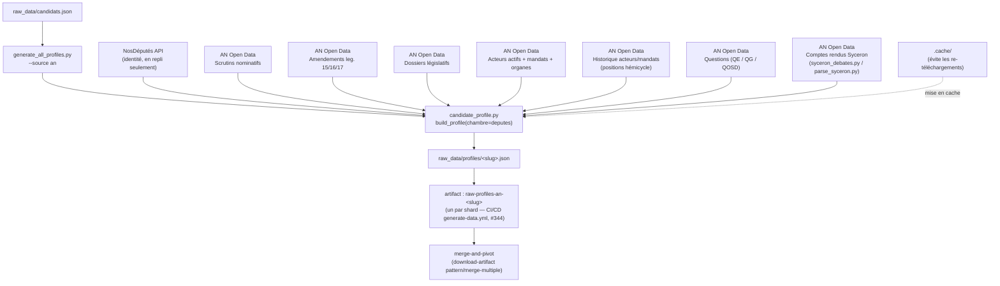

# extract-an

## Ce que fait ce job

Matrix strategy depuis #344 (voir `docs/technical_decisions.md#matrix-extract-an-par-candidat`) :
un job préparatoire léger `prepare-an-matrix` lit `raw_data/candidats.json` et calcule la liste
des slugs résolvables, puis `extract-an` tourne en un shard (un runner) par candidat, séquencés
un par un (`max-parallel: 1`). Chaque shard installe l'environnement Python, restaure
éventuellement le cache, puis lance :

```
python3 generate_all_profiles.py --source an --only <slug>
```

(avec `--no-merge` si `existing_profiles=overwrite` — `cold_start` ne purge
que les caches de téléchargement depuis #578). Voir `generate-data.yml`.

Le scope `--source an` force une extraction Assemblée nationale uniquement (députés), sans Sénat, sans UE.
Un candidat sans slug (liste éditoriale) est un no-op silencieux dans ce scope et n'a donc pas de shard.
Le profil brut produit par chaque shard va dans `raw_data/profiles/<slug>.json`, puis est uploadé comme
artifact `raw-profiles-an-<slug>` — `merge-and-pivot` télécharge tous les artifacts `raw-profiles-an-*`
d'un coup (`download-artifact` en mode `pattern`/`merge-multiple`).

> **#580 — un profil brut n'est plus un fichier.** `<slug>.json` est le
> **socle** (le profil sauf `amendements`) ; les amendements vivent en tranches
> sous `raw_data/profiles/<slug>/<legislature>.json`. L'artifact transporte les
> deux (`publish-written-profiles`), et la relecture passe par
> `src/profil_brut.py`, jamais par un `json.load` direct. Voir
> [`docs/technical_decisions.md#partition-profils-legislature-580`](technical_decisions.md#partition-profils-legislature-580).


**Pourquoi un shard par candidat plutôt qu'un seul job séquentiel** : le runner GitHub peut recevoir un
`shutdown signal` d'infrastructure qui gèle le job entier, y compris ses steps `if: always()`
(angle mort documenté dans `docs/technical_decisions.md#resilience-generate-data-shutdown-signal`
et `#228`) — la progression déjà écrite sur disque pour les candidats précédents serait alors perdue
avec le reste du job. Le sharding par candidat borne cette perte à un seul candidat : les shards
déjà terminés ont déjà uploadé leur artifact indépendamment.

---

## Schéma de flux



> **Priorité des votes** : scrutins nominatifs AN Open Data en premier ; endpoint votes NosDéputés en fallback uniquement.  
> **Amendements** : indexés par `acteurRef` (`PAxxxx`), avec mapping des états procéduraux. Lecture **cache-only** de `.cache/amendements_an/` (`_read_cached_amendement_index`) — ce job ne télécharge plus jamais les archives lui-même ; l'index est construit par le job dédié `extract-amendements-an` (`generate-data.yml`, voir `docs/technical_decisions.md#amendements-index-job-dedie-ci`), et une législature absente du cache produit un warning `meta.warnings` au lieu d'un téléchargement.  
> **Textes portés** : rôles factuels extraits des dossiers législatifs (auteur, rapporteur, co-rapporteur).  
> **Positions hémicycle** : issues des dumps acteurs historique — nécessitent `source_url` (règle éditoriale §6).  
> **Interventions Syceron** : texte intégral des séances téléchargé via `syceron_debates.py`, parsé via `parse_syceron.py`, indexé par `_build_acteur_interventions_syceron_index` — **une tranche par acteur** sous `.cache/syceron_an/<législature>/index_par_acteur/` — puis lu par `fetch_interventions_syceron`. Depuis #510 (27/08/2026), c'est la **seule** source de débats : le repli NosDéputés (recherche + détail par document) a été retiré, et une collecte vide reste vide, déclarée dans `meta.warnings[]`. Voir `docs/technical_decisions.md#syceron-actif-510`.

---

## Logique d'extraction (chaîne interne)

1. `generate_all_profiles.py` lit les candidats de `raw_data/candidats.json`.
2. Pour chaque candidat (`source=an`), il appelle uniquement la chambre `deputes` via `build_profile` dans `candidate_profile.py`.
3. `candidate_profile.py` récupère l'identité (référentiel AN d'abord, NosDéputés en repli), puis enrichit avec les jeux AN officiels. La **recherche d'interventions NosDéputés a été retirée** (#510) : elle n'alimentait que le repli du chemin interventions.
4. Les votes sont prioritairement pris depuis l'open data AN (scrutins nominatifs), pas depuis le endpoint votes NosDéputés (fallback seulement).
5. Les amendements AN sont indexés par `acteurRef` (`PAxxxx`), avec mapping des états procéduraux — lus exclusivement depuis `.cache/amendements_an/` (jamais téléchargés par ce job, voir `docs/technical_decisions.md#amendements-index-cache-only-consumers`).
6. Les dossiers législatifs AN servent à produire les textes portés avec rôles factuels (auteur, rapporteur, co-rapporteur).
7. Les questions parlementaires (QE/QG/QOSD) sont transformées puis ajoutées aux interventions.
8. Les comptes rendus de séance Syceron (L15/L16/L17) sont téléchargés via `syceron_debates.py`, parsés par `parse_syceron.py`, et les interventions de l'élu sont extraites et fusionnées dans `interventions[]`.
9. Des enrichissements identité/mandats AN existent aussi via les dumps acteurs (actifs + historique), dont les positions hémicycle.
10. Les données sont mises en cache sous `.cache/` pour éviter les re-téléchargements massifs.

---

## Sources associées

| Source | Contenu |
|---|---|
| NosDéputés API | Identité (repli, quand l'acteur est absent des archives AN) |
| [AN Open Data](https://data.assemblee-nationale.fr/static/openData/repository) | Base de référence |
| Scrutins nominatifs | Votes (source prioritaire) |
| Amendements (leg. 15/16/17) | Amendements + états procéduraux |
| Dossiers législatifs (bulk) | Textes portés, rôles factuels |
| Acteurs actifs + mandats + organes | Identité, mandats |
| Historique acteurs/mandats/organes | Positions hémicycle |
| Questions (QE/QG/QOSD) | Interventions écrites et orales |
| Comptes rendus Syceron | Texte intégral des prises de parole en séance (L15/L16/L17) |

Référentiel documentaire détaillé : [`an_opendata.md`](./an_opendata.md).

---

## À ne pas confondre

| Job | Périmètre |
|---|---|
| **extract-an** | AN / NosDéputés uniquement |
| `extract-ue-officiel` | Parlement européen |
| `merge-and-pivot` | Fusion et normalisation finale |

Tout est orchestré dans `generate-data.yml`.
