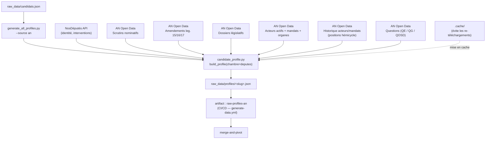

# extract-an

## Ce que fait ce job

Il installe l'environnement Python, restaure éventuellement le cache, puis lance :

```
python3 generate_all_profiles.py --source an
```

(avec `--no-merge` si `fresh_run=true`). Voir `generate-data.yml`.

Le scope `--source an` force une extraction Assemblée nationale uniquement (députés), sans Sénat, sans UE.  
Les profils bruts produits vont dans `raw_data/profiles/`, puis sont uploadés comme artifact `raw-profiles-an`.

---

## Schéma de flux



> **Priorité des votes** : scrutins nominatifs AN Open Data en premier ; endpoint votes NosDéputés en fallback uniquement.  
> **Amendements** : indexés par `acteurRef` (`PAxxxx`), avec mapping des états procéduraux.  
> **Textes portés** : rôles factuels extraits des dossiers législatifs (auteur, rapporteur, co-rapporteur).  
> **Positions hémicycle** : issues des dumps acteurs historique — nécessitent `source_url` (règle éditoriale §6).

---

## Logique d'extraction (chaîne interne)

1. `generate_all_profiles.py` lit les candidats de `raw_data/candidats.json`.
2. Pour chaque candidat (`source=an`), il appelle uniquement la chambre `deputes` via `build_profile` dans `candidate_profile.py`.
3. `candidate_profile.py` récupère l'identité NosDéputés, la synthèse, les interventions, puis enrichit avec les jeux AN officiels.
4. Les votes sont prioritairement pris depuis l'open data AN (scrutins nominatifs), pas depuis le endpoint votes NosDéputés (fallback seulement).
5. Les amendements AN sont indexés par `acteurRef` (`PAxxxx`), avec mapping des états procéduraux.
6. Les dossiers législatifs AN servent à produire les textes portés avec rôles factuels (auteur, rapporteur, co-rapporteur).
7. Les questions parlementaires (QE/QG/QOSD) sont transformées puis ajoutées aux interventions.
8. Des enrichissements identité/mandats AN existent aussi via les dumps acteurs (actifs + historique), dont les positions hémicycle.
9. Les données sont mises en cache sous `.cache/` pour éviter les re-téléchargements massifs.

---

## Sources associées

| Source | Contenu |
|---|---|
| NosDéputés API | Identité, interventions, synthèse |
| [AN Open Data](https://data.assemblee-nationale.fr/static/openData/repository) | Base de référence |
| Scrutins nominatifs | Votes (source prioritaire) |
| Amendements (leg. 15/16/17) | Amendements + états procéduraux |
| Dossiers législatifs (bulk) | Textes portés, rôles factuels |
| Acteurs actifs + mandats + organes | Identité, mandats |
| Historique acteurs/mandats/organes | Positions hémicycle |
| Questions (QE/QG/QOSD) | Interventions écrites et orales |

Référentiel documentaire détaillé : [`an_opendata.md`](./an_opendata.md).

---

## À ne pas confondre

| Job | Périmètre |
|---|---|
| **extract-an** | AN / NosDéputés uniquement |
| `extract-senat` | Sénat |
| `extract-ue-officiel` | Parlement européen |
| `merge-and-pivot` | Fusion et normalisation finale |

Tout est orchestré dans `generate-data.yml`.
