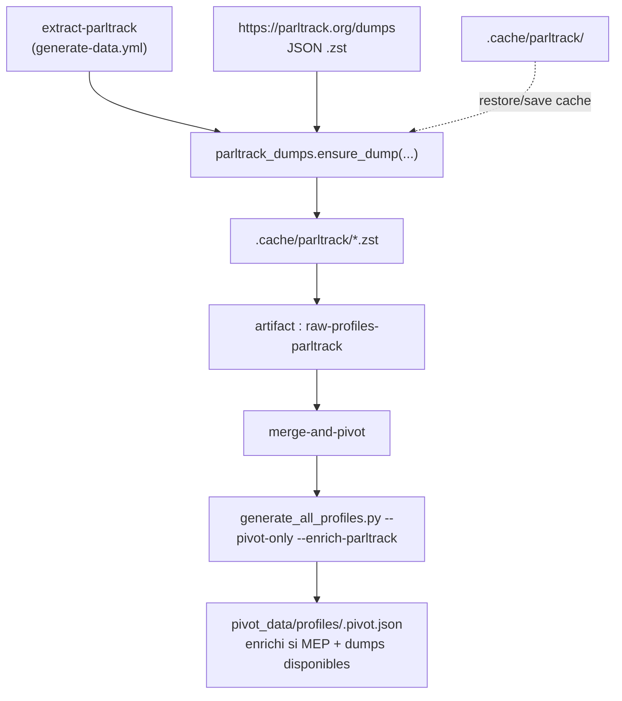

# extract-parltrack

## Ce que fait ce job

Il installe l'environnement Python, restaure éventuellement le cache `.cache/parltrack`, puis télécharge les dumps ParlTrack requis via `src/parltrack_dumps.py`.

Ce job **ne génère pas de profils candidats** directement. Il prépare les dumps `.zst` consommés plus tard par `merge-and-pivot`.

Voir `.github/workflows/generate-data.yml` (job `extract-parltrack`, `continue-on-error: true`).

Les dumps mis en cache sont uploadés comme artifact `raw-profiles-parltrack`.

---

## Schéma de flux

> **Résilience** : `continue-on-error: true` signifie qu'un échec/timed out ParlTrack ne bloque pas `merge-and-pivot`.  
> **Fallback** : si les dumps sont absents, l'étape pivot ajoute un warning de fallback au lieu d'inventer des données.

---

## Logique d'extraction (chaîne interne)

1. Le job tente de restaurer `.cache/parltrack` (sauf `cold_start=true`).
2. Avec `cold_start=true`, le cache ParlTrack est purgé puis les dumps sont re-téléchargés.
3. L'étape Python appelle `ensure_dump(...)` pour :
   - `ep_dossiers.json.zst`
   - `ep_plenary_amendments.json.zst`
   - `ep_amendments.json.zst`
4. Les dumps présents dans `.cache/parltrack/` sont publiés dans l'artifact `raw-profiles-parltrack`.
5. Dans `merge-and-pivot`, `generate_all_profiles.py --pivot-only --enrich-parltrack` enrichit les pivots MEP via `normalize_parltrack_dumps.py`.

---

## Sources associées

| Source | Contenu |
|---|---|
| [ParlTrack dumps](https://parltrack.org/dumps) | Dossiers, amendements plénière, amendements comité |
| `src/parltrack_dumps.py` | Téléchargement/cache local des dumps |
| `src/normalize_parltrack_dumps.py` | Mapping des dumps vers `textes_portes[]` / `amendements[]` pivot |

Référentiel pipeline global : [`pipeline-profiles-groupes.md`](./pipeline-profiles-groupes.md).

---

## À ne pas confondre

| Job | Périmètre |
|---|---|
| `extract-an` | Profils bruts AN |
| `extract-ue-officiel` | Profils bruts UE (API officielle EP) |
| **extract-parltrack** | Téléchargement de dumps `.zst` pour enrichissement pivot |
| `merge-and-pivot` | Fusion des profils bruts + enrichissement ParlTrack + sorties pivot/groupes/partis |

Tout est orchestré dans `.github/workflows/generate-data.yml`.
