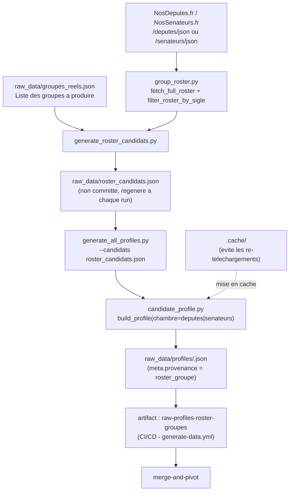

# extract-roster-groupes

## Ce que fait ce job

Il installe l'environnement Python, restaure éventuellement le cache `.cache`,
construit la liste roster-driven puis lance l'extraction individuelle sur
cette liste :

```
python3 src/generate_roster_candidats.py
python3 src/generate_all_profiles.py \
  --candidats raw_data/roster_candidats.json \
  --workers <workers> \
  --skip-existing --resume \
  [--limit <roster_extraction_limit>] [--max-pages <max_pages>] \
  [--no-merge] [--skip-interventions]
```

Voir `.github/workflows/generate-data.yml` (job `extract-roster-groupes`).

Contrairement à `extract-an` / `extract-senat` / `extract-ue-officiel`, ce job
ne part pas de la liste éditoriale `raw_data/candidats.json` mais de la
composition réelle des groupes parlementaires configurés dans
`raw_data/groupes_reels.json` — couverture de groupe complète (~750+
membres), pas seulement les candidats déclarés/pressentis. Voir
`docs/pipeline-profiles-groupes.md` (tableau des deux sources d'entrée).

---

## Rollout progressif (#188/#190/#192)

Ce job est un **déploiement progressif**, pas encore un run complet :

- `continue-on-error: true` — un échec ou dépassement de ce job ne bloque pas
  `merge-and-pivot` (même traitement que `extract-parltrack`).
- `roster_extraction_limit` (input du workflow, défaut `20`) borne le nombre
  de membres traités par run (`--limit`, ordre déterministe) pour rester dans
  un budget CI raisonnable pendant le rollout. `0` = pas de limite
  (déconseillé tant que le timeout n'a pas été recalibré sur un run complet).
- `timeout-minutes: 60` est provisoire, calibré pour
  `roster_extraction_limit=20` avec `--source` implicite (coût par membre
  comparable à `extract-an`) — à recalibrer après un premier run mesuré
  manuellement (`workflow_dispatch`, limite réduite) avant d'envisager
  d'augmenter la limite par défaut.
- L'activation d'un run complet planifié (`schedule: cron`, toujours
  commenté dans `generate-data.yml`) est une décision ultérieure distincte,
  hors périmètre de #192.

---

## Schéma de flux



> **2 appels réseau au total** : `generate_roster_candidats.py` mutualise le
> fetch roster par `(chambre, legislature)` distinct présent dans
> `groupes_reels.json` (même optimisation que `generate_group_profiles.py` /
> `group_roster.fetch_full_roster`), puis filtre côté client par
> `groupe_sigle` (l'endpoint `/groupe/<SIGLE>/json` renvoie systématiquement
> une erreur HTTP 500).  
> **`raw_data/roster_candidats.json` n'est pas committé** : source de vérité
> = `raw_data/groupes_reels.json`, régénéré à chaque run.  
> **Provenance** : chaque profil produit ici porte `meta.provenance =
> "roster_groupe"` — ne rétrograde jamais un profil `candidat_declare`
> existant lors de la fusion (`merge_pivot_profile`), voir
> `docs/technical_decisions.md#provenance-pivot`.  
> **Même fan-out par membre que `extract-an`/`extract-senat`** : coût par
> candidat identique, seul le volume traité change (borné par
> `roster_extraction_limit`).

---

## Logique d'extraction (chaîne interne)

1. `generate_roster_candidats.py` lit `raw_data/groupes_reels.json` (via
   `--config`, défaut ce fichier).
2. Pour chaque `(roster_chambre, legislature)` distinct référencé par les
   groupes de la config, il fait **un seul** fetch réseau
   (`group_roster.fetch_full_roster`) — partagé entre tous les groupes de la
   même chambre/législature.
3. Chaque roster brut est filtré côté client par `groupe_sigle`
   (`group_roster.filter_roster_by_sigle`), avec filtrage temporel
   additionnel pour le Sénat (`senat_periode_debut`, domaine d'archive
   unique sans sous-domaine par législature).
4. Les membres de tous les groupes sont aplatis en une liste unique de
   candidats (dédupliquée par `slug`, garde-fou en cas de config
   incohérente), écrite dans `raw_data/roster_candidats.json` au même format
   d'entrée que `raw_data/candidats.json` (`{"candidats": [...]}`) —
   `statut: "roster_groupe"`, `notes` référençant le groupe d'origine.
5. `generate_all_profiles.py --candidats raw_data/roster_candidats.json`
   pilote ensuite la même chaîne de collecte que `extract-an`/`extract-senat`
   (`candidate_profile.py`, identité/mandats/votes/interventions via
   NosDéputés/NosSénateurs + AN Open Data), candidat par candidat, chambre
   déterminée par `roster_chambre` du groupe d'origine.
6. `--skip-existing --resume` évite de retraiter les profils déjà présents
   et permet la reprise après interruption ; `--limit` (piloté par
   `roster_extraction_limit`) borne le nombre de membres traités ce run.
7. Les données sont écrites dans `raw_data/profiles/<slug>.json` puis
   publiées en artifact `raw-profiles-roster-groupes` (`if-no-files-found:
   warn` — ce job peut légitimement ne produire aucun fichier si le fetch
   roster échoue).
8. Dans `merge-and-pivot`, cet artifact est fusionné avec ceux de
   `extract-an`/`extract-senat`/`extract-ue-officiel`
   (`merge_profile.py --dirs`), puis re-normalisé en pivot spécifiquement
   via `raw_data/roster_candidats.json` régénéré à cette étape (fetch réseau
   bon marché, 2 appels, plutôt que transitée par artifact) — no-op
   silencieux si `extract-roster-groupes` a échoué/été absent.

---

## Sources associées

| Source | Contenu |
|---|---|
| `raw_data/groupes_reels.json` | Liste des groupes à couvrir (chambre, législature, sigle) |
| NosDéputés.fr / NosSénateurs.fr (`/deputes\|senateurs/json`) | Liste complète des parlementaires, filtrée côté client par `groupe_sigle` |
| `src/group_roster.py` | Fetch mutualisé + filtrage roster par sigle |
| `src/generate_roster_candidats.py` | Aplatissement du roster en liste de candidats (`raw_data/roster_candidats.json`) |
| AN Open Data / NosDéputés / NosSénateurs (via `candidate_profile.py`) | Identité, mandats, votes, interventions — même chaîne que `extract-an`/`extract-senat` |

Référentiel pipeline global : [`pipeline-profiles-groupes.md`](./pipeline-profiles-groupes.md).

---

## À ne pas confondre

| Job | Périmètre |
|---|---|
| `extract-an` | AN / NosDéputés, liste éditoriale `candidats.json` |
| `extract-senat` | Sénat / NosSénateurs, liste éditoriale `candidats.json` |
| `extract-ue-officiel` | Parlement européen, liste éditoriale `candidats.json` |
| `extract-parltrack` | Téléchargement des dumps ParlTrack (`.zst`) |
| **extract-roster-groupes** | Extraction individuelle pilotée par la composition réelle des groupes (`groupes_reels.json`), rollout progressif borné par `roster_extraction_limit` |
| `merge-and-pivot` | Fusion inter-sources + normalisation pivot + profils groupes/partis |

Tout est orchestré dans `.github/workflows/generate-data.yml`.
