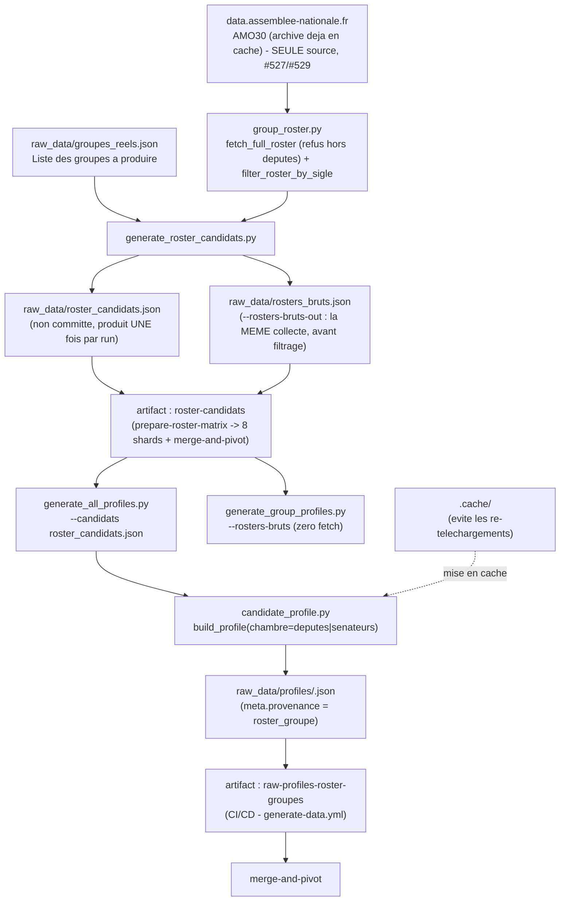

# extract-roster-groupes

**Le point d'entrée des huit jobs est
[`workflow-generate-data.md`](./workflow-generate-data.md) §1** — ce que chacun
fait, consomme, produit, et les décisions derrière sa forme. Ce fichier-ci est
le seul job d'extraction à garder une page à lui, parce qu'il a de la
profondeur qui ne tient pas en un bloc : le rollout, la régénération de
l'existant, les six combinaisons des deux axes du formulaire, les trois codes
de sortie du roster.

## Ce que fait ce job

Il installe l'environnement Python, restaure éventuellement le cache `.cache`,
construit la liste roster-driven puis lance l'extraction individuelle sur
cette liste :

```
python3 src/generate_roster_candidats.py
python3 src/generate_all_profiles.py \
  --candidats raw_data/roster_candidats.json \
  --workers <workers> \
  [--skip-existing | --refresh-existing] --resume \
  (--skip-interventions | --interventions-theme-seul) --skip-dossiers-legislatifs \
  [--limit <roster_limit>] [--no-merge]
```

**La population vient de DEUX AXES DISJOINTS (#578).** `existing_profiles`
(menu `leave-as-is` / `refresh` / `overwrite`) dit ce qu'on fait des profils déjà
écrits ; `add_uncovered_members` (**une case à cocher**, cochée par défaut) dit
si on en écrit de nouveaux. Les six combinaisons se demandent :

| | `add_uncovered_members` décoché | `add_uncovered_members` coché *(défaut)* |
| --- | --- | --- |
| `leave-as-is` | rien à faire (manifeste vide) | `--skip-existing` |
| `refresh` *(défaut)* | `--refresh-existing` | *(aucun drapeau)* |
| `overwrite` | `--refresh-existing --no-merge` | `--no-merge` |

L'axe 2 était un menu `roster_coverage` (`current-members-only` /
`add-uncovered-members`) quand #578 l'a livré ; **#590 en a fait une case**, deux
états n'ayant jamais eu besoin d'un menu. `roster_coverage` est un nom **mort**,
et `test_les_deux_axes_sont_deux_champs_distincts` échoue s'il réapparaît dans
les inputs. `python3 scripts/rendu_formulaire.py` rend le formulaire tel qu'il
s'affiche — lire le YAML masque exactement le défaut que #578 a corrigé.

`--skip-existing` est **strict** : il ne saute rien conditionnellement. Pour
recollecter l'existant, on ne le pose pas. `cold_start` n'entre plus dans ce
calcul — il purge les caches de téléchargement, ce qui ne dit rien de ce qu'on
écrit. Voir §*Régénérer l'existant* ci-dessous et
`docs/decisions/deux-axes-formulaire-578.md`.

**Mode d'extraction léger (#357, sous-issue 6/6 de #351)** :
`--skip-dossiers-legislatifs` est toujours appliqué ici — un membre roster n'a
besoin que d'identité minimale + mandats + votes + amendements pour les agrégats
de groupe (§4, `build_groupe_profile()`, #349). `dossiers_legislatifs` et
`questions_officielles` ne sont donc jamais extraits par ce job.

**Les interventions ont quitté ce mode (#657).** L'affirmation « non consommées
par les agrégats de groupe » était **fausse** : `tags_thematiques` en dérive
intégralement, et `tags_thematiques_agreges` de chaque fiche de groupe en dérive
à son tour — les 468 membres publiant `interventions: []`, l'empreinte
thématique de chaque fiche était celle d'**une seule personne**. Elles suivent
désormais `collect_interventions`, sous la forme **réduite au thème**
(`--interventions-theme-seul`) : débats Syceron sans verbatim, questions
officielles toujours écartées (elles ne portent aucun thème). Un candidat
déclaré traité par ce job en est **exempté** — c'est `extract-an` qui le
collecte en entier. Voir
`docs/decisions/collecte-interventions-reduite-au-theme-657.md`. Voir aussi
`--skip-dossiers-legislatifs` dans `generate_all_profiles.py` : il saute
`fetch_textes_portes_officiels` (`candidate_profile.build_profile`, étape 8),
**seule** source de `dossiers_legislatifs` depuis #528 — l'étape qui triait la
liste NosDéputés collectée pour les sénateurs est partie avec le Sénat.

Voir `.github/workflows/generate-data.yml` (job `extract-roster-groupes`).

Contrairement à `extract-an` / `extract-ue-officiel`, ce job
ne part pas de la liste éditoriale `raw_data/candidats.json` mais de la
composition réelle des groupes parlementaires configurés dans
`raw_data/groupes_reels.json` — couverture de groupe complète (~750+
membres), pas seulement les candidats déclarés/pressentis. Voir
`docs/data-architecture.md` (tableau des deux sources d'entrée).

---

## Rollout progressif (#188/#190/#192)

## Régénérer l'existant (#445)

Une correction de fond — la clé `uid` de #440, par exemple — ne concerne que
les profils **déjà écrits**. Or `--skip-existing` s'applique *avant*
`--no-merge` : tant qu'il est posé, un run qui écrase saute précisément les
profils qu'il faudrait corriger.

`--refresh-existing` est la sélection strictement inverse de `--skip-existing` :
il ne retient que les candidats dont le profil JSON existe déjà. La combinaison
des deux flags est **refusée** (`SystemExit`) plutôt que de laisser un job
tourner sans écrire un seul profil ; depuis #578 le workflow ne peut plus la
produire, une seule affectation de `POP_FLAG` étant atteinte par run.

Le run correspondant :

| input | valeur |
| --- | --- |
| `existing_profiles` | `overwrite` |
| `add_uncovered_members` | décoché (`false`) |
| `roster_limit` | `0` |

**Le piège réductible a été supprimé (#578).** `roster_limit=0` rafraîchissait
autrefois *moins* que `roster_limit=20` : sans `--limit`, le chemin de #224
(`_select_candidats_couverture`) n'était pas emprunté, et `--skip-existing`
sautait chaque profil existant. Un plafond de volume commandait donc une
politique de rafraîchissement qu'il ne nommait pas. `--limit` n'est plus qu'un
plafond, et recollecter l'existant se demande sur l'axe 1.

Il n'y a plus d'avertissement sur « fusionner au lieu d'écraser ». Le workflow
ne sait pas si le correctif porte sur une clé — il n'a ni le diff de `src/`, ni
l'intention de qui lance le run — et l'avertissement traitait le mode le plus
sûr, devenu le défaut, comme suspect. Le signal qui reste porte sur le mode
destructeur (#460 : écraser sans collecter les interventions), et il chiffre la
perte au lieu de la supposer.

Contrôle après coup : `src/audit_diff_profils.py`, qui compare une ref git au
disque champ par champ et sort en erreur sur toute perte dans les champs
stables (votes, mandats, textes portés).

## Déploiement progressif

Ce job est un **déploiement progressif**, pas encore un run complet :

- `continue-on-error: true` — un échec ou dépassement de ce job ne bloque pas
  `merge-and-pivot` (même traitement que `extract-parltrack`).
- `roster_limit` (input du workflow, défaut `0` depuis #578) borne le nombre
  de membres traités par run (`--limit`) pour rester dans un budget CI
  raisonnable pendant le rollout. **`--limit` est déterministe pour un fichier
  donné, mais l'ordre de `roster_candidats.json` ne l'est pas dans le temps :
  le fichier est régénéré par `generate_roster_candidats.py`.** Une borne
  positionnelle ne désigne donc pas le même sous-ensemble d'un run à l'autre —
  d'où le fait que la sélection utile ne s'appuie jamais sur la position, mais
  sur la couverture (`_select_candidats_couverture`, #224) ou sur l'existence
  du profil (`--refresh-existing`, #445). `0` = pas de plafond, et c'est le
  **défaut depuis #578** : le rollout progressif que ce plafond budgétait est
  terminé (roster couvert à 452/452), et un plafond ferait mentir le défaut
  `existing_profiles=refresh`.
- `timeout-minutes: 60` est provisoire, calibré pour
  `roster_limit=20` avec `--source` implicite (coût par membre
  comparable à `extract-an`) — à recalibrer après un premier run mesuré
  manuellement (`workflow_dispatch`, limite réduite) avant d'envisager
  d'augmenter la limite par défaut.
- L'activation d'un run complet planifié (`schedule: cron`, toujours
  commenté dans `generate-data.yml`) est une décision ultérieure distincte,
  hors périmètre de #192.

---

## Schéma de flux



> **Un roster par `(chambre, legislature)` distinct** :
> `generate_roster_candidats.py` le mutualise entre tous les groupes de la
> config (même optimisation que `generate_group_profiles.py` /
> `group_roster.fetch_full_roster`), puis filtre **côté client** par
> `groupe_sigle`. Le filtrage côté client est né d'une contrainte de
> NosDéputés — son endpoint `/groupe/<SIGLE>/json` renvoyait
> systématiquement un HTTP 500 — mais il lui a survécu : AMO30 rend une
> archive d'acteurs, pas une liste par groupe, et le filtre par sigle reste
> donc le seul chemin. Histoire assumée, plus une dépendance.  
> **La clé `deputes` n'est plus un appel réseau depuis #527** : elle est
> **dérivée d'AMO30**, l'archive que `candidate_profile.py` télécharge et met
> déjà en cache pour quatre autres index. Il ne reste donc, côté roster, que la
> clé `senateurs` — suspendue depuis #516. L'aiguillage est dans
> `group_roster.fetch_full_roster`, seul endroit du dépôt qui choisisse une
> source de roster, et il tient en une condition sur
> `an_roster.AN_ROSTER_ACTIF`. Voir
> `docs/decisions/bascule-roster-an-amo30-527.md`.  
> **`raw_data/roster_candidats.json` n'est pas committé** : source de vérité
> = `raw_data/groupes_reels.json`, produit à chaque run.  
> **UNE construction par run depuis #518** : `prepare-roster-matrix` la fait et
> publie l'artifact `roster-candidats` ; les 8 shards et `merge-and-pivot` le
> téléchargent, et ne régénèrent que si l'artifact manque. Neuf constructions
> indépendantes étaient à la fois fragiles (4 shards perdus sur le run
> `32738726729`) et **incorrectes** : les shards se partagent le roster par
> position, `merge-and-pivot` normalise en pivot **sa** liste — deux listes qui
> divergent produisent un « collecté mais non publié » (#511) sans qu'aucune
> étape n'échoue. Voir
> `docs/decisions/roster-unique-par-run-518.md`.  
> **ZÉRO fetch résiduel depuis le second incident de #518** : le même artifact
> porte aussi le roster **brut** (`--rosters-bruts-out` →
> `generate_group_profiles.py --rosters-bruts`), qui était le dernier à
> refetcher la liste — et le fetch sur lequel le run `32750929942` a perdu son
> commit. Ce n'est pas qu'une requête de moins : la fiche de groupe était bâtie
> sur une composition lue ~7 min après celle qui avait servi à collecter les
> profils. **Le plafond de lecture qui allait avec est un chemin mort** :
> `fetch_full_roster_nosdeputes` a été supprimé par #529, et avec lui toute
> la machinerie de reprise qui l'entourait (`_erreur_retentable`,
> `_ROSTER_MAX_ATTEMPTS`, `_ROSTER_RETRY_BACKOFF_SECONDS`,
> `_ROSTER_TIMEOUT`). Il ne part plus **aucune** requête HTTP de
> `group_roster.py` ; le téléchargement de l'archive AMO30 a ses propres
> reprises, dans `candidate_profile._ensure_acteurs_historique_zip_downloaded`.
> Ce qui reste de #518, et qui n'a pas bougé, c'est le transit du roster brut
> par artifact. Voir `docs/decisions/plafond-roster-et-commit-518.md` et
> `docs/decisions/retrait-nosdeputes-529.md`.  
> **Provenance** : chaque profil produit ici porte `meta.provenance =
> "roster_groupe"` — ne rétrograde jamais un profil `candidat_declare`
> existant lors de la fusion (`merge_pivot_profile`), voir
> `docs/decisions/provenance-pivot.md`.  
> **Même fan-out par membre que `extract-an`** : coût par
> candidat identique, seul le volume traité change (borné par
> `roster_limit`).

---

## Logique d'extraction (chaîne interne)

1. `generate_roster_candidats.py` lit `raw_data/groupes_reels.json` (via
   `--config`, défaut ce fichier). Une entrée portant `extraction_suspendue`
   en sort d'emblée (#516) : ni fetch, ni collecte, et son absence n'est pas
   une anomalie. Les **2 groupes Sénat** le sont depuis le 24/08/2026, ce qui
   retire la clé `('senateurs', None)` — donc, aujourd'hui, **1 seul appel
   réseau** au lieu de 2. Voir
   `docs/decisions/extraction-groupe-suspendue-516.md`.
2. Pour chaque `(roster_chambre, legislature)` distinct référencé par les
   groupes **actifs** de la config, il obtient **un seul** roster
   (`group_roster.fetch_full_roster`) — partagé entre tous les groupes de la
   même chambre/législature.
   **Une seule clé est servie** : `deputes`, **dérivée d'AMO30** (#527), sans
   aucune requête réseau propre — `fetch_full_roster` lit une archive que
   `candidate_profile` télécharge et met déjà en cache pour quatre autres
   index. Une archive absente, illisible ou sans organe `GP` lève
   `RosterAnIndisponible` ; une législature sans entrée dans
   `correspondance_sigles_an` lève `CorrespondanceSiglesInvalide` en
   **nommant** le couple. Les deux sont dans `group_roster.ERREURS_ROSTER`,
   donc traitées comme un « roster indisponible » ordinaire : rien n'est
   écrit, la clé est annotée, le run ne meurt pas sur une trace de pile.

   Toute autre chambre **lève en nommant #528**, plutôt que de rendre un
   roster vide : la clé `senateurs` et son repli AN sont partis avec
   NosDéputés (#529), et ce chemin ne serait atteint que si quelqu'un levait
   la suspension des deux groupes Sénat. `session=` reste dans la signature
   parce que trois appelants la passent encore, et n'a plus aucun effet.
3. Chaque roster brut est filtré côté client par `groupe_sigle`
   (`group_roster.filter_roster_by_sigle`). Le filtrage temporel additionnel
   qu'il portait pour le Sénat (`senat_periode_debut`) est parti avec #528 ;
   `chambre` reste dans la signature du filtre parce qu'une chambre qui
   disparaît d'un filtre est une information perdue le jour où il y en a deux.
4. Les membres de tous les groupes sont aplatis en une liste unique de
   candidats (dédupliquée par `slug`, garde-fou en cas de config
   incohérente), écrite dans `raw_data/roster_candidats.json` au même format
   d'entrée que `raw_data/candidats.json` (`{"candidats": [...]}`) —
   `statut: "roster_groupe"`, `notes` référençant le groupe d'origine.
   Un membre **sans slug** ne peut alimenter aucun profil (`<slug>.pivot.json`
   *est* le nom du fichier, #487) : il est donc écarté, mais **nommé** depuis
   #527 — groupe, état civil, dates de mandat, sur `stderr` et en annotation
   `::warning::` (`ROSTER_SANS_SLUG`). Le cas n'existait pas avec NosDéputés,
   dont le slug est l'identifiant ; AMO30 publie un `PA######`, et le slug
   vient de la table committée du lot 2 (#525). Non bloquant : les 4 de la 16e
   sont une catégorie fermée, datée et déclarée dans `groupes_reels.json`
   (`correspondance_sigles_an[].ecart_membres`). Ce qui doit être bruyant,
   c'est leur nombre s'il bouge.
5. **Rien n'est écrit si la collecte est incomplète (#511)** : un fetch en
   échec, un groupe configuré rendant 0 membre, ou un roster total vide font
   sortir le script en 1 sans toucher au fichier. Un `Read timed out` avait
   écrit un roster de 0 candidat en rendant 0, et la passe pivot suivante avait
   itéré sur le vide — run `32405297873`, conclu en `success`. Ce n'est pas un
   seuil de rétrécissement : la granularité d'une panne est la clé de fetch
   entière, soit 452 ou 300 membres sur 752. Voir
   `docs/decisions/collecte-non-publiee.md#roster-jamais-ecrit-vide`. Chaque anomalie part
   aussi en annotation `::error::` depuis #518 — un run mort ici ne laissait
   sinon que `Process completed with exit code 1` —, et **nomme sa cause**
   depuis #524 (`HTTPError: 500 …`, `SSLError: …`, `Timeout: …`) : l'exception
   était jusque-là affichée puis jetée, et l'annotation se réduisait à « en
   échec ».
6. **Trois codes de sortie, et ils ne veulent pas dire la même chose** (#524) :

   | Code | Sens | Ce que fait l'appelant |
   |---|---|---|
   | `0` | roster écrit | poursuit la branche roster |
   | `1` | collecte incomplète (§5) **ou** config illisible/vide | `merge-and-pivot` saute la branche roster et committe quand même ; les autres appelants rougissent |
   | `2` | `EXIT_ROSTER_INDISPONIBLE` — **toutes** les entrées ont leur extraction suspendue (#516) | les **trois** appelants sautent la branche roster |

   Aucun de ces codes n'écrit un roster à 0 candidat : `1` et `2` n'écrivent
   rien du tout. Le filtrage se fait **sur le code, dans le shell** — jamais
   par un `continue-on-error: true`, qui avalerait aussi un code non
   documenté. Voir
   `docs/decisions/cloisonnement-branche-roster-524.md`.
5. `generate_all_profiles.py --candidats raw_data/roster_candidats.json`
   pilote ensuite la même chaîne de collecte que `extract-an`
   (`candidate_profile.py`, identité/mandats/votes/amendements depuis le
   seul open data AN — NosDéputés est sorti du pipeline avec #529, et un slug
   que le référentiel AN ne résout pas sort avec `identite: None` et un
   `WARNING_PREFIX_IDENTITE_INTROUVABLE`, sans repli), candidat par candidat,
   chambre déterminée par
   `roster_chambre` du groupe d'origine — qui ne vaut plus que `deputes`
   depuis #528 — en mode léger
   (`--skip-dossiers-legislatifs`, #357) : dossiers législatifs et questions
   officielles ne sont jamais extraits ici (non consommés par les agrégats de
   groupe, #349). Les interventions le sont, réduites au thème, quand
   `collect_interventions` est coché (#657).
6. `--skip-existing --resume` évite de retraiter les profils déjà présents
   et permet la reprise après interruption ; `--limit` (piloté par
   `roster_limit`) borne le nombre de membres traités ce run.
   `--skip-existing` s'applique **avant** `--no-merge` : voir §*Régénérer
   l'existant* pour la conséquence.
7. Les données sont écrites dans `raw_data/profiles/<slug>.json` puis
   publiées en artifact `raw-profiles-roster-groupes` (`if-no-files-found:
   warn` — ce job peut légitimement ne produire aucun fichier si le fetch
   roster échoue).
   Depuis #580, « les données » = le socle `<slug>.json` **et** ses tranches
   `<slug>/<legislature>.json` — l'action de publication copie les deux.
8. Dans `merge-and-pivot`, cet artifact est fusionné avec ceux de
   `extract-an`/`extract-ue-officiel`
   (`merge_profile.py --dirs`), puis re-normalisé en pivot spécifiquement
   via `raw_data/roster_candidats.json` — **celui du run**, téléchargé depuis
   l'artifact `roster-candidats` (#518), et non plus une liste reconstruite à
   cette étape. No-op silencieux si `extract-roster-groupes` a échoué/été
   absent.

---

## Sources associées

| Source | Contenu |
|---|---|
| `raw_data/groupes_reels.json` | Liste des groupes à couvrir (chambre, législature, sigle) |
| AMO30 (`data.assemblee-nationale.fr`, Licence Ouverte) | Composition des groupes AN, dérivée par `src/an_roster.py` depuis #527 — même archive que les scrutins et les amendements |
| `src/group_roster.py` | Mutualisation par clé + filtrage du roster par sigle. **Aucun appel réseau propre depuis #529** : `AN_ROSTER_ACTIF` baissé lève `RosterAnInactif`, il n'aiguille plus vers rien |
| `src/generate_roster_candidats.py` | Aplatissement du roster en liste de candidats (`raw_data/roster_candidats.json`) |
| AN Open Data (via `candidate_profile.py`) | Identité, mandats, votes, amendements — **source unique depuis #529**. Mode léger (#357) : dossiers législatifs et questions officielles jamais extraits ici ; les interventions le sont, réduites au thème, quand `collect_interventions` est coché (#657) |

Référentiel pipeline global : [`data-architecture.md`](./data-architecture.md).

---

## À ne pas confondre

| Job | Périmètre |
|---|---|
| `extract-an` | Assemblée nationale, liste éditoriale `candidats.json` |
| `extract-ue-officiel` | Parlement européen, liste éditoriale `candidats.json` |
| `extract-parltrack` | Téléchargement des dumps ParlTrack (`.zst`) |
| **extract-roster-groupes** | Extraction individuelle pilotée par la composition réelle des groupes (`groupes_reels.json`), rollout progressif borné par `roster_limit`, mode léger (#357) |
| `merge-and-pivot` | Fusion inter-sources + normalisation pivot + profils groupes/partis |

Tout est orchestré dans `.github/workflows/generate-data.yml`.
