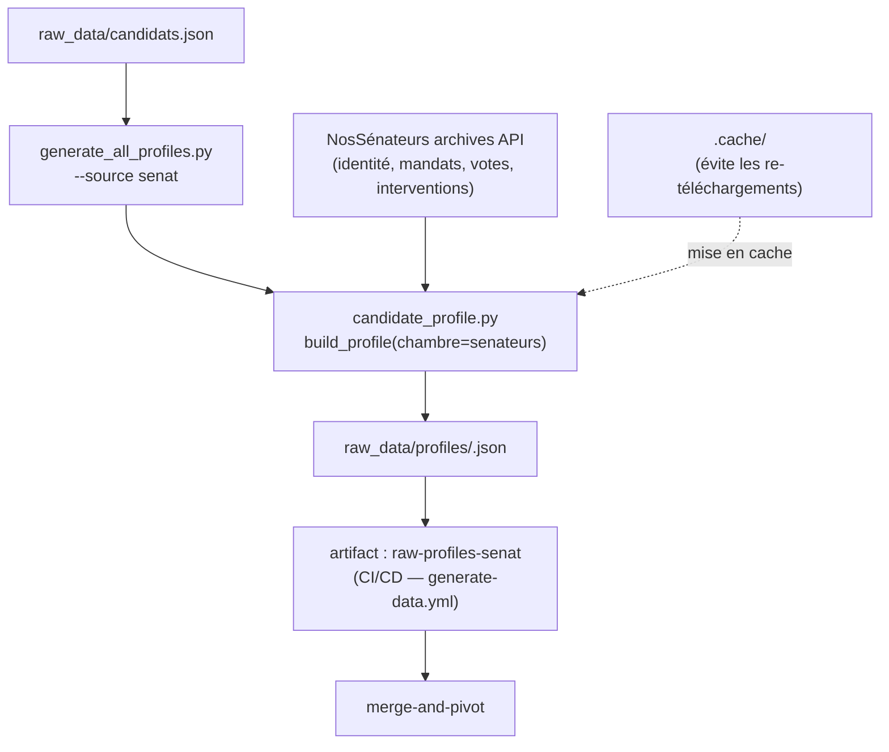

# extract-senat

## Ce que fait ce job

Il installe l'environnement Python, restaure éventuellement le cache, puis lance :

```
python3 src/generate_all_profiles.py --source senat
```

(avec `--no-merge` si `fresh_run=true`). Voir `.github/workflows/generate-data.yml`.

Le scope `--source senat` force une extraction NosSénateurs uniquement (pas AN, pas UE).
Les profils bruts produits vont dans `raw_data/profiles/`, puis sont uploadés comme artifact `raw-profiles-senat`.

---

## Schéma de flux



> **Portée** : extraction centrée Sénat via NosSénateurs (frozen archives).  
> **Fusion** : en mode incrémental, la fusion additive conserve les données déjà collectées.  
> **Sortie** : ce job produit uniquement des profils bruts, la normalisation pivot est faite dans `merge-and-pivot`.

---

## Logique d'extraction (chaîne interne)

1. `generate_all_profiles.py` lit les candidats de `raw_data/candidats.json`.
2. Pour chaque candidat (`source=senat`), il appelle uniquement la chambre `senateurs` via `build_profile` dans `candidate_profile.py`.
3. `candidate_profile.py` récupère identité, mandats, votes, interventions via l'API NosSénateurs d'archive.
4. Les données sont écrites dans `raw_data/profiles/<slug>.json` puis publiées en artifact `raw-profiles-senat`.
5. Le job `merge-and-pivot` fusionne ensuite cet artifact avec ceux de `extract-an` et `extract-ue-officiel`.

---

## Sources associées

| Source | Contenu |
|---|---|
| NosSénateurs archives API | Identité, mandats, votes, interventions |
| `raw_data/candidats.json` | Liste des candidats à traiter |

Référentiel pipeline global : [`pipeline-profiles-groupes.md`](./pipeline-profiles-groupes.md).

---

## À ne pas confondre

| Job | Périmètre |
|---|---|
| `extract-an` | AN / NosDéputés |
| **extract-senat** | Sénat / NosSénateurs |
| `extract-ue-officiel` | API officielle Parlement européen |
| `extract-parltrack` | Téléchargement des dumps ParlTrack (`.zst`) |
| `merge-and-pivot` | Fusion inter-sources + normalisation pivot + profils groupes/partis |

Tout est orchestré dans `.github/workflows/generate-data.yml`.
