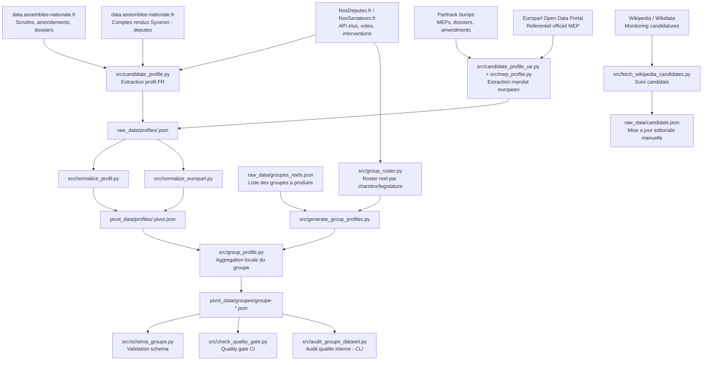
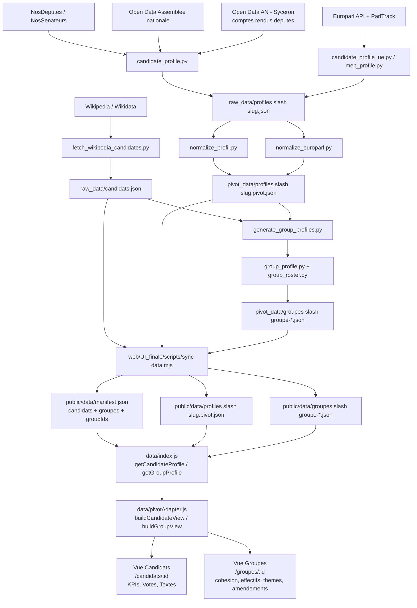

# Pipeline groupes parlementaires et profils candidats

Les données des groupes parlementaires sont construites en deux étages:

- construction des profils candidats (collecte + normalisation pivot),
- agrégation de ces profils en profils de groupes parlementaires réels.

## Schéma de flux complet

## Variante: flux prolongé jusqu'aux vues web (UI_finale)

Cette variante explicite la consommation des artefacts JSON par l'interface
`web/UI_finale` (React 19 + Vite, onglets `Candidats` et `Groupes`).

Repères d'implémentation UI_finale :

- `web/UI_finale/scripts/sync-data.mjs` copie les artefacts pivot vers
    `public/data/` et génère `manifest.json` (index des candidats et groupes
    disponibles, avec `groupIds[]` pour le filtrage côté client).
- `web/UI_finale/src/data/index.js` expose l'API de fetch (`getCandidateProfile`,
    `getGroupProfile`, `getCandidatesList`, `getGroupsList`).
- `web/UI_finale/src/data/pivotAdapter.js` transforme le JSON pivot en objets
    prêts à l'affichage (calcul KPIs, tri votes, classification thématique,
    classification hémicycle majorité/opposition).
- Les profils de groupes affichés sont ceux copiés depuis `pivot_data/groupes`
    par `sync-data.mjs`.

## Lecture rapide

1. Les profils candidats sont d'abord produits depuis les sources ouvertes,
   puis normalises en format pivot dans `pivot_data/profiles`.
2. La pipeline groupes combine roster reel et profils pivot individuels pour
   construire `pivot_data/groupes`.
3. Chaque profil groupe est valide via le schema puis controle par le quality gate.

## Points importants

- `group_profile.py` n'interroge pas le reseau: il agrege des profils locaux.
- Le fetch roster est mutualise par `(chambre, legislature)` dans
  `generate_group_profiles.py` pour eviter les appels redondants — et en CI il
  n'y en a **aucun** : `--rosters-bruts` relit le roster brut collecte au debut
  du run (artifact `roster-candidats`). C'est ce qui garantit que la
  composition publiee est celle du corpus collecte, et non une liste relue
  ~7 min plus tard (#518, voir
  `technical_decisions.md#plafond-roster-et-commit-518`).
- Un roster indisponible fait sortir `generate_group_profiles.py` en **2**, pas
  en 1 : aucune fiche n'a ete touchee, donc le run peut committer le reste. Un
  vrai plantage de generation reste en 1 et fait echouer le step.
- La logique groupe parlementaire reel est distincte de l'agregation editoriale
  par parti (`parti_profile.py`).
- A ne pas confondre avec le job CI `extract-roster-groupes` : ce dernier
  utilise aussi `group_roster.py` (via `generate_roster_candidats.py`), mais
  pour produire des profils *individuels* bruts (`raw_data/profiles/`,
  reseau) couvrant tous les membres du roster, en amont de l'agregation
  faite ici par `group_profile.py`. Voir
  [`extract-roster-groupes.md`](./extract-roster-groupes.md).

## Détails: pipeline profils candidats

Comment ça marche concrètement

L'extraction individuelle (`generate_all_profiles.py`) accepte deux sources
d'entrée distinctes via `--candidats`, qui pilotent des périmètres différents :

| Source | Fichier | Qui la produit | Portée | `meta.provenance` |
|---|---|---|---|---|
| Éditoriale (défaut) | `raw_data/candidats.json` | Maintenue à la main | Candidats/présidentiables déclarés/pressentis | `candidat_declare` |
| Roster-driven | `raw_data/roster_candidats.json` | Générée par `generate_roster_candidats.py` depuis `raw_data/groupes_reels.json` | Tou·te·s les membres réels des groupes configurés **dont l'extraction n'est pas suspendue** — 5 des 7 depuis le 24/08/2026 (#516), les 2 groupes Sénat étant gelés | `roster_groupe` |

Les deux sources partagent le même format d'entrée (attendu par
`generate_all_profiles.py --candidats`) et alimentent le même pipeline de
collecte/normalisation ci-dessous. Un même `slug` peut apparaître dans les
deux sources (un membre de groupe qui est aussi candidat déclaré) : la
politique de fusion (`merge_profile.merge_pivot_profile()`) ne rétrograde
jamais un profil `candidat_declare` vers `roster_groupe`, la source éditoriale
prime toujours. Détail complet de cette décision :
[`docs/technical_decisions.md#provenance-pivot`](./technical_decisions.md#provenance-pivot).

En CI/CD, la voie roster-driven est un job dédié, distinct de
`extract-an`/`extract-ue-officiel` : `extract-roster-groupes`
(`.github/workflows/generate-data.yml`), en rollout progressif (#188/#190/#192,
`continue-on-error: true`, volume borné par l'input `roster_limit`).
Détail complet du job : [`extract-roster-groupes.md`](./extract-roster-groupes.md).

1. Source de vérité éditoriale
     - `raw_data/candidats.json` contient la liste des candidats suivis
         (`nom`, `slug`, `parti`, `statut`, `source`).
     - Ce fichier reste éditorial: `fetch_wikipedia_candidates.py` propose des
         écarts, mais ne modifie jamais automatiquement `candidats.json`.
     - Source alternative pour la couverture de groupe complète :
         `raw_data/roster_candidats.json`, générée par
         `python src/generate_roster_candidats.py` (un seul fetch réseau par
         couple `(chambre, legislature)`, comme `generate_group_profiles.py`)
         — voir le tableau ci-dessus.

2. Collecte du profil FR (Assemblée/Sénat)
     - `candidate_profile.py` collecte les faits bruts depuis NosDéputés /
         NosSénateurs (identité, mandats, interventions).
     - Pour les votes/amendements/questions, la pipeline complète avec les
         jeux de données officiels AN Open Data quand disponibles.
     - Pour les interventions des députés, les comptes rendus de séance
         Syceron (`syceron_debates.py` / `parse_syceron.py`, législatures 15-17)
         sont la source primaire ; le scraping NosDéputés reste un fallback si
         Syceron ne retourne rien pour l'acteurRef du candidat. Voir
         `docs/an_opendata.md` (section Syceron).
     - Sortie: `raw_data/profiles/<slug>.json` (socle) + une tranche
         `raw_data/profiles/<slug>/<legislature>.json` par législature pour
         `amendements` (#580). Relecture par `src/profil_brut.py`, qui accepte
         aussi l'ancienne forme monolithique.

3. Collecte du volet européen
     - `candidate_profile_ue.py` cherche un mandat PE par correspondance de nom
         (normalisée), puis récupère les mandats `hasMembership` via l'API officielle
         du Parlement européen.
     - `mep_profile.py` et les dumps ParlTrack peuvent enrichir la dimension UE
         selon le mode d'exécution.
     - Le volet UE est fusionné dans le même profil brut sous
         `mandat_europeen`.

4. Batch multi-candidats
     - `generate_all_profiles.py` pilote la génération globale.
     - Niveau 1 de parallélisme: pour un candidat, collecte FR et UE en parallèle.
     - Niveau 2 de parallélisme: plusieurs candidats traités en parallèle
         (`--workers`).
     - En cas d'interruption, reprise possible via checkpoint (`--resume`).

5. Fusion additive (stabilité des données)
     - Par défaut, la régénération ne remplace pas brutalement l'existant:
         `merge_profile.py` fusionne le nouveau et l'ancien pour éviter la perte
         de données lors d'un aléa API temporaire.
     - `--no-merge` force un écrasement complet.

6. Normalisation vers le pivot commun
     - `normalize_profil.py` convertit le profil brut FR vers
         `schema_pivot.py`.
     - `normalize_europarl.py` convertit le volet UE vers le même schéma.
     - Sortie pivot: `pivot_data/profiles/<slug>.pivot.json` (option `--pivot`
         dans `generate_all_profiles.py`).

7. Validation implicite pour la suite
     - Ces pivots servent d'entrée unique aux agrégations groupes/partis.
     - Les données manquantes restent `null` (jamais des zéros par défaut),
         pour respecter les invariants éditoriaux.

Commandes usuelles

- Générer tous les profils bruts candidats:
    `python src/generate_all_profiles.py`
- Générer aussi les pivots:
    `python src/generate_all_profiles.py --pivot`
- Limiter à un candidat:
    `python src/generate_all_profiles.py --only jean-luc-melenchon --pivot`
- Reprendre après interruption:
    `python src/generate_all_profiles.py --resume --pivot`
- Générer la liste roster-driven puis les pivots pour la couverture de groupe
  complète (mode d'extraction léger, #357 — voir
  [`extract-roster-groupes.md`](./extract-roster-groupes.md)):
    `python src/generate_roster_candidats.py`
    `python src/generate_all_profiles.py --candidats raw_data/roster_candidats.json --pivot --skip-existing \`
    `  --skip-interventions --skip-dossiers-legislatifs`

Entrées / sorties de la pipeline candidats

- Entrées principales:
    - `raw_data/candidats.json` (défaut, éditorial) ou
      `raw_data/roster_candidats.json` (roster-driven, généré) — voir
      tableau des deux sources ci-dessus
    - APIs NosDéputés / NosSénateurs
    - Open Data AN
    - API Open Data Parlement européen (+ éventuel enrichissement ParlTrack)
- Sorties:
    - `raw_data/profiles/<slug>.json` (profil brut fusionné)
    - `pivot_data/profiles/<slug>.pivot.json` (profil normalisé pivot v1)

## Détails: pipeline groupes parlementaires
Comment ça marche concrètement

La liste des groupes à produire est définie dans groupes_reels.json.
Une entrée portant extraction_suspendue (#516) est ignorée : ni fetch, ni régénération, et ce n'est pas un échec — sa fiche déjà publiée reste en place, gelée à sa dernière génération réussie. Voir technical_decisions.md#extraction-groupe-suspendue-516.
Le batch generate_group_profiles.py fait un seul fetch réseau par couple (chambre, législature) (optimisation clé).
Ce fetch passe par group_roster.py:
  - récupération de la liste complète députés/sénateurs,
  - filtrage côté client par groupe_sigle (car endpoint groupe direct peu fiable).

Pour chaque membre trouvé, le script charge son profil pivot local dans profiles.
group_profile.py agrège les faits:
  - membres et périodes,
  - cohésion de vote par scrutin,
  - tags thématiques agrégés,
  - mandats agrégés (catégoriel : commission, commission_enquete, mission_information, groupe_etudes, delegation, groupe_amitie, extra_parlementaire — voir MANDATS_AGREGES_CATEGORIES ; périmètre élargi par #382, voir docs/technical_decisions.md#taxonomie-mandats-typeorgane-an),
  - amendements agrégés (avec ventilation par type de déposant).
Le JSON final est contraint par schema_groupe.py, puis contrôlé par check_quality_gate.py.

Points importants de la pipeline

  - La logique « groupe parlementaire réel » est distincte de la logique « parti éditorial ».
  - Les partis sont générés séparément (pas la même finalité).
  - group_profile.py n’interroge pas le réseau: il agrège des données déjà présentes localement.
  - En mode batch, la couverture roster/profils disponibles est tracée (pour éviter de confondre effectif réel et effectif effectivement agrégé).
  - Le quality gate peut faire échouer le run si structure invalide ou incidents réseau au-delà du seuil.

### Audit du jeu de données groupes

`src/audit_groupe_dataset.py` est un outil de qualité interne, distinct du
quality gate CI : il scanne `pivot_data/groupes` (par défaut) et produit un
rapport JSON/Markdown (volumétrie, complétude, cohérence, fraîcheur des
sources, warnings agrégés, tableau croisé des volumes par groupe — membres,
cohesion_votes, tags_thematiques_agreges, amendements_agreges), sur le même
modèle que `audit_pivot_dataset.py` pour `pivot_data/profiles`. Aucun score
ni classement — voir `README.md` §11 et
`docs/examples/audit_groupe_report_sample.md` pour un exemple de rapport.

### Pipeline d'audit combiné (outil manuel)

`src/audit_pipeline.py` est un point d'entrée **manuel** qui exécute les deux
audits ci-dessus (`audit_pivot_dataset.py` et `audit_groupe_dataset.py`) en
appelant directement leurs fonctions (pas de sous-processus) et compile une
section « vue d'ensemble » en plus des deux rapports détaillés : totaux
profils/groupes audités, erreurs de lecture agrégées, warnings agrégés tous
documents confondus. Pure composition des rapports déjà produits par les deux
modules `audit_*` — aucune nouvelle logique de calcul métier.

Cet outil est distinct de `src/check_quality_gate.py` (seul gate bloquant en
CI) et n'est **pas** intégré à `.github/workflows/generate-data.yml` — choix
explicite (issue #178) : jamais appelé automatiquement par la CI, usage
manuel uniquement. Voir `README.md` §12 pour la commande CLI.

