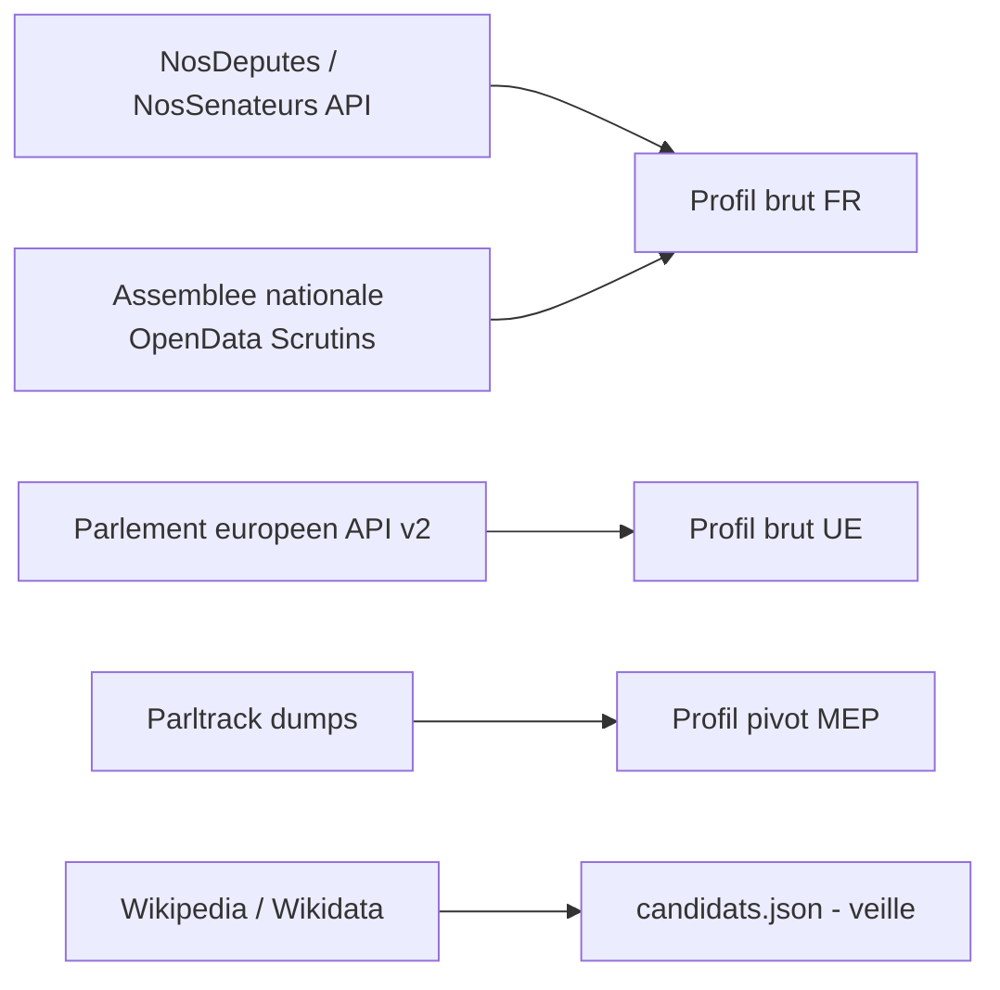
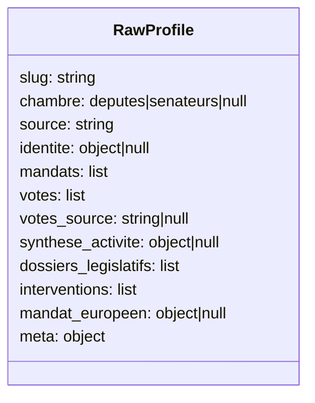
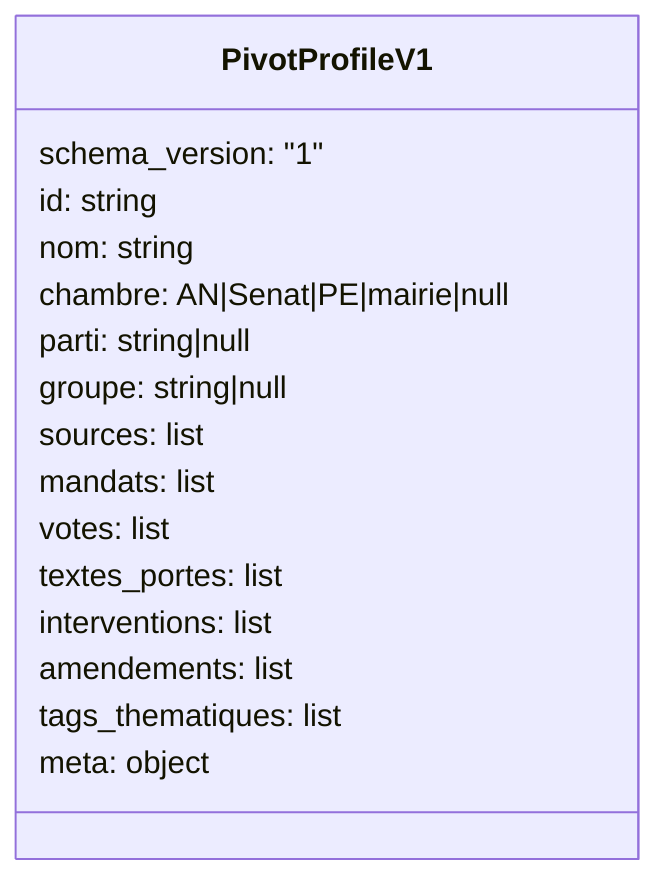
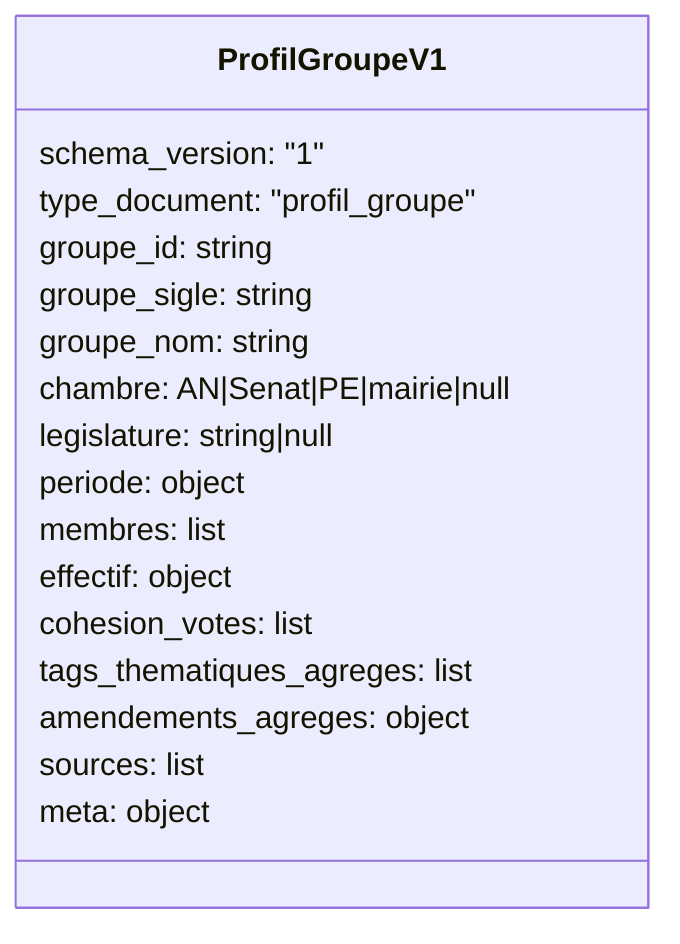
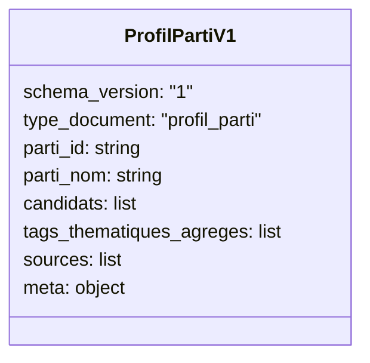
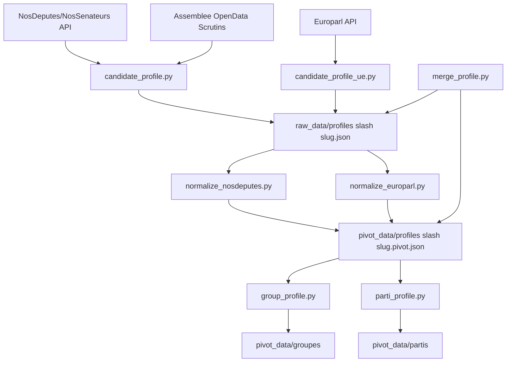

# Schémas de données et transformations

Ce document sert de référence rapide pour comprendre :
- les données d'entrée telles qu'elles sont fournies par les API,
- les données transformées produites par le projet,
- les transformations opérées entre les deux.

## 1) Schéma des données d'entrée (API)

### Vue d'ensemble des sources



### 1.1 NosDeputes / NosSenateurs

Principaux endpoints utilises dans `candidate_profile.py` :
- `/{slug}/json` ou `/{slug}/xml` : identite et responsabilites d'un parlementaire.
- `/{slug}/votes/json` : fallback des votes (souvent indisponible cote API).
- `/recherche/{query}?object_name=Intervention&format=json&page=n` : recherche d'interventions.
- `/api/document/Intervention/{id}/json` : detail d'une intervention.
- `/synthese/data/json` : synthese globale par elu.
- `/{legislature}/dossiers/nom/json` : liste des dossiers legislatifs.
- `/deputes/json` et `/senateurs/json` : roster complet de chambre (utilise pour les groupes).

Forme simplifiee des objets lus :

```json
{
  "depute|senateur": {
    "nom": "...",
    "groupe_sigle": "...",
    "nom_groupe_politique": "...",
    "profession": "...",
    "date_naissance": "YYYY-MM-DD",
    "mandat_debut": "YYYY-MM-DD",
    "mandat_fin": null,
    "responsabilites": [
      {"responsabilite": {"organisme": "...", "fonction": "...", "debut_fonction": "...", "fin_fonction": null}}
    ],
    "groupes_parlementaires": [],
    "responsabilites_extra_parlementaires": []
  }
}
```

```json
{
  "results": [
    {
      "document_id": "...",
      "document_type": "Intervention",
      "document_url": "https://..."
    }
  ],
  "last_result": "..."
}
```

### 1.2 Assemblee nationale Open Data (scrutins)

Source de verite pour les votes nominatif deputes (utilisee prioritairement par `candidate_profile.py`) :
- zip JSON par legislature : `.../repository/{legislature}/loi/scrutins/...zip`

Forme simplifiee :

```json
{
  "scrutin": {
    "numero": "...",
    "dateScrutin": "YYYY-MM-DD",
    "titre": "...",
    "sort": {"libelle": "adopte|rejete|..."},
    "ventilationVotes": {
      "organe": {
        "groupes": {
          "groupe": [
            {
              "vote": {
                "decompteNominatif": {
                  "pours": {"votant": [{"acteurRef": "PAxxxx"}]},
                  "contres": {"votant": [{"acteurRef": "PAxxxx"}]},
                  "abstentions": {"votant": [{"acteurRef": "PAxxxx"}]},
                  "nonVotants": {"votant": [{"acteurRef": "PAxxxx"}]}
                }
              }
            }
          ]
        }
      }
    }
  }
}
```

### 1.3 Parlement europeen API v2

Utilisee par `candidate_profile_ue.py` :
- `/meps?country-of-representation=FR` : liste des eurodeputes FR.
- `/meps/{id}` : detail avec `hasMembership`.
- `/corporate-bodies/{id}` : resolution des organisations.

Forme simplifiee :

```json
{
  "data": [
    {
      "identifier": "197451",
      "label": "Prenom NOM",
      "bday": "YYYY-MM-DD",
      "hasMembership": [
        {
          "membershipClassification": "def/ep-entities/EU_POLITICAL_GROUP",
          "organization": "org/xxxx",
          "role": "def/ep-roles/MEMBER",
          "memberDuring": {"startDate": "YYYY-MM-DD", "endDate": null}
        }
      ]
    }
  ]
}
```

### 1.4 Parltrack dumps

Utilises par `mep_profile.py` :
- `ep_meps.json.lzma` (NDJSON)
- `ep_votes.json.lzma` (NDJSON)

Chaque ligne est un objet JSON.

### 1.5 Wikipedia / Wikidata (veille)

Utilisees par `fetch_wikipedia_candidates.py` pour comparer avec `raw_data/candidats.json`.
- Wikipedia REST HTML article cible.
- Wikidata SPARQL endpoint.

Ce flux n'ecrit jamais automatiquement `candidats.json`.

## 2) Schéma des données transformées

### 2.1 Profil brut candidat (intermediaire)

Produit par `candidate_profile.py` puis batch via `generate_all_profiles.py`.



Sortie: `raw_data/profiles/<slug>.json`.

### 2.2 Profil pivot individuel (contrat commun)

Defini par `schema_pivot.py`, alimente par `normalize_nosdeputes.py` et `normalize_europarl.py`.



Sortie: `pivot_data/profiles/<slug>.pivot.json`.

### 2.3 Profil groupe (agregation parlementaire reelle)

Defini par `schema_groupe.py`, calcule par `group_profile.py` (batch possible via `generate_group_profiles.py`).



Sortie: `pivot_data/groupes/groupe-*.json`.

### 2.4 Profil parti (agregation editoriale de candidats)

Defini par `schema_parti.py`, calcule par `parti_profile.py`.



Sortie: `pivot_data/partis/parti-*.json`.

## 3) Transformations operees

### Pipeline global



### Regles de transformation importantes

1. Votes deputes: priorite a l'open data Assemblee nationale.
2. Fallback votes: endpoint NosDeputes uniquement si les votes officiels sont indisponibles.
3. Normalisation chambre: `deputes -> AN`, `senateurs -> Senat`, `UE -> PE`.
4. Sources tracees: chaque profil pivot renseigne `sources[]` avec `type`, `url`, `synchro_le`.
5. Tags thematiques: derives des `interventions[].mots_cles` (sans harmonisation semantique a ce stade).
6. Fusion additive: `merge_profile.py` ajoute les nouvelles entrees sans supprimer l'existant (brut et pivot).
7. Validation structurelle: `validate_profil`, `validate_profil_groupe`, `validate_profil_parti` verifient les invariants de schema.

### Mapping resume (entree -> transforme)

| Entree API | Champ transforme | Cible |
|---|---|---|
| Identite NosDeputes `nom` | `identite.nom_complet` puis `nom` | brut -> pivot |
| Identite NosDeputes `groupe_sigle` / `nom_groupe_politique` | `identite.groupe_*` puis `groupe` | brut -> pivot |
| Responsabilites API `responsabilite.organisme/fonction/...` | `mandats[]` | brut -> pivot |
| Scrutins AN `numero/dateScrutin/titre/sort/libelle + acteurRef` | `votes[]` | brut -> pivot |
| Recherche interventions + detail document | `interventions[]` avec `sujet`, `mots_cles`, `format` | brut -> pivot |
| Europarl `hasMembership[]` | `mandats[]` + `groupe` (EU_POLITICAL_GROUP) | ue brut -> pivot |
| Ensemble de pivots individuels | `cohesion_votes`, `effectif`, `amendements_agreges` | pivot -> profil groupe |
| Candidats par label parti + pivots disponibles | `candidats[]`, `tags_thematiques_agreges` | pivot -> profil parti |

## 4) Fichiers de reference dans le code

- Entrees et collecte: `src/candidate_profile.py`, `src/candidate_profile_ue.py`, `src/mep_profile.py`, `src/fetch_wikipedia_candidates.py`
- Normalisation pivot: `src/normalize_nosdeputes.py`, `src/normalize_europarl.py`
- Contrats de schema: `src/schema_pivot.py`, `src/schema_groupe.py`, `src/schema_parti.py`
- Agregations: `src/group_profile.py`, `src/group_roster.py`, `src/parti_profile.py`, `src/generate_group_profiles.py`
- Fusion additive: `src/merge_profile.py`
