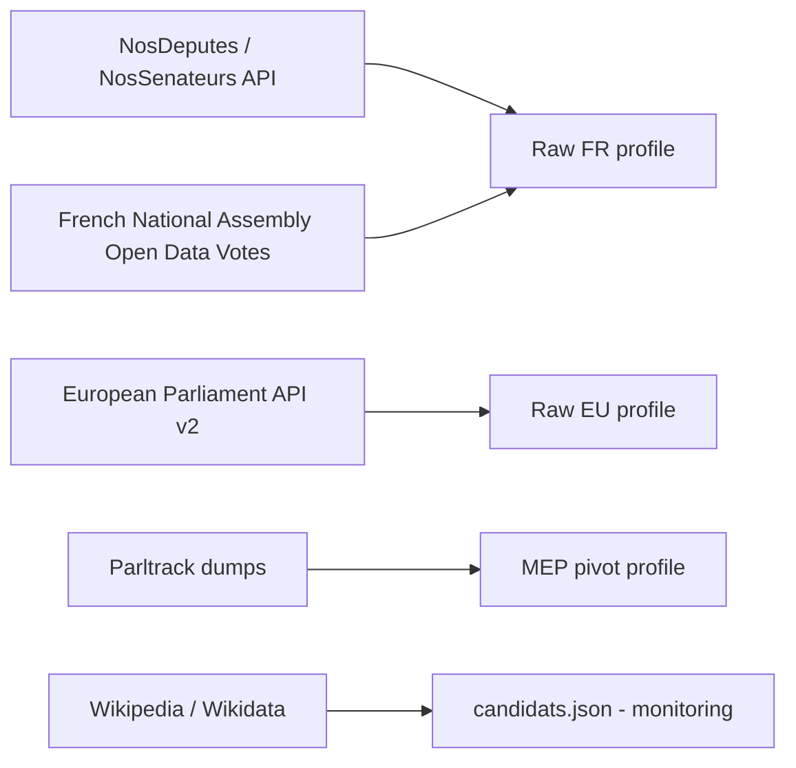
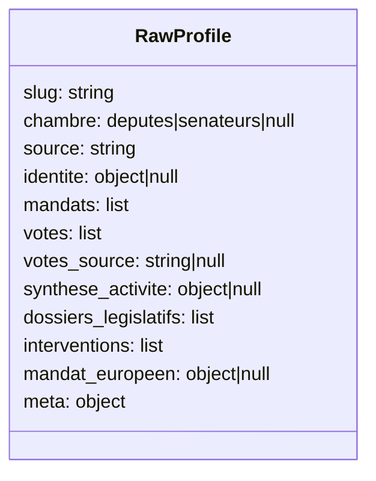
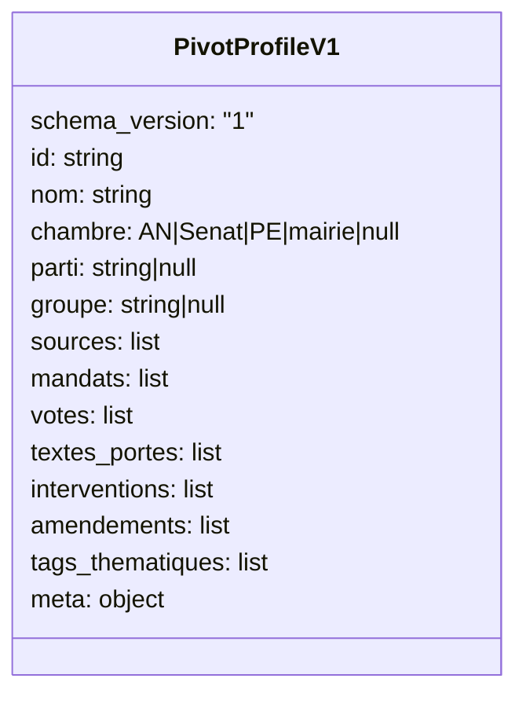
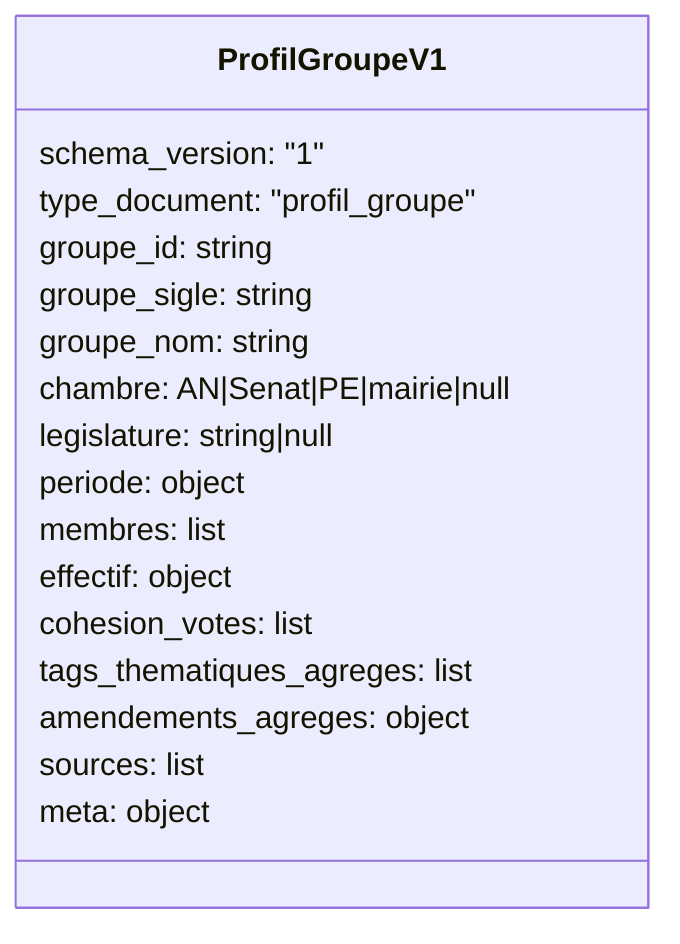
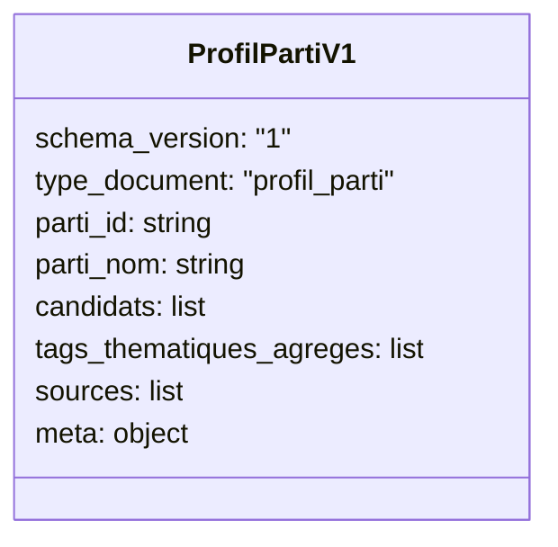
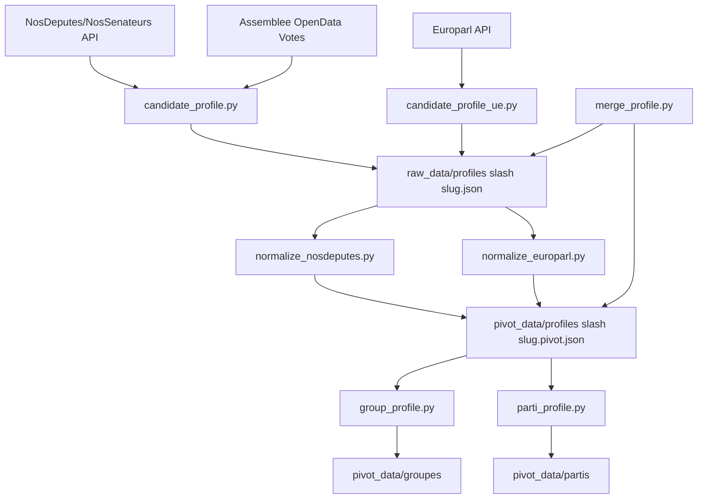

# Data Schemas and Transformations

This document is a quick reference to understand:
- input data as provided by APIs,
- transformed data produced by the project,
- transformations applied between the two.

## 1) Input data schema (APIs)

### Source overview



### 1.1 NosDeputes / NosSenateurs

Main endpoints used in `candidate_profile.py`:
- `/{slug}/json` or `/{slug}/xml`: identity and responsibilities for one parliamentarian.
- `/{slug}/votes/json`: vote fallback (often unavailable).
- `/recherche/{query}?object_name=Intervention&format=json&page=n`: intervention search.
- `/api/document/Intervention/{id}/json`: intervention details.
- `/synthese/data/json`: global summary per elected official.
- `/{legislature}/dossiers/nom/json`: legislative files list.
- `/deputes/json` and `/senateurs/json`: full chamber roster (used for groups).

Simplified object shape:

```json
{
  "depute|senateur": {
    "nom": "...",
    "groupe_sigle": "...",
    "nom_groupe_politique": "...",
    "profession": "...",
    "date_naissance": "YYYY-MM-DD",
    "mandat_debut": "YYYY-MM-DD",
    "mandat_fin": null,
    "responsabilites": [
      {"responsabilite": {"organisme": "...", "fonction": "...", "debut_fonction": "...", "fin_fonction": null}}
    ],
    "groupes_parlementaires": [],
    "responsabilites_extra_parlementaires": []
  }
}
```

```json
{
  "results": [
    {
      "document_id": "...",
      "document_type": "Intervention",
      "document_url": "https://..."
    }
  ],
  "last_result": "..."
}
```

### 1.2 National Assembly Open Data (votes)

Source of truth for roll-call deputy votes (primary source in `candidate_profile.py`):
- legislature ZIP JSON: `.../repository/{legislature}/loi/scrutins/...zip`

Simplified shape:

```json
{
  "scrutin": {
    "numero": "...",
    "dateScrutin": "YYYY-MM-DD",
    "titre": "...",
    "sort": {"libelle": "adopte|rejete|..."},
    "ventilationVotes": {
      "organe": {
        "groupes": {
          "groupe": [
            {
              "vote": {
                "decompteNominatif": {
                  "pours": {"votant": [{"acteurRef": "PAxxxx"}]},
                  "contres": {"votant": [{"acteurRef": "PAxxxx"}]},
                  "abstentions": {"votant": [{"acteurRef": "PAxxxx"}]},
                  "nonVotants": {"votant": [{"acteurRef": "PAxxxx"}]}
                }
              }
            }
          ]
        }
      }
    }
  }
}
```

### 1.3 European Parliament API v2

Used by `candidate_profile_ue.py`:
- `/meps?country-of-representation=FR`: list of French MEPs.
- `/meps/{id}`: full record including `hasMembership`.
- `/corporate-bodies/{id}`: organization resolution.

Simplified shape:

```json
{
  "data": [
    {
      "identifier": "197451",
      "label": "GivenName SURNAME",
      "bday": "YYYY-MM-DD",
      "hasMembership": [
        {
          "membershipClassification": "def/ep-entities/EU_POLITICAL_GROUP",
          "organization": "org/xxxx",
          "role": "def/ep-roles/MEMBER",
          "memberDuring": {"startDate": "YYYY-MM-DD", "endDate": null}
        }
      ]
    }
  ]
}
```

### 1.4 Parltrack dumps

Used by `mep_profile.py`:
- `ep_meps.json.lzma` (NDJSON)
- `ep_votes.json.lzma` (NDJSON)

Each line is a JSON object.

### 1.5 Wikipedia / Wikidata (monitoring)

Used by `fetch_wikipedia_candidates.py` to compare with `raw_data/candidats.json`.
- Wikipedia REST HTML page.
- Wikidata SPARQL endpoint.

This pipeline never auto-writes `candidats.json`.

## 2) Transformed data schema

### 2.1 Raw candidate profile (intermediate)

Produced by `candidate_profile.py`, then batch-generated by `generate_all_profiles.py`.



Output: `raw_data/profiles/<slug>.json`.

### 2.2 Individual pivot profile (common contract)

Defined by `schema_pivot.py`, fed by `normalize_nosdeputes.py` and `normalize_europarl.py`.



Output: `pivot_data/profiles/<slug>.pivot.json`.

### 2.3 Group profile (real parliamentary aggregation)

Defined by `schema_groupe.py`, computed by `group_profile.py`
(batch mode available through `generate_group_profiles.py`).



Output: `pivot_data/groupes/groupe-*.json`.

### 2.4 Party profile (editorial candidate aggregation)

Defined by `schema_parti.py`, computed by `parti_profile.py`.



Output: `pivot_data/partis/parti-*.json`.

## 3) Applied transformations

### Global pipeline



### Key transformation rules

1. Deputy votes: prioritize official National Assembly open data.
2. Vote fallback: use NosDeputes endpoint only when official votes are unavailable.
3. Chamber normalization: `deputes -> AN`, `senateurs -> Senat`, `UE -> PE`.
4. Source traceability: every pivot profile populates `sources[]` with `type`, `url`, `synchro_le`.
5. Thematic tags: derived from `interventions[].mots_cles` (raw extraction stage).
6. Additive merge: `merge_profile.py` appends new entries without deleting existing ones.
7. Structural validation: `validate_profil`, `validate_profil_groupe`, `validate_profil_parti` enforce schema invariants.

### Mapping summary (input -> transformed)

| API input | Transformed field | Target |
|---|---|---|
| NosDeputes identity `nom` | `identite.nom_complet` then `nom` | raw -> pivot |
| NosDeputes identity `groupe_sigle` / `nom_groupe_politique` | `identite.groupe_*` then `groupe` | raw -> pivot |
| Responsibility fields `responsabilite.organisme/fonction/...` | `mandats[]` | raw -> pivot |
| AN votes `numero/dateScrutin/titre/sort/libelle + acteurRef` | `votes[]` | raw -> pivot |
| Intervention search + document details | `interventions[]` with `sujet`, `mots_cles`, `format` | raw -> pivot |
| Europarl `hasMembership[]` | `mandats[]` + `groupe` (EU political group) | raw EU -> pivot |
| Set of individual pivots | `cohesion_votes`, `effectif`, `amendements_agreges` | pivot -> group profile |
| Candidates grouped by party label + available pivots | `candidats[]`, `tags_thematiques_agreges` | pivot -> party profile |

## 4) Code reference files

- Inputs and collection: `src/candidate_profile.py`, `src/candidate_profile_ue.py`, `src/mep_profile.py`, `src/fetch_wikipedia_candidates.py`
- Pivot normalization: `src/normalize_nosdeputes.py`, `src/normalize_europarl.py`
- Schema contracts: `src/schema_pivot.py`, `src/schema_groupe.py`, `src/schema_parti.py`
- Aggregations: `src/group_profile.py`, `src/group_roster.py`, `src/parti_profile.py`, `src/generate_group_profiles.py`
- Additive merge: `src/merge_profile.py`
